РОССИЙСКИЙ УНИВЕРСИТЕТ ДРУЖБЫ НАРОДОВ

**Факультет физико-математических и естественных наук**

**Кафедра прикладной информатики и теории вероятностей**

ОТЧЕТ

по лабораторной работе №6

**«Анализ файловой системы Linux.**

**Команды для работы с файлами и каталогами»**

[дисциплина: Операционные системы]{.underline}

[Студентка:]{.underline}

[Бочкарева Елена Дмитриевна]{.underline}

Студенческий билет номер №: 1032207514

Группа:

[НПМбв-01-19]{.underline}

**МОСКВА**

2023

# Цель работы

Ознакомление с файловой системой Linux, её структурой, именами и
содержанием каталогов. Приобретение практических навыков по применению
команд для работы с файлами и каталогами, по управлению процессами (и
работами), по проверке использования диска и обслуживанию файловой
системы.

#  Последовательность выполнения работы {#последовательность-выполнения-работы .unnumbered}

**1.Выполним все примеры, приведённые в первой части описания
лабораторной работы из пунктов 3.2.2, 3.2.3, 3.2.5.**

**1.1. Выполним примеры из пункта 3.2.2. «Копирование файлов и
каталогов». Примеры:**

1.1.1. Скопируем файл \~/abc1 в файл april и в файл may: cd touch abc1
cp abc1 april cp abc1 may (Ссылка: риc.1).

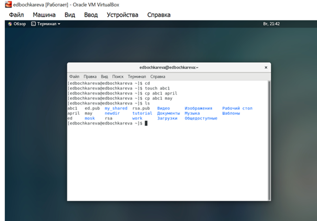

Рис.1 (image1): Копирование файла в текущем каталоге.

1.1.2. Скопируем файлы april и may в каталог monthly: mkdir monthly cp
april may monthly (Ссылка: риc.2).

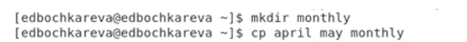

Рис.2 (image2): Копирование нескольких файлов в каталог.

1.1.3. Копирование файлов в произвольном каталоге. Скопируем файл
monthly/may в файл с именем june: cp monthly/may monthly/june ls monthly
(Ссылка: риc.3).

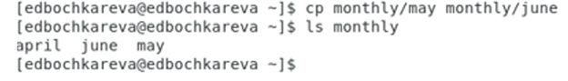

Рис.3 (image3): Копирование файлов в произвольном каталоге.

Используем команду cp с опцией r (recursive), которая позволяет
копировать каталоги вместе с входящими в них файлами и каталогами.
Примеры:

1.1.4. Копирование каталогов в текущем каталоге. Скопируем каталог
monthly в каталог monthly.00: mkdir monthly.00 cp -r monthly monthly.00

1.1.5. Копирование каталогов в произвольном каталоге. Скопируем каталог
monthly.00 в каталог /tmp cp -r monthly.00 /tmp

**1.2. Выполним примеры из пункта 3.2.3. «Перемещение и переименование
файлов и каталогов». Примеры:**

1.2.1. Переименование файлов в текущем каталоге. Изменим название файла
april на july в домашнем каталоге: cd mv april july.

1.2.2. Перемещение файлов в другой каталог. Переместим файл july в
каталог monthly.00: mv july monthly.00 ls monthly.00

1.2.3. Переименование каталогов в текущем каталоге. Переименуем каталог
monthly.00 в monthly.01 mv monthly.00 monthly.01

1.2.4. Перемещение каталога в другой каталог. Переместим каталог
monthly.01в каталог reports: mkdir reports mv monthly.01 reports

1.2.5. Переместим каталог reports/monthly.01 в reports/monthly: mv
reports/monthly.01 reports/monthly (Ссылка: риc.4).

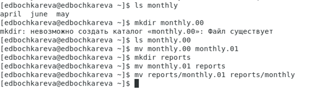

Рис.4 (image4): Переименование каталога, не являющегося текущим.

**1.3. Выполним примеры из пункта 3.2.5. «Изменение прав доступа».**
Права доступа к файлу или каталогу можно изменить, для этого
воспользуемся командой chmod.

1.3.1. Создадим файл \~/may с правом выполнения для владельца: cd touch
may ls -l may chmod u+x may ls -l may

1.3.2. Лишим владельца файла \~/may права на выполнение: chmod u-x may
ls -l may

(Ссылка: риc.5) для пунктов 1.3.1., 1.3.2.

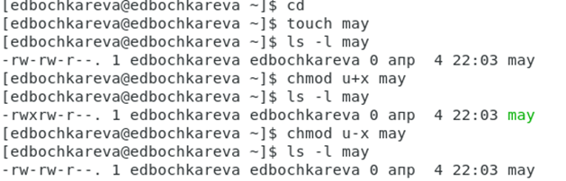

{width="6.564951881014873in"
height="2.113131014873141in"}

Рис.5 (image5): Изменение права доступа к файлу или каталогу с командой
chmod.

1.3.3. Создадим каталог monthly с запретом на чтение для членов группы и
всех остальных пользователей: cd mkdir monthly chmod g-r, o-r monthly

1.3.4. Создадим файл \~/abc1 с правом записи для членов группы: cd touch
abc1 chmod g+w abc1

(Ссылка: риc.6) для пунктов 1.3.3. и 1.3.4.

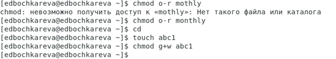

Рис.6 (image6): Создание каталогов и файлов с запретом на чтение для
членов группы и всех остальных пользователей и с правом записи для
членов группы.

**2.Выполним следующие действия, зафиксировав в отчёте по лабораторной
работе используемые при этом команды и результаты их выполнения:**

2.1. Скопируем файл /usr/include/sys/io.h в домашний каталог и назовем
его equipment. Если файла io.h нет, то используем любой другой файл в
каталоге /usr/include/sys/ вместо него.

2.2. В домашнем каталоге создадим директорию \~/ski.plases. (Ссылка:
риc.7)

Рис.7 (image7): Создание директории в домашнем каталоге.

2.  2.3. Переместим файл equipment в каталог \~/ski.plases.

Рисунок 8 (image8):

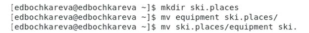

Рис.8 (image8): Перемещение файл equipment в каталог.

2.4. Переименуем файл \~/ski.plases/equipment в \~/ski.plases/equiplist.

2.5. Создадим в домашнем каталоге файл abc1 и скопируем его в каталог
\~/ski.plases, назовем его equiplist2 (Ссылка: риc.9)

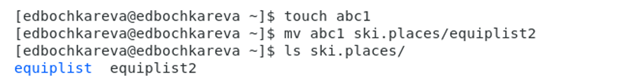

Рис.9 (image9): Создание в домашнем каталоге файла abc1, его копирование
его в каталог \~/ski.plases, название файла equiplist2

2.6. Создадим каталог с именем equipment в каталоге \~/ski.plases.

(Ссылка: риc.10)

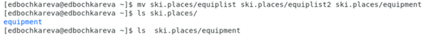

2.7. Переместим файлы \~/ski.plases/equiplist и equiplist2 в каталог
\~/ski.plases/equipment. (Ссылка: риc.11)

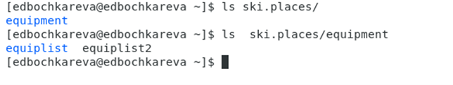

{width="6.7783956692913385in"
height="1.281771653543307in"}Рис.11 (image11): Перемещение файлов.

2.8. Создадим и переместим каталог \~/newdir в каталог \~/ski.plases и
назовем его plans. (Ссылка: риc.12)

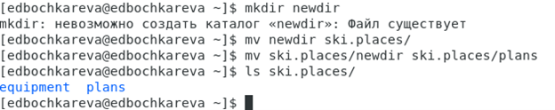

{width="6.496527777777778in"
height="1.2889938757655293in"}

Рис.12 (image12): Создание и перемещение каталога.

3.1 Определим опции команды chmod, необходимые для того, чтобы присвоить
перечисленным ниже файлам выделенные права доступа, считая, что в начале
таких прав нет:

3.1. drwxr\--r\-- \... australia 3.2. drwx\--x\--x \... play 3.3.
-r-xr\--r\-- \... my_os 3.4. -rw-rw-r\-- \... feathers

(Ссылка: риc.13, 14, 15) для пунктов 3.1., 3.2.,3.3.,3.4.

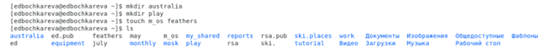

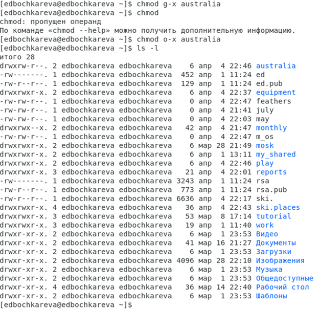

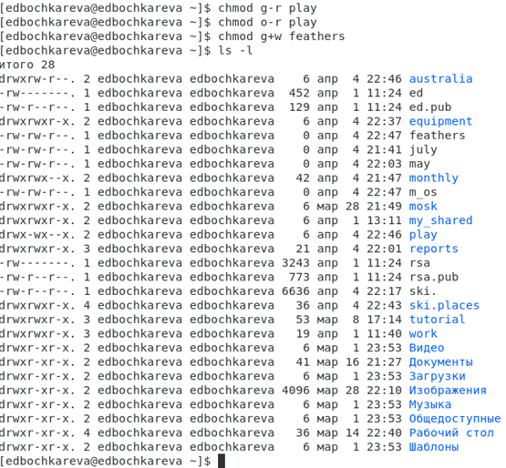

Рис.13 (image13): Определение опций команды chmod, необходимых для того,
чтобы присвоить файлам выделенные права доступа.

# {width="6.496527777777778in" height="6.29375in"}

Рис.14 (image14): Определение опций команды chmod, необходимых для того,
чтобы присвоить файлам выделенные права доступа.

Рис.15 (image15): Определение опций команды chmod, необходимых для того,
чтобы присвоить файлам выделенные права доступа.

4.1 Просмотрим содержимое файла /etc/password. (Ссылка: риc.16)

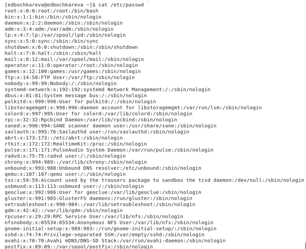

Рис.16 (image16): Просмотр содержимого файла.

4.2 Скопируем файл \~/feathers в файл \~/file.old.

4.3 Переместите файл \~/file.old в каталог \~/play

4.4 Скопируйте каталог \~/play в каталог \~/fun.

4.5 Переместите каталог \~/fun в каталог \~/play и назовите его games.

(Ссылка: риc.17) для пунктов 4.2.,4.3., 4.4.,4.5.

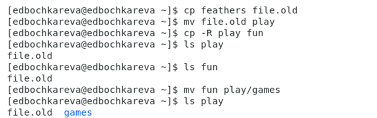

Рис.17 (image17):

4.7 Что произойдёт, если вы попытаетесь просмотреть файл \~/feathers
командой cat? (Ссылка: риc.18)

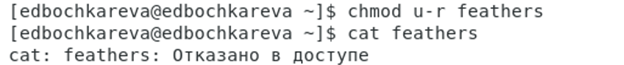

Рис.18 (image18): Просмотр файла \~/feathers командой cat.

4.8 Что произойдёт, если вы попытаетесь скопировать файл \~/feathers?
(Ссылка: риc.19)

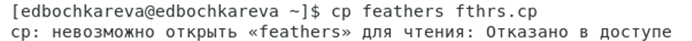

Рис.19 (image19): Последствия попытки копирования файла \~/feathers.
Просмотр действия.

4.9 Дайте владельцу файла \~/feathers право на чтение. (Ссылка: риc.20)

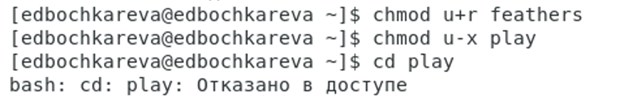

Рис.20 (image20): Предоставление прав владельцу файла на чтение.

4.11 Перейдем в каталог \~/play. Посмотрим, что произошло? (Ссылка:
риc.21)

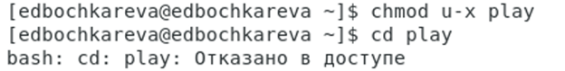

Рис.21 (image21): Переход в каталог \~/play. Просмотр результата
действия.

4.12 Дайте владельцу каталога \~/play право на выполнение.

(Ссылка: риc.22)

Рис.22 (image22): Предоставление владельцу каталога прав на выполнение.

5**. Прочитаем man по командам mount, fsck, mkfs, kill и кратко их
охарактеризуем, приведем примеры.** (Ссылка: риc.23)

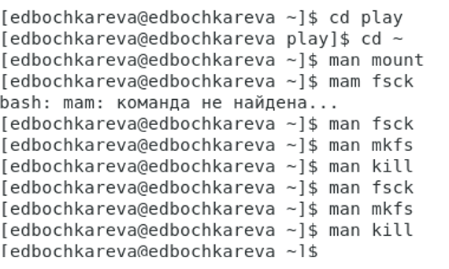

Рис.23 (image23): **Чтение man по командам mount, fsck, mkfs, kill и
краткая характеристика с примерами.**

5.1.**Охарактеризуем команду mount**: команда монтирует диск в файловую
систему, пример: mount -t type device dir (Ссылка: риc.24)

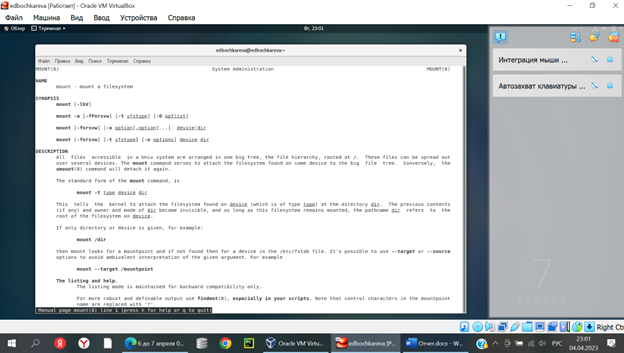

Рис.24 (image24**): Характеристика команды mount.**

5.2.**Охарактеризуем команду fsck**: утилита для проверки и
восстановления файловых систем Linux, пример: fsck -a (Ссылка: риc.25)

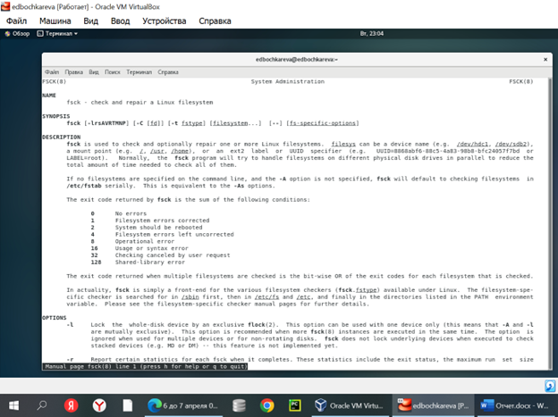

Рис.25 (image25**): Характеристика команды fsck**.

5.3.**Охарактеризуем команду mkfs**: команда создает файловую систему,
синтаксис: mkfs \[параметры\] \[-t \<тип\>\] \[параметры ФС\]
\<устройство\> \[\<размер\>\](Ссылка: риc.26)

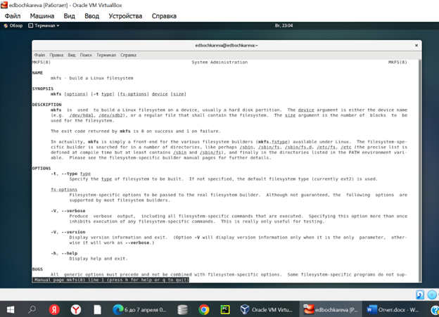

Рис.26 (image26**): Характеристика команды mkfs.**

5.4.Ответ: **Охарактеризуем команду kill:** посылает указанный сигнал
указанному процессу, пример: kill -9 1234 \>\](Ссылка: риc.27)

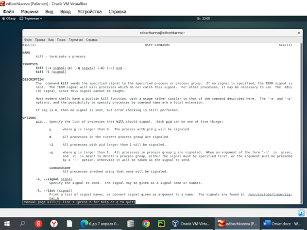

Рис.27 (image27**): Характеристика команды kill.**

# Ответы на контрольные вопросы  {#ответы-на-контрольные-вопросы .unnumbered}

5.  1\. **Дайте характеристику каждой файловой системе, существующей на
    жёстком диске компьютера, на котором вы выполняли лабораторную
    работу.**

    **Ответ:** На нашем компьютере используется файловая система EXT
    (Extended File System). Она была разработана специально для
    операционной системы Linux. Главной целью, которую преследовали
    создатели EXT было преодоление максимального размера записываемых
    файлов, который в то время составлял всего лишь 64 МБ. Благодаря
    созданию новой структуры метаданных -- максимально возможный размер
    файла увеличился до 2 ГБ. В то же время максимальная длина имен
    файлов увеличилась о 255 байт.

    Главный разработчик файловой системы EXT Реми Кард восхищался
    файловой системой UFS, поэтому некоторые ее возможности перекочевали
    и в EXT.

    Несмотря на то, что Linux поддерживает достаточно большое количество
    файловых систем, именно EXT является наиболее предпочтительной,
    поскольку она изначально построена на ядре Linux.

    Хоть EXT и преодолела основные недостатки файловой системы Minix
    (которая использовалась в то время в Linux) ее главным недостатком
    были временные метки. В EXT разрешалось использовать только одну
    временную метку для каждого файла. Поэтому разработка EXT не
    прекратилась и в последующих версиях она постоянно развивалась и
    обрастала новыми возможностями.

    Это сделало ее очень популярной не только среди пользователей Linux,
    но и среди владельцев смартфонов на Android, так как по умолчанию
    Android использует файловую систему Ext4.

**2. Приведите общую структуру файловой системы и дайте характеристику
каждой директории первого уровня этой структуры**.

**Ответ:** Чтобы посмотреть, какие директории есть в корне файловой
системы, можно выполнить команду:

ls /

Типичное содержимое:

bin/ boot/ dev/ etc/ home/ lib/ lib64/ lost+found/ mnt/ opt/ proc/ root/
run/ sbin/ srv/ swapfile/ sys/ tmp/ usr/ var/

Давайте рассмотрим значение и содержимое каждой папки в Linux.

/bin: Все исполнимые бинарные программы (файлы) необходимые во время
загрузки, восстановления и ремонта системы; файлы, необходимые для
запуска в однопользовательском режиме и другие важные, основные команды,
такие как cat, du, df, tar, rpm, wc, и т. д.

/boot: Содержит важные файлы для процесса загрузки, включая ядро Linux.
В современных системах при установке обычно на главном диске создаётся
небольшой раздел, который затем монтируется в директорию /boot

/dev: Содержит файлы устройств для всех физических устройств на данной
машине, например, cdrom, cpu и т. д. Как мы уже знаем, здесь же
размещены файлы дисков --- на случай, если понадобится смонтировать
новый диск или сменный носитель.

/etc: Содержит файлы конфигурации приложений, а также файлы управления
службами Systemd. То есть настройки системы, программ и служб хранятся
именно в этой папке. Количество папок и файлов здесь может быть
различным в зависимости от количество установленных программ на данной
системе.

/home: домашний каталог пользователей. Каждый раз, когда создаётся новый
пользователь, в домашнем каталоге создаётся каталог в соответствии с
именем пользователя, который содержит другие каталоги, такие как Рабочий
стол (Desktop), Загрузки (Downloads), Документы (Documents) и т. д.
Исключением является только пользователь root, его файлы хранятся в
директории /root.

/lib: Каталог lib содержит модули ядра и образы общих библиотек,
необходимые для загрузки системы и запуска команд в корневой файловой
системе.

/lost+found: Этот каталог создаётся во время установки Linux, полезен
для восстановления файлов, которые могут быть повреждены из-за
неожиданного завершения работы. Если программа для поиска ошибок в
файловой системе выявила проблема (например, нашла повреждённые файлы),
то эти файлы будут перемещены в этот каталог.

/media: Точки монтирования для съёмных носителей, таких как CD-ROM
(появились в FHS-2.3).

/mnt: Каталог монтирования для временного монтирования файловых систем
(внешних дисков, USB накопителей и т.д.).

/opt: Аббревиатура от слова «опциональный», то есть необязательный.
Содержит стороннее программное обеспечение, такое как Java, cuda,
dropbox, metasploit, viber, vuze и т.д.

/proc: Виртуальная и псевдо-файловая система, которая содержит
информацию о запущенных процессах и настройках ядра в виде файлов.
Виртуальная файловая система, предоставляющая информацию о процессах и
ядре в виде файлов. В Linux соответствует монтированию procfs. Обычно
автоматически генерируется и заполняется системой на лету.

/root: Это домашний каталог пользователя root, и его никогда не следует
путать с «/».

Домашний каталог суперпользователя (root) находится в /root, а не в
/home/root, так как учётная запись суперпользователя предназначена
исключительно для администрирования операционной системы. Это помогает
повысить надёжность системы: /root обычно располагается на том же
разделе, где и система, что позволяет производить обслуживание и
настройку операционной системы, смонтировав лишь корневой раздел.

/run: Информация о системе с момента её загрузки, в том числе данные,
необходимые для работы демонов (pid-файлы, UNIX-сокеты и т.д.).

/sbin: Содержит двоичные исполняемые программы, необходимые системному
администратору для обслуживания: iptables, fdisk, ifconfig, swapon,
reboot и т.д.

/srv: Название директории является аббревиатурой от «сервисы». Эта
директория содержит файлы, имеющие отношение к сервисам. Например здесь
хранят файлы такие сервисы как deluge, ftp, http.

/sys: Содержит информацию об устройствах, драйверах, а так же некоторых
свойствах ядра. Современные дистрибутивы Linux включают директорию /sys
в качестве виртуальной файловой системы, которая хранит и позволяет
модифицировать устройства, подключённые к системе.

/tmp: Системный временный каталог, доступный пользователям и root.
Сохраняет временные файлы для пользователя и системы, которые удаляются
при следующей загрузке.

/usr: Содержит исполняемые файлы, документацию, исходный код, библиотеки
для программ второго уровня.

/var: Директория для переменных данных. Содержимое файлов в этой
директории, как ожидается, будет расти. Этот каталог содержит файлы
журналов, lock, spool, почты и временных файлов.

**3. Какая операция должна быть выполнена, чтобы содержимое некоторой
файловой системы было доступно операционной системе?**

**Ответ:** Команда mount.

**4. Назовите основные причины нарушения целостности файловой системы.
Как устранить повреждения файловой системы**?

**Ответ:** Отсутствие синхронизации между образом файловой системы в
памяти и ее данными на диске в случае аварийного останова может привести
к появлению следующих ошибок:

-   Один блок адресуется несколькими mode (принадлежит нескольким
    файлам).

-   Блок помечен как свободный, но в то же время занят (на него
    ссылается onode).

-   Блок помечен как занятый, но в то же время свободен (ни один inode
    на него не ссылается).

-   Неправильное число ссылок в inode (недостаток или избыток
    ссылающихся записей в каталогах).

-   Несовпадение между размером файла и суммарным размером адресуемых
    inode блоков.

-   Недопустимые адресуемые блоки (например, расположенные за пределами
    файловой системы).

-   \"Потерянные\" файлы (правильные inode, на которые не ссылаются
    записи каталогов).

-   Недопустимые или неразмещенные номера inode в записях каталогов.

**5. Как создаётся файловая система?**

**Ответ:** Команда mkfs позволяет создать файловую систему в Linux.

**6. Дайте характеристику командам, которые позволяют просмотреть
текстовые файлы.**

**Ответ:** Для просмотра небольших файлов удобно пользоваться командой
cat.

Формат команды:

cat имя-файла

Для просмотра больших файлов используйте команду less --- она позволяет
осуществлять постраничный просмотр файлов (длина страницы соответствует
размеру экрана).

Формат команды:

less имя-файла

Для просмотра начала файла можно воспользоваться командой head. По
умолчанию она выводит первые 10 строк файла.

Формат команды:

head \[-n\] имя-файла

где n --- количество выводимых строк.

Команда tail выводит несколько (по умолчанию 10) последних строк файла.

Формат команды:

tail \[-n\] имя-файла

где n --- количество выводимых строк.

**7. Приведите основные возможности команды cp в Linux.**

**Ответ:** Копирование файлов и каталогов осуществляется при помощи
команды cp.

Формат команды:

cp \[-опции\] исходный_файл целевой_файл

8\. **Назовите и дайте характеристику командам перемещения и
переименования файлов и каталогов.**

**Ответ:** Команды mv и mvdir предназначены для перемещения и
переименования файлов и каталогов.

Формат команды mv:

mv \[-опции\] старый_файл новый_файл

**9. Что такое права доступа? Как они могут быть изменены?**

**Ответ:** Права доступа это специальных механизм ОС Linux, позволяющий
контролировать кто и какие действия может совершать с определёнными
файлами в ОС. Права доступа к файлу или каталогу можно изменить,
воспользовавшись командой chmod. Сделать это может владелец файла (или
каталога) или пользователь с правами администратора.

Формат команды:

chmod режим имя_файла

# Выводы

В данной лабораторной работе я узнала как устроена файловая система
Linux и познакомилась с основными командами для работы с файлами.
