РОССИЙСКИЙ УНИВЕРСИТЕТ ДРУЖБЫ НАРОДОВ

**Факультет физико-математических и естественных наук**

**Кафедра прикладной информатики и теории вероятностей**

ОТЧЕТ

по лабораторной работе №8

«Командная оболочка

Midnight Commander»

[дисциплина: Операционные системы]{.underline}

[Студентка:]{.underline}

[Бочкарева Елена Дмитриевна]{.underline}

Студенческий билет номер №: 1032207514

Группа:

[НПМбв-01-19]{.underline}

**МОСКВА**

2023

# Оглавление {#оглавление .TOC-Heading .unnumbered}

[Цель работы: [6](#цель-работы)](#цель-работы)

[Результаты выполнения задания.
[6](#результаты-выполнения-задания.)](#результаты-выполнения-задания.)

[5.2.5. Задание по mc: [8](#задание-по-mc)](#задание-по-mc)

[Пункт 1. Изучите информацию о mc, вызвав в командной строке man mc
(рис.5).
[8](#пункт-1.-изучите-информацию-о-mc-вызвав-в-командной-строке-man-mc-рис.5.)](#пункт-1.-изучите-информацию-о-mc-вызвав-в-командной-строке-man-mc-рис.5.)

[1.1. Изучаю информацию о mc: «Наименование», «Синтаксис», «Описание»,
«Ключи» (рис.6).
[9](#изучаю-информацию-о-mc-наименование-синтаксис-описание-ключи-рис.6.)](#изучаю-информацию-о-mc-наименование-синтаксис-описание-ключи-рис.6.)

[1.2. Изучаю информацию о mc: «Главное окно программы», «Поддержка мыши»
(рис.7).
[9](#изучаю-информацию-о-mc-главное-окно-программы-поддержка-мыши-рис.7.)](#изучаю-информацию-о-mc-главное-окно-программы-поддержка-мыши-рис.7.)

[1.3. Изучаю информацию о mc: «Клавиатурные команды» (рис.8).
[10](#изучаю-информацию-о-mc-клавиатурные-команды-рис.8.)](#изучаю-информацию-о-mc-клавиатурные-команды-рис.8.)

[1.4. Изучаю информацию о mc: «Переопределение клавиатурных команд»,
«Разные команды» (рис.9).
[10](#изучаю-информацию-о-mc-переопределение-клавиатурных-команд-разные-команды-рис.9.)](#изучаю-информацию-о-mc-переопределение-клавиатурных-команд-разные-команды-рис.9.)

[1.5. Изучаю информацию о mc: «Панели каталогов (1)» (рис.10).
[11](#изучаю-информацию-о-mc-панели-каталогов-1-рис.10.)](#изучаю-информацию-о-mc-панели-каталогов-1-рис.10.)

[1.6. Изучаю информацию о mc: «Панели каталогов(2)» (рис.11).
[11](#изучаю-информацию-о-mc-панели-каталогов2-рис.11.)](#изучаю-информацию-о-mc-панели-каталогов2-рис.11.)

[1.7. Изучаю информацию о mc: «Команды» (рис.12).
[12](#изучаю-информацию-о-mc-команды-рис.12.)](#изучаю-информацию-о-mc-команды-рис.12.)

[1.8. Изучаю информацию о mc: «Быстрый поиск», «Командная строка
оболочки» (рис.13).
[12](#изучаю-информацию-о-mc-быстрый-поиск-командная-строка-оболочки-рис.13.)](#изучаю-информацию-о-mc-быстрый-поиск-командная-строка-оболочки-рис.13.)

[1.9. Изучаю информацию о mc: «Клавиши управления перемещением»
(рис.14).
[13](#изучаю-информацию-о-mc-клавиши-управления-перемещением-рис.14.)](#изучаю-информацию-о-mc-клавиши-управления-перемещением-рис.14.)

[1.10. Изучаю информацию о mc: «Редактирование строк ввода» (рис.15).
[13](#изучаю-информацию-о-mc-редактирование-строк-ввода-рис.15.)](#изучаю-информацию-о-mc-редактирование-строк-ввода-рис.15.)

[1.11. Изучаю информацию о mc: «Главное меню программы Midnight
Commander», «Меню левой и правой панелей» (рис.16).
[14](#изучаю-информацию-о-mc-главное-меню-программы-midnight-commander-меню-левой-и-правой-панелей-рис.16.)](#изучаю-информацию-о-mc-главное-меню-программы-midnight-commander-меню-левой-и-правой-панелей-рис.16.)

[1.12. Изучаю информацию о mc: «Имена полей» (рис.17).
[14](#изучаю-информацию-о-mc-имена-полей-рис.17.)](#изучаю-информацию-о-mc-имена-полей-рис.17.)

[1.13. Изучаю информацию о mc: «Информация», «Дерево», «Порядок
сортировки», «Быстрый просмотр» (рис.18).
[15](#изучаю-информацию-о-mc-информация-дерево-порядок-сортировки-быстрый-просмотр-рис.18.)](#изучаю-информацию-о-mc-информация-дерево-порядок-сортировки-быстрый-просмотр-рис.18.)

[1.14. Изучаю информацию о mc: «Файл», «Просмотр файла», «Просмотр
вывода команды», «Копирование», «Редактирование» (рис.19).
[15](#изучаю-информацию-о-mc-файл-просмотр-файла-просмотр-вывода-команды-копирование-редактирование-рис.19.)](#изучаю-информацию-о-mc-файл-просмотр-файла-просмотр-вывода-команды-копирование-редактирование-рис.19.)

[1.15. Изучаю информацию о mc: «Права доступа», «Жесткая ссылка»,
«Абсолютная символическая ссылка», «Относительная символическая ссылка»
(рис.20).
[16](#изучаю-информацию-о-mc-права-доступа-жесткая-ссылка-абсолютная-символическая-ссылка-относительная-символическая-ссылка-рис.20.)](#изучаю-информацию-о-mc-права-доступа-жесткая-ссылка-абсолютная-символическая-ссылка-относительная-символическая-ссылка-рис.20.)

[1.16. Изучаю информацию о mc: «Владелец/группа», «Права доступа»,
«Переименования», «Создание каталога», «Удаление», «Быстрая смена
каталога», «Отметить группу» (рис.21).
[16](#изучаю-информацию-о-mc-владелецгруппа-права-доступа-переименования-создание-каталога-удаление-быстрая-смена-каталога-отметить-группу-рис.21.)](#изучаю-информацию-о-mc-владелецгруппа-права-доступа-переименования-создание-каталога-удаление-быстрая-смена-каталога-отметить-группу-рис.21.)

[Пункт 2. Запустите из командной строки mc, изучите его структуру и
меню.
[17](#пункт-2.-запустите-из-командной-строки-mc-изучите-его-структуру-и-меню.)](#пункт-2.-запустите-из-командной-строки-mc-изучите-его-структуру-и-меню.)

[2.1. Строка «Меню» состоит из пяти подменю: \"Left\", \"File\",
\"Command\", \"Options\" и \"Right\".
[17](#_Toc132980060)](#_Toc132980060)

[2.2. Меню «Файл». Выполнение команды «Просмотр файла» (рис.23).
[18](#меню-файл.-выполнение-команды-просмотр-файла-рис.23.)](#меню-файл.-выполнение-команды-просмотр-файла-рис.23.)

[2.3. Меню «Команда» (рис.24).
[18](#меню-команда-рис.24.)](#меню-команда-рис.24.)

[2.4. Меню «Настройки» (рис.25).
[19](#меню-настройки-рис.25.)](#меню-настройки-рис.25.)

[2.5. Демонстрация «Дерево каталога» (рис.26).
[19](#демонстрация-дерево-каталога-рис.26.)](#демонстрация-дерево-каталога-рис.26.)

[Пункт 3. Выполните несколько операций в mc, используя управляющие
клавиши (операции с панелями; выделение/отмена выделения файлов,
копирование/перемещение файлов, получение информации о размере и правах
доступа на файлы и/или каталоги и т.п.)
[20](#пункт-3.-выполните-несколько-операций-в-mc-используя-управляющие-клавиши-операции-с-панелями-выделениеотмена-выделения-файлов-копированиеперемещение-файлов-получение-информации-о-размере-и-правах-доступа-на-файлы-иили-каталоги-и-т.п.)](#пункт-3.-выполните-несколько-операций-в-mc-используя-управляющие-клавиши-операции-с-панелями-выделениеотмена-выделения-файлов-копированиеперемещение-файлов-получение-информации-о-размере-и-правах-доступа-на-файлы-иили-каталоги-и-т.п.)

[Пункт 4. Выполните основные команды меню левой (или правой) панели.
Оцените степень подробности вывода информации о файлах.
[21](#пункт-4.-выполните-основные-команды-меню-левой-или-правой-панели.-оцените-степень-подробности-вывода-информации-о-файлах.)](#пункт-4.-выполните-основные-команды-меню-левой-или-правой-панели.-оцените-степень-подробности-вывода-информации-о-файлах.)

[4.1. Меню Left. Список файлов (рис.27).
[21](#меню-left.-список-файлов-рис.27.)](#меню-left.-список-файлов-рис.27.)

[4.2. Меню «Список файлов». Просмотр информации после ввода команды
(рис.28).
[22](#меню-список-файлов.-просмотр-информации-после-ввода-команды-рис.28.)](#меню-список-файлов.-просмотр-информации-после-ввода-команды-рис.28.)

[4.3. Меню «Левая панель». Демонстрация «Команда. Сравним каталоги»
(рис.29).
[22](#меню-левая-панель.-демонстрация-команда.-сравним-каталоги-рис.29.)](#меню-левая-панель.-демонстрация-команда.-сравним-каталоги-рис.29.)

[4.4. Меню «Левая панель». Демонстрация «Сравним каталоги по размеру»
(рис.30).
[23](#меню-левая-панель.-демонстрация-сравним-каталоги-по-размеру-рис.30.)](#меню-левая-панель.-демонстрация-сравним-каталоги-по-размеру-рис.30.)

[4.5. Меню «Правая панель». Демонстрация «Список файлов» (рис.31).
[23](#меню-правая-панель.-демонстрация-список-файлов-рис.31.)](#меню-правая-панель.-демонстрация-список-файлов-рис.31.)

[4.6. Левая панель. Демонстрация подпункта «Информация». Просмотр
информации о файле или каталоге (рис.32).
[24](#левая-панель.-демонстрация-подпункта-информация.-просмотр-информации-о-файле-или-каталоге-рис.32.)](#левая-панель.-демонстрация-подпункта-информация.-просмотр-информации-о-файле-или-каталоге-рис.32.)

[4.7. «Быстрый просмотр»: [24](#быстрый-просмотр)](#быстрый-просмотр)

[4.7.1 Демонстрация режима меню «Информация» (рис.33).
[24](#демонстрация-режима-меню-информация-рис.33.)](#демонстрация-режима-меню-информация-рис.33.)

[4.8. Левая панель. Демонстрация «Порядок сортировки» (рис.34).
[26](#левая-панель.-демонстрация-порядок-сортировки-рис.34.)](#левая-панель.-демонстрация-порядок-сортировки-рис.34.)

[4.9 Левая панель. Подпункт «Порядок сортировки». Обзор выполнения
команды после ввода клавиши Enter (рис.35).
[27](#левая-панель.-подпункт-порядок-сортировки.-обзор-выполнения-команды-после-ввода-клавиши-enter-рис.35.)](#левая-панель.-подпункт-порядок-сортировки.-обзор-выполнения-команды-после-ввода-клавиши-enter-рис.35.)

[Пункт 5. Используя возможности подменю «Файл», выполните:
[27](#пункт-5.-используя-возможности-подменю-файл-выполните)](#пункт-5.-используя-возможности-подменю-файл-выполните)

[5.1. Просмотр содержимого текстового файла.
[27](#просмотр-содержимого-текстового-файла.)](#просмотр-содержимого-текстового-файла.)

[5.1.1. Просмотр ( F3 ) --- позволяет посмотреть содержимое текущего
(или выделенного) файла без возможности редактирования (рис.36).
[28](#просмотр-f3-позволяет-посмотреть-содержимое-текущего-или-выделенного-файла-без-возможности-редактирования-рис.36.)](#просмотр-f3-позволяет-посмотреть-содержимое-текущего-или-выделенного-файла-без-возможности-редактирования-рис.36.)

[5.1.2. Просмотр файла после ввода команды «Enter» (рис.37).
[28](#просмотр-файла-после-ввода-команды-enter-рис.37.)](#просмотр-файла-после-ввода-команды-enter-рис.37.)

[5.1.3. Просмотр файла после ввода команды «Enter». «Просмотр
невозможен: необычный файл» (рис.38).
[29](#просмотр-файла-после-ввода-команды-enter.-просмотр-невозможен-необычный-файл-рис.38.)](#просмотр-файла-после-ввода-команды-enter.-просмотр-невозможен-необычный-файл-рис.38.)

[5.1.4. Редактирование содержимого текстового файла (без сохранения
результатов редактирования) (рис.39).
[30](#редактирование-содержимого-текстового-файла-без-сохранения-результатов-редактирования-рис.39.)](#редактирование-содержимого-текстового-файла-без-сохранения-результатов-редактирования-рис.39.)

[5.1.5. Создание каталога (рис.40).
[30](#создание-каталога-рис.40.)](#создание-каталога-рис.40.)

[5.1.6. Создание каталога. Вводим имя каталога (рис.41).
[31](#создание-каталога.-вводим-имя-каталога-рис.41.)](#создание-каталога.-вводим-имя-каталога-рис.41.)

[5.1.7. Создание каталога «edbochkareva» (рис.42).
[31](#создание-каталога-edbochkareva-рис.42.)](#создание-каталога-edbochkareva-рис.42.)

[5.1.8. Просмотр пути каталога «edbochkareva» (рис.43).
[32](#просмотр-пути-каталога-edbochkareva-рис.43.)](#просмотр-пути-каталога-edbochkareva-рис.43.)

[5.1.9. Копирование в файлов в созданный каталог (рис.44).
[32](#изображение-выглядит-как-диаграмма-автоматически-созданное-описание5.1.9.-копирование-в-файлов-в-созданный-каталог-рис.44.)](#изображение-выглядит-как-диаграмма-автоматически-созданное-описание5.1.9.-копирование-в-файлов-в-созданный-каталог-рис.44.)

[5.1.10. Демонстрация хода работы. Копирование в файлов в созданный
каталог (рис.45)
[33](#демонстрация-хода-работы.-копирование-в-файлов-в-созданный-каталог-рис.45)](#демонстрация-хода-работы.-копирование-в-файлов-в-созданный-каталог-рис.45)

[5.1.11. Демонстрация хода работы. Копирование файлов в созданный
каталог (рис.46)
[34](#демонстрация-хода-работы.-копирование-файлов-в-созданный-каталог-рис.46)](#демонстрация-хода-работы.-копирование-файлов-в-созданный-каталог-рис.46)

[Пункт 6. С помощью соответствующих средств подменю «Команда»
осуществите:
[34](#пункт-6.-с-помощью-соответствующих-средств-подменю-команда-осуществите)](#пункт-6.-с-помощью-соответствующих-средств-подменю-команда-осуществите)

[6.1. Поиск в файловой системе файла с заданными условиями (рис.47).
[34](#поиск-в-файловой-системе-файла-с-заданными-условиями-рис.47.)](#поиск-в-файловой-системе-файла-с-заданными-условиями-рис.47.)

[6.2. Поиск в файловой системе файла с заданными условиями «Шаблон
имени», «Содержимое» (рис.48)
[35](#поиск-в-файловой-системе-файла-с-заданными-условиями-шаблон-имени-содержимое-рис.48)](#поиск-в-файловой-системе-файла-с-заданными-условиями-шаблон-имени-содержимое-рис.48)

[6.3. Вводим информацию с заданными условиями: «От каталога», «Шаблон
имени», «Содержимое» (рис.49)
[36](#вводим-информацию-с-заданными-условиями-от-каталога-шаблон-имени-содержимое-рис.49)](#вводим-информацию-с-заданными-условиями-от-каталога-шаблон-имени-содержимое-рис.49)

[6.4. Демонстрация экрана по факту введения информации с заданными
условиями: «От каталога», «Шаблон имени», «Содержимое» (рис.50)
[36](#демонстрация-экрана-по-факту-введения-информации-с-заданными-условиями-от-каталога-шаблон-имени-содержимое-рис.50)](#демонстрация-экрана-по-факту-введения-информации-с-заданными-условиями-от-каталога-шаблон-имени-содержимое-рис.50)

[6.5. Осуществляем «Переход в каталог» (рис.51)
[37](#осуществляем-переход-в-каталог-рис.51)](#осуществляем-переход-в-каталог-рис.51)

[6.6. Выбор и повторение одной из предыдущих команд (рис.52).
[37](#выбор-и-повторение-одной-из-предыдущих-команд-рис.52.)](#выбор-и-повторение-одной-из-предыдущих-команд-рис.52.)

[6.7. Выбор и повторение одной из предыдущих команд (рис.53).
[38](#выбор-и-повторение-одной-из-предыдущих-команд-рис.53.)](#выбор-и-повторение-одной-из-предыдущих-команд-рис.53.)

[6.8. Осуществляем «Переход в домашний каталог» (рис.54).
[38](#осуществляем-переход-в-домашний-каталог-рис.54.)](#осуществляем-переход-в-домашний-каталог-рис.54.)

[6.9. Анализ файла меню и файла расширений (рис.55).
[39](#анализ-файла-меню-и-файла-расширений-рис.55.)](#анализ-файла-меню-и-файла-расширений-рис.55.)

[Пункт 7. Вызовите подменю «Настройки». Освойте операции, определяющие
структуру экрана mc (Full screen, Show Hidden Files и т.д.)
[40](#пункт-7.-вызовите-подменю-настройки.-освойте-операции-определяющие-структуру-экрана-mc-full-screen-show-hidden-files-и-т.д.)](#пункт-7.-вызовите-подменю-настройки.-освойте-операции-определяющие-структуру-экрана-mc-full-screen-show-hidden-files-и-т.д.)

[7.1. Демонстрация экрана «Внешний вид» (рис.56).
[40](#демонстрация-экрана-внешний-вид-рис.56.)](#демонстрация-экрана-внешний-вид-рис.56.)

[7.2. «Настройки. Конфигурации» (рис.57).
[40](#настройки.-конфигурации-рис.57.)](#настройки.-конфигурации-рис.57.)

[7.3. Демонстрация экрана «Настройки. Параметры конфигурации» (рис.58).
[42](#демонстрация-экрана-настройки.-параметры-конфигурации-рис.58.)](#демонстрация-экрана-настройки.-параметры-конфигурации-рис.58.)

[7.5. Демонстрация выполнения команды «Layout» (рис.60).
[43](#демонстрация-выполнения-команды-layout-рис.60.)](#демонстрация-выполнения-команды-layout-рис.60.)

[5.2.6. Задание по встроенному редактору mc.
[43](#задание-по-встроенному-редактору-mc.)](#задание-по-встроенному-редактору-mc.)

[Пункт 1. Создайте текстовой файл text.txt.
[43](#пункт-1.-создайте-текстовой-файл-text.txt.)](#пункт-1.-создайте-текстовой-файл-text.txt.)

[1.1. Создать текстовый файл (рис.61).
[43](#создать-текстовый-файл-рис.61.)](#создать-текстовый-файл-рис.61.)

[1.2. Текстовый редактор mc можно вызвать независимо
от Midnight Commander просто из командной строки командой mcedit. Пример
(рис.62).
[45](#текстовый-редактор-mc-можно-вызвать-независимо-от-midnight-commander-просто-из-командной-строки-командой-mcedit.-пример-рис.62.)](#текстовый-редактор-mc-можно-вызвать-независимо-от-midnight-commander-просто-из-командной-строки-командой-mcedit.-пример-рис.62.)

[1.3. «Файл. Новый» (рис.63).
[46](#файл.-новый-рис.63.)](#файл.-новый-рис.63.)

[1.4.Нажимаем кнопку «Сохранить» и вводим имя текстового файла tet.txt.
Нажимаю «Изменить окончания строк на: не изменять» (рис.64).
[47](#нажимаем-кнопку-сохранить-и-вводим-имя-текстового-файла-tet.txt.-нажимаю-изменить-окончания-строк-на-не-изменять-рис.64.)](#нажимаем-кнопку-сохранить-и-вводим-имя-текстового-файла-tet.txt.-нажимаю-изменить-окончания-строк-на-не-изменять-рис.64.)

[1.5.Нажимаю «Файл. Сохранить как\...» (рис.65).
[47](#нажимаю-файл.-сохранить-как...-рис.65.)](#нажимаю-файл.-сохранить-как...-рис.65.)

[Пункт 2. Откройте этот файл с помощью встроенного в mc редактора
(рис.66).
[48](#пункт-2.-откройте-этот-файл-с-помощью-встроенного-в-mc-редактора-рис.66.)](#пункт-2.-откройте-этот-файл-с-помощью-встроенного-в-mc-редактора-рис.66.)

[Пункт 3. Вставьте в открытый файл небольшой фрагмент текста,
скопированный из любого другого файла или Интернета.
[49](#пункт-3.-вставьте-в-открытый-файл-небольшой-фрагмент-текста-скопированный-из-любого-другого-файла-или-интернета.)](#пункт-3.-вставьте-в-открытый-файл-небольшой-фрагмент-текста-скопированный-из-любого-другого-файла-или-интернета.)

[3.1.Открываю браузер Firefox. Выбираю любой текст на свое усмотрение
(рис.67).
[49](#открываю-браузер-firefox.-выбираю-любой-текст-на-свое-усмотрение-рис.67.)](#открываю-браузер-firefox.-выбираю-любой-текст-на-свое-усмотрение-рис.67.)

[3.2. Скопировать текст, предварительно был открыт браузер Firefox
(рис.68).
[50](#скопировать-текст-предварительно-был-открыт-браузер-firefox-рис.68.)](#скопировать-текст-предварительно-был-открыт-браузер-firefox-рис.68.)

[Пункт 4. Проделайте с текстом следующие манипуляции, используя горячие
клавиши:
[51](#пункт-4.-проделайте-с-текстом-следующие-манипуляции-используя-горячие-клавиши)](#пункт-4.-проделайте-с-текстом-следующие-манипуляции-используя-горячие-клавиши)

[4.1. Удалите строку текста.
[51](#удалите-строку-текста.)](#удалите-строку-текста.)

[4.1.1. Пример текста до удаления строки (рис.69).
[51](#пример-текста-до-удаления-строки-рис.69.)](#пример-текста-до-удаления-строки-рис.69.)

[4.1.2. Пример текста после удаления строки (рис.70).
[52](#пример-текста-после-удаления-строки-рис.70.)](#пример-текста-после-удаления-строки-рис.70.)

[4.2. Выделите фрагмент текста и скопируйте его на новую строку.
[53](#выделите-фрагмент-текста-и-скопируйте-его-на-новую-строку.)](#выделите-фрагмент-текста-и-скопируйте-его-на-новую-строку.)

[4.2.1. Нажимаю в меню «Правка», «Копировать блок» (рис.71).
[54](#нажимаю-в-меню-правка-копировать-блок-рис.71.)](#нажимаю-в-меню-правка-копировать-блок-рис.71.)

[4.2.2. Демонстрация экрана после выполнения команды «Копировать блок»
(рис.72).
[54](#демонстрация-экрана-после-выполнения-команды-копировать-блок-рис.72.)](#демонстрация-экрана-после-выполнения-команды-копировать-блок-рис.72.)

[4.3. Выделите фрагмент текста и перенесите его на новую строку.
[55](#выделите-фрагмент-текста-и-перенесите-его-на-новую-строку.)](#выделите-фрагмент-текста-и-перенесите-его-на-новую-строку.)

[4.3.1. При помощи клавиши F3 были отмечены начало и конец предложения
(рис.73).
[55](#при-помощи-клавиши-f3-были-отмечены-начало-и-конец-предложения-рис.73.)](#при-помощи-клавиши-f3-были-отмечены-начало-и-конец-предложения-рис.73.)

[4.3.2. Демонстрация экрана после перенесения текста на новую строку
(рис.74).
[56](#демонстрация-экрана-после-перенесения-текста-на-новую-строку-рис.74.)](#демонстрация-экрана-после-перенесения-текста-на-новую-строку-рис.74.)

[4.4. Сохраните файл. [57](#сохраните-файл.)](#сохраните-файл.)

[4.5. Отмените последнее действие.
[57](#отмените-последнее-действие.)](#отмените-последнее-действие.)

[4.6. Перейдите в конец файла (нажав комбинацию клавиш) и напишите
некоторый текст (рис.75).
[58](#перейдите-в-конец-файла-нажав-комбинацию-клавиш-и-напишите-некоторый-текст.)](#перейдите-в-конец-файла-нажав-комбинацию-клавиш-и-напишите-некоторый-текст.)

[4.6.1. Меню «Правка. Конец файла» (рис.76).
[59](#меню-правка.-конец-файла-рис.76.)](#меню-правка.-конец-файла-рис.76.)

[4.6.2. При помощи комбинации Ctrl-End был осуществлён переход в конец
файла и был введён текст \"Конец текста\" (рис.77).
[59](#при-помощи-комбинации-ctrl-end-был-осуществлён-переход-в-конец-файла-и-был-введён-текст-конец-текста-рис.77.)](#при-помощи-комбинации-ctrl-end-был-осуществлён-переход-в-конец-файла-и-был-введён-текст-конец-текста-рис.77.)

[4.7. Перейдите в начало файла (нажав комбинацию клавиш) и напишите
некоторый текст.
[60](#перейдите-в-начало-файла-нажав-комбинацию-клавиш-и-напишите-некоторый-текст.)](#перейдите-в-начало-файла-нажав-комбинацию-клавиш-и-напишите-некоторый-текст.)

[4.7.1. «Правка. Начало файла» (рис.78).
[61](#правка.-начало-файла-рис.78.)](#правка.-начало-файла-рис.78.)

[4.8. Сохраните и закройте файл.
[62](#сохраните-и-закройте-файл.)](#сохраните-и-закройте-файл.)

[4.8.1. Далее, для выхода из редактора, дважды была нажата клавиша Es
(рис.81).
[64](#далее-для-выхода-из-редактора-дважды-была-нажата-клавиша-es-рис.81.)](#далее-для-выхода-из-редактора-дважды-была-нажата-клавиша-es-рис.81.)

[Пункт 5. Откройте файл с исходным текстом на некотором языке
программирования (например C или Java).
[64](#пункт-5.-откройте-файл-с-исходным-текстом-на-некотором-языке-программирования-например-c-или-java.)](#пункт-5.-откройте-файл-с-исходным-текстом-на-некотором-языке-программирования-например-c-или-java.)

[5.1. Клавишами «Вверх» и «Вниз» был выбран каталог «edbochkareva»
(рис.82).
[65](#клавишами-вверх-и-вниз-был-выбран-каталог-edbochkareva-рис.82.)](#клавишами-вверх-и-вниз-был-выбран-каталог-edbochkareva-рис.82.)

[5.2. Клавишей «Enter» был осуществлён переход в каталог «edbochkareva»
(рис.83).
[66](#клавишей-enter-был-осуществлён-переход-в-каталог-edbochkareva-рис.83.)](#клавишей-enter-был-осуществлён-переход-в-каталог-edbochkareva-рис.83.)

[5.3. Далее там можно создать файл «app.cpp» на языке C++ и открыть при
помощи команды F4 (рис.84).
[66](#далее-там-можно-создать-файл-app.cpp-на-языке-c-и-открыть-при-помощи-команды-f4-рис.84.)](#далее-там-можно-создать-файл-app.cpp-на-языке-c-и-открыть-при-помощи-команды-f4-рис.84.)

[Пункт 6. Используя меню редактора, включите подсветку синтаксиса, если
она не включена, или выключите, если она включена.
[67](#пункт-6.-используя-меню-редактора-включите-подсветку-синтаксиса-если-она-не-включена-или-выключите-если-она-включена.)](#пункт-6.-используя-меню-редактора-включите-подсветку-синтаксиса-если-она-не-включена-или-выключите-если-она-включена.)

[6.1. Выбираем пункт \"Настройки\" (рис.85).
[67](#выбираем-пункт-настройки-рис.85.)](#выбираем-пункт-настройки-рис.85.)

[6.2. «Выбор цветовыделения синтаксиса (1 шаг)» (рис.86).
[68](#выбор-цветовыделения-синтаксиса-1-шаг-рис.86.)](#выбор-цветовыделения-синтаксиса-1-шаг-рис.86.)

[6.3. «Выбор цветовыделения синтаксиса (2 шаг)» (рис.87).
[68](#выбор-цветовыделения-синтаксиса-2-шаг-рис.87.)](#выбор-цветовыделения-синтаксиса-2-шаг-рис.87.)

[6.4. «Цветовыделение синтаксиса» (рис.88).
[69](#цветовыделение-синтаксиса-рис.88.)](#цветовыделение-синтаксиса-рис.88.)

[6.5. Демонстрация экрана команды «Выбор цветовыделения синтаксиса»
(рис.89).
[69](#демонстрация-экрана-после-выполнения-команды-выбор-цветовыделения-синтаксиса-рис.89.)](#демонстрация-экрана-после-выполнения-команды-выбор-цветовыделения-синтаксиса-рис.89.)

[Ответы на контрольные вопросы:
[69](#ответы-на-контрольные-вопросы)](#ответы-на-контрольные-вопросы)

[Выводы, согласованные с целью работы:
[88](#выводы-согласованные-с-целью-работы)](#выводы-согласованные-с-целью-работы)

##### Цель работы:  {#цель-работы .unnumbered}

> Освоение основных возможностей командной оболочки Midnight Commander.
> Приобретение навыков практической работы по просмотру каталогов и
> файлов; манипуляций с ними.

##### Результаты выполнения задания. {#результаты-выполнения-задания. .unnumbered}

1.  **Запускаем виртуальную машину.**

    1.  Запускаем операционную систему **(рис.1).**

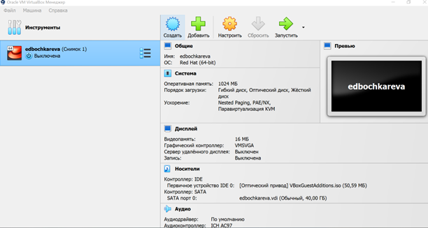

Рис.1: Рисунок 1

2.  Вхожу от имени пользователя edbochkareva. Ввожу пароль (рис.2).

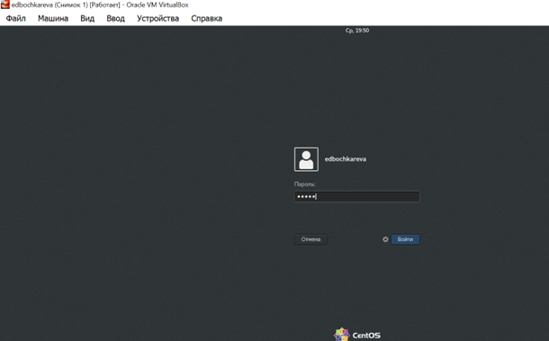

Рис.2: Рисунок 2

3.  **Устанавливаем MC в Sentos (рис.3).**

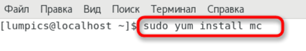

Рис.3: Рисунок 3

4.  Инсталляция пакета MC определенной версии **(рис.4).**

Данное действие выполняется от имени суперпользователя, поэтому
подтверждаем подлинность учетной записи, указываю пароль, получаю
уведомление о том, что начинается инсталляция пакета определенной
версии. Подтверждаю это, выбрав вариант **y**\\ и y.

Ожидаю завершения установки. Установка занимает больше одной минуты,
поскольку сам пакет занимает всего 1,7 мегабайт в сжатом состоянии и 5,6
после распаковки.

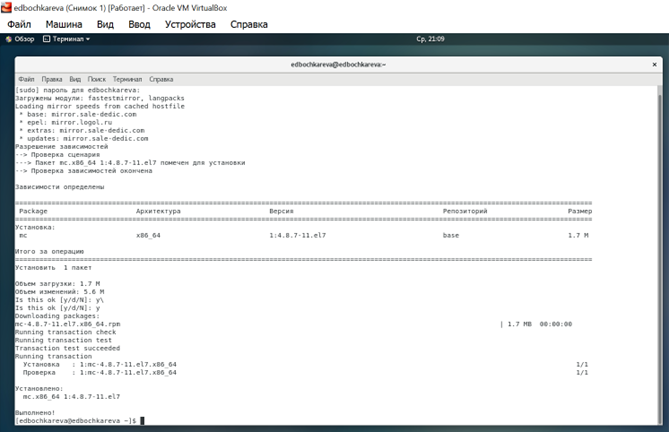

Рис.4: Рисунок 4

###### 5.2.5. Задание по mc: {#задание-по-mc .unnumbered}

## Пункт 1. Изучите информацию о mc, вызвав в командной строке man mc (рис.5). {#пункт-1.-изучите-информацию-о-mc-вызвав-в-командной-строке-man-mc-рис.5. .unnumbered}

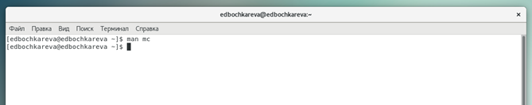

Рис.5: Рисунок 5

## 1.1. Изучаю информацию о mc: «Наименование», «Синтаксис», «Описание», «Ключи» (рис.6). {#изучаю-информацию-о-mc-наименование-синтаксис-описание-ключи-рис.6. .unnumbered}

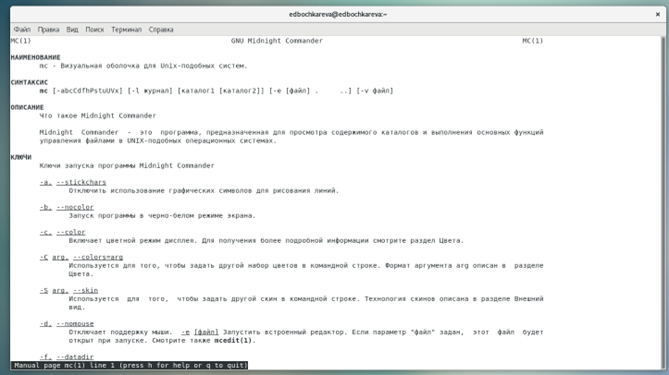

Рис.6: Рисунок 6

## 1.2. Изучаю информацию о mc: «Главное окно программы», «Поддержка мыши» (рис.7). {#изучаю-информацию-о-mc-главное-окно-программы-поддержка-мыши-рис.7. .unnumbered}


Рис.7: Рисунок 7

## 1.3. Изучаю информацию о mc: «Клавиатурные команды» (рис.8). {#изучаю-информацию-о-mc-клавиатурные-команды-рис.8. .unnumbered}

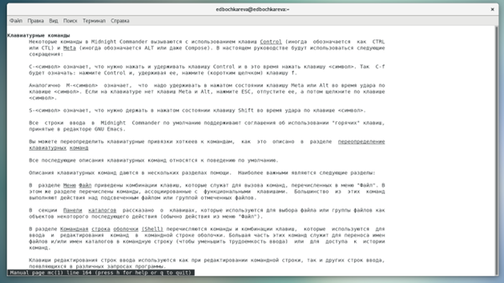

Рис.8: Рисунок 8

## 1.4. Изучаю информацию о mc: «Переопределение клавиатурных команд», «Разные команды» (рис.9). {#изучаю-информацию-о-mc-переопределение-клавиатурных-команд-разные-команды-рис.9. .unnumbered}

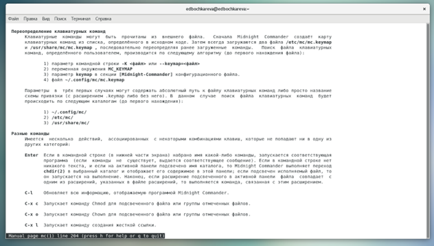

Рис.9: Рисунок 9

## 1.5. Изучаю информацию о mc: «Панели каталогов (1)» (рис.10). {#изучаю-информацию-о-mc-панели-каталогов-1-рис.10. .unnumbered}

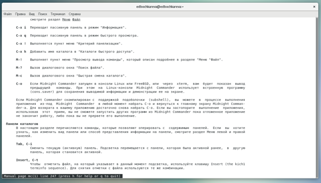

Рис.10: Ри сунок 10

## 1.6. Изучаю информацию о mc: «Панели каталогов(2)» (рис.11). {#изучаю-информацию-о-mc-панели-каталогов2-рис.11. .unnumbered}

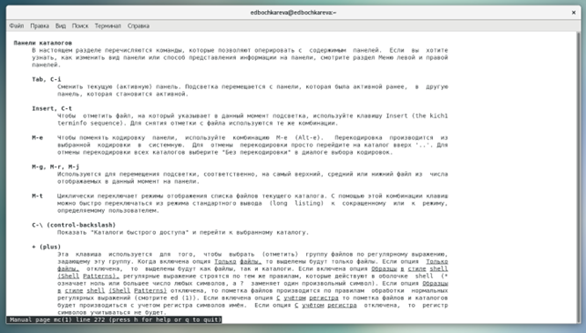

Рис.11: Рисунок 11

## 1.7. Изучаю информацию о mc: «Команды» (рис.12). {#изучаю-информацию-о-mc-команды-рис.12. .unnumbered}

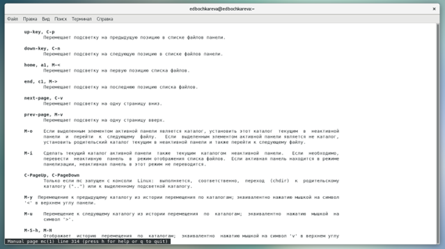

Рис.12: Рисунок 12

## 1.8. Изучаю информацию о mc: «Быстрый поиск», «Командная строка оболочки» (рис.13). {#изучаю-информацию-о-mc-быстрый-поиск-командная-строка-оболочки-рис.13. .unnumbered}

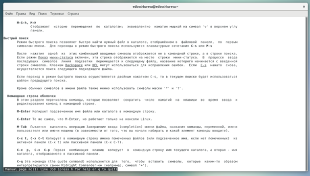

Рис.13: Рисунок 13

## 1.9. Изучаю информацию о mc: «Клавиши управления перемещением» (рис.14). {#изучаю-информацию-о-mc-клавиши-управления-перемещением-рис.14. .unnumbered}

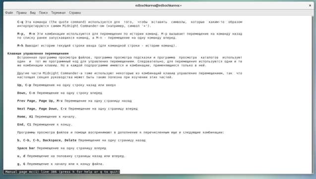

Рис.14: Рисунок 14

## 1.10. Изучаю информацию о mc: «Редактирование строк ввода» (рис.15). {#изучаю-информацию-о-mc-редактирование-строк-ввода-рис.15. .unnumbered}

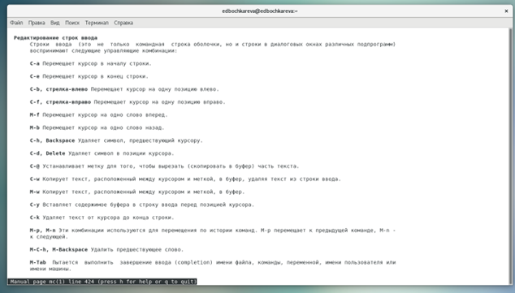

Рис.14: Рисунок 15

## 1.11. Изучаю информацию о mc: «Главное меню программы Midnight Commander», «Меню левой и правой панелей» (рис.16). {#изучаю-информацию-о-mc-главное-меню-программы-midnight-commander-меню-левой-и-правой-панелей-рис.16. .unnumbered}

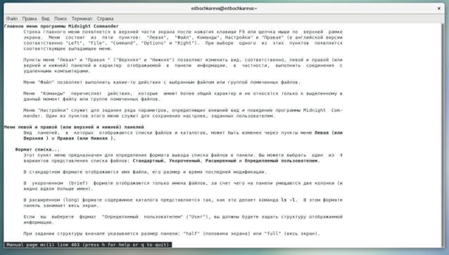

Рис.16: Рисунок 16

## 1.12. Изучаю информацию о mc: «Имена полей» (рис.17). {#изучаю-информацию-о-mc-имена-полей-рис.17. .unnumbered}

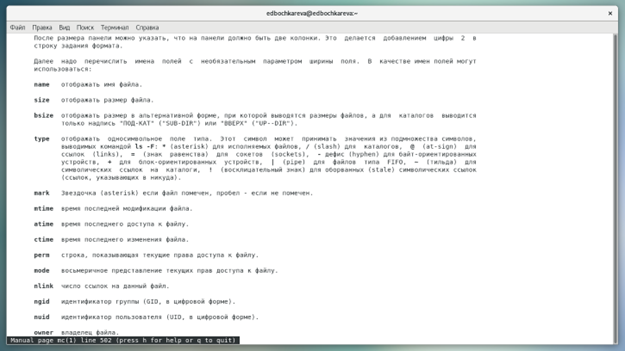

Рис.17: Рисунок 17

## 1.13. Изучаю информацию о mc: «Информация», «Дерево», «Порядок сортировки», «Быстрый просмотр» (рис.18). {#изучаю-информацию-о-mc-информация-дерево-порядок-сортировки-быстрый-просмотр-рис.18. .unnumbered}

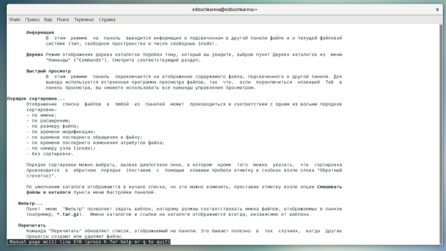

Рис.18: Рисунок 18

## 1.14. Изучаю информацию о mc: «Файл», «Просмотр файла», «Просмотр вывода команды», «Копирование», «Редактирование» (рис.19). {#изучаю-информацию-о-mc-файл-просмотр-файла-просмотр-вывода-команды-копирование-редактирование-рис.19. .unnumbered}

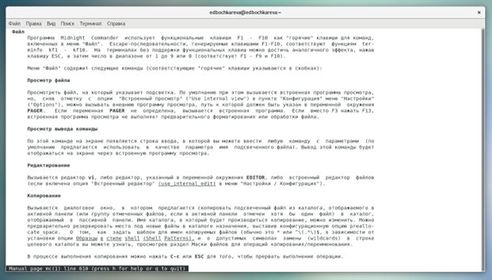

Рис.19: Рисунок 19

## 1.15. Изучаю информацию о mc: «Права доступа», «Жесткая ссылка», «Абсолютная символическая ссылка», «Относительная символическая ссылка» (рис.20). {#изучаю-информацию-о-mc-права-доступа-жесткая-ссылка-абсолютная-символическая-ссылка-относительная-символическая-ссылка-рис.20. .unnumbered}

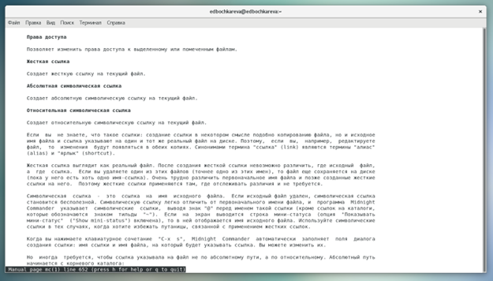

Рис.20: Рисунок 20

## 1.16. Изучаю информацию о mc: «Владелец/группа», «Права доступа», «Переименования», «Создание каталога», «Удаление», «Быстрая смена каталога», «Отметить группу» (рис.21). {#изучаю-информацию-о-mc-владелецгруппа-права-доступа-переименования-создание-каталога-удаление-быстрая-смена-каталога-отметить-группу-рис.21. .unnumbered}

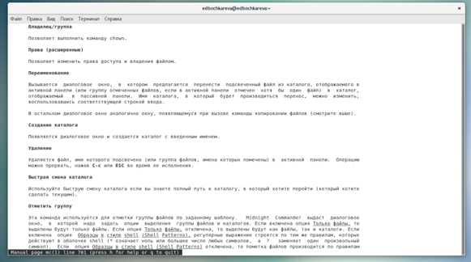

Рис.21: Рисунок 21

# Пункт 2. Запустите из командной строки mc, изучите его структуру и меню.  {#пункт-2.-запустите-из-командной-строки-mc-изучите-его-структуру-и-меню. .unnumbered}

Для запуска mc необходимо в командной строке набрать mc и нажать Enter.
Рабочее пространство mc имеет две панели, отображающие по умолчанию
списки файлов двух каталогов. Строка «Меню» появляется при нажатии F9
или при щелчке мышью в верхней строке экрана.

[]{#_Toc132980060 .anchor}**2.1. Строка «Меню» состоит из пяти подменю:
\"Left\", \"File\", \"Command\", \"Options\" и \"Right\".** Под панелями
внизу расположены управляющие экранные кнопки, ассоциированные с
функциональными клавишами F1 -- F10. Внешний вид экрана при работе с
Midnight Commander.

Рабочее пространство mc имеет две панели, отображающие по умолчанию
списки файлов двух каталогов.

Панель в mc отображает список файлов текущего каталога **(рис.22).**

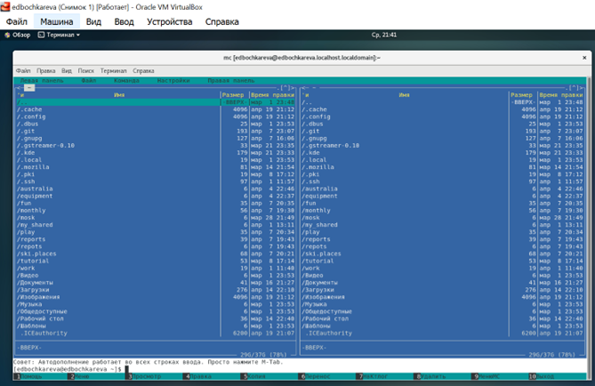

Рис.22: Рисунок 22

## 2.2. Меню «Файл». Выполнение команды «Просмотр файла» (рис.23). {#меню-файл.-выполнение-команды-просмотр-файла-рис.23. .unnumbered}

Меню содержит перечень команд, которые могут быть применены к одному или
нескольким файлам или каталогам.

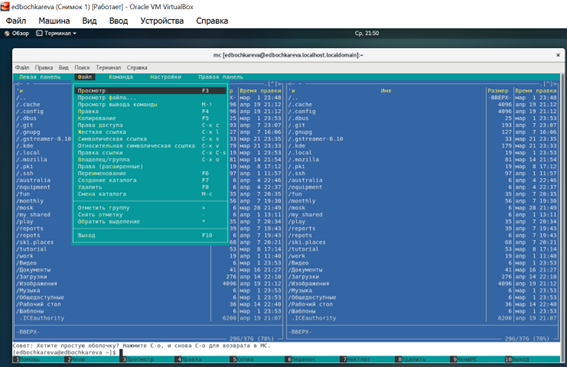

Рис.23: Рисунок 23

## 2.3. Меню «Команда» (рис.24). {#меню-команда-рис.24. .unnumbered}

**В меню «Команда»** содержатся более общие команды для работы с mc. В
меню Command содержатся более общие команды, которые никак не связаны с
текущим файлом или помеченной группой файлов **(рис.24).**

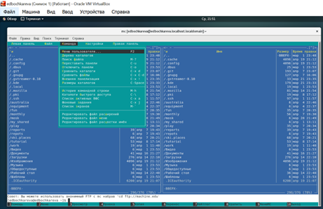

Рис.24: Рисунок 24

## 2.4. Меню «Настройки» (рис.25). {#меню-настройки-рис.25. .unnumbered}

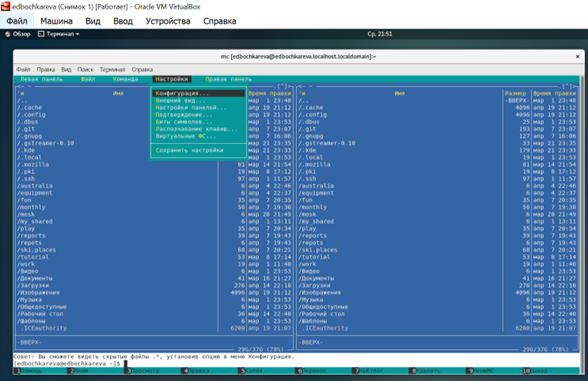

Рис.25: Рисунок 25

## 2.5. Демонстрация «Дерево каталога» (рис.26). {#демонстрация-дерево-каталога-рис.26. .unnumbered}

**Левая панель. Режим «Дерево». «Дерево»** -- демонстрация дерева
каталогов файловой системы.

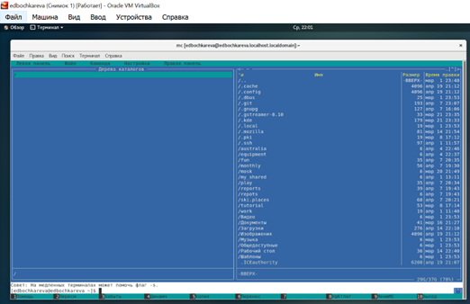

Рис.26: Рисунок 26

# Пункт 3. Выполните несколько операций в mc, используя управляющие клавиши (операции с панелями; выделение/отмена выделения файлов, копирование/перемещение файлов, получение информации о размере и правах доступа на файлы и/или каталоги и т.п.) {#пункт-3.-выполните-несколько-операций-в-mc-используя-управляющие-клавиши-операции-с-панелями-выделениеотмена-выделения-файлов-копированиеперемещение-файлов-получение-информации-о-размере-и-правах-доступа-на-файлы-иили-каталоги-и-т.п. .unnumbered}

#  {#section .unnumbered}

**Рассмотрим по ходу выполнения работы несколько операций в последующих
примерах.**

Например, меню File содержит следующие команды (в скобках даны
соответствующие им функциональные клавиши):

**Справка (F1)**

> Вызывает встроенный гипертекстовый вьюер помощи. Нажатие клавиши Tab
> приводит к выбору следующей ссылки, а Enter - к переходу по этой
> ссылке. Клавиши Space и Backspace позволяют перемещаться вперёд и
> назад. Для получения справки по используемым клавишам, нажмите F1 ещё
> раз.

**Меню (F2)**

> Вызывает меню пользователя. Оно позволяет создавать и добавлять
> дополнительные функции.

**Просмотр (F3, Shift-F3)**

> Показывает текущий файл. По умолчанию эта команда вызывает внутренний
> вьюер файлов. Если опция \"Use internal view\" не установлена, то
> вызывается внешний вьюер, указанный в переменной PAGER. Если эта
> переменная не определена, то вызывается команда \"view\". При нажатии
> Shift-F3, вьюер будет вызван без форматирования и предварительной
> обработки файла.

**Перенаправленный просмотр (A-!)**

> Эта функция запрашивает команду с параметрами (аргумент к текущему
> выбранному файлу) и результат перенаправляется во встроенный вюьер
> файлов.

**Редактирование (F4)**

> Обычно эта команда вызывает редактор \"vi\" или любой другой,
> указанный в переменной оболочки EDITOR.

**Копирование (F5)**

> Выдаёт диалоговое окно с каталогом назначения, которым по умолчанию
> принимается каталог неактивной панели, и копирует выделенный файл или
> группу помеченных файлов в каталог, указанный в этом окне. Копирование
> можно прервать в любой момент, нажав C-c или Escape. Для подробной
> информации по установке маски копируемых файлов (обычно \* или
> \^\\(.\*\\)\$, в зависимости от установки опции использования шаблонов
> оболочки) и возможных шаблонов каталога назначения см. команду
> копирование/переименование по маске.

# Пункт 4. Выполните основные команды меню левой (или правой) панели. Оцените степень подробности вывода информации о файлах. {#пункт-4.-выполните-основные-команды-меню-левой-или-правой-панели.-оцените-степень-подробности-вывода-информации-о-файлах. .unnumbered}

## 4.1. Меню Left. Список файлов (рис.27). {#меню-left.-список-файлов-рис.27. .unnumbered}

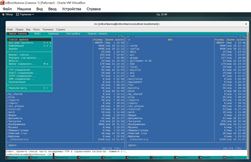

Рис.27: Рисунок 27

## 4.2. Меню «Список файлов». Просмотр информации после ввода команды (рис.28). {#меню-список-файлов.-просмотр-информации-после-ввода-команды-рис.28. .unnumbered}

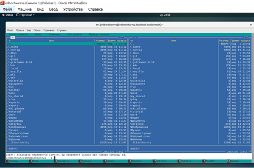

Рис.28: Рисунок 28

## 4.3. Меню «Левая панель». Демонстрация «Команда. Сравним каталоги» (рис.29). {#меню-левая-панель.-демонстрация-команда.-сравним-каталоги-рис.29. .unnumbered}

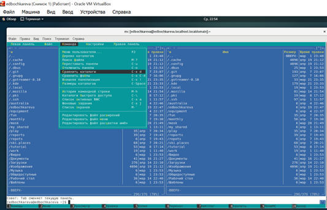

Рис.29: Рисунок 29

## 4.4. Меню «Левая панель». Демонстрация «Сравним каталоги по размеру» (рис.30). {#меню-левая-панель.-демонстрация-сравним-каталоги-по-размеру-рис.30. .unnumbered}


Рис.30: Рисунок 30

## 4.5. Меню «Правая панель». Демонстрация «Список файлов» (рис.31). {#меню-правая-панель.-демонстрация-список-файлов-рис.31. .unnumbered}

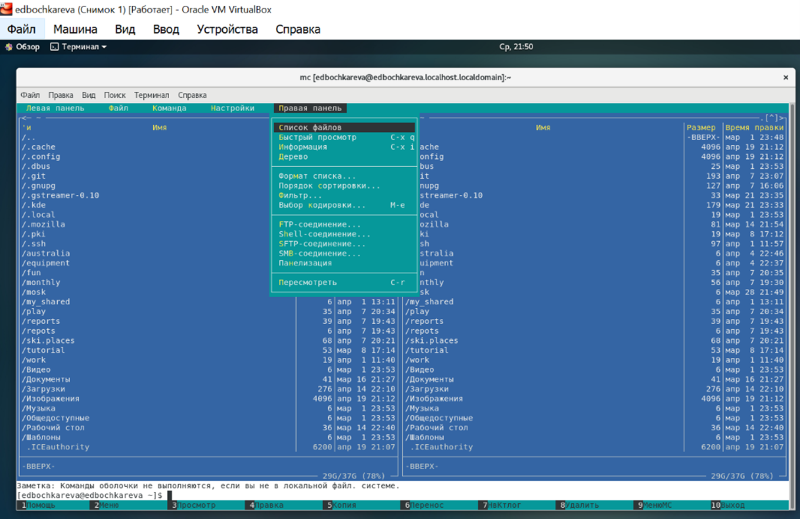

Рис.31: Рисунок 31

## 4.6. Левая панель. Демонстрация подпункта «Информация». Просмотр информации о файле или каталоге (рис.32).  {#левая-панель.-демонстрация-подпункта-информация.-просмотр-информации-о-файле-или-каталоге-рис.32. .unnumbered}

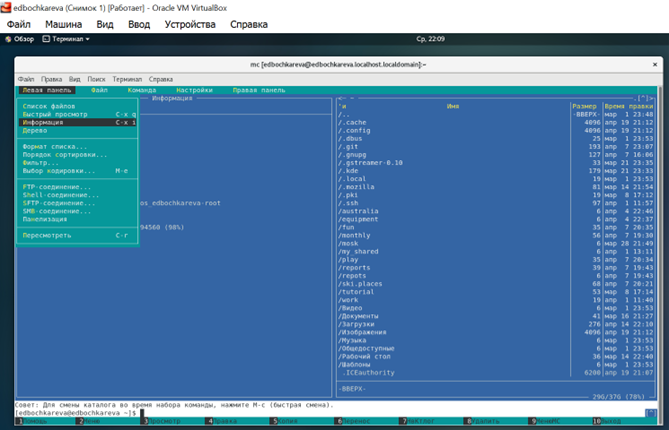

Рис.32: Рисунок 32

## 4.7. «Быстрый просмотр»: {#быстрый-просмотр .unnumbered}

## 4.7.1 Демонстрация режима меню «Информация» (рис.33). {#демонстрация-режима-меню-информация-рис.33. .unnumbered}

Подпункт меню «Быстрый просмотр» позволяет выполнить быстрый просмотр
содержимого панели.

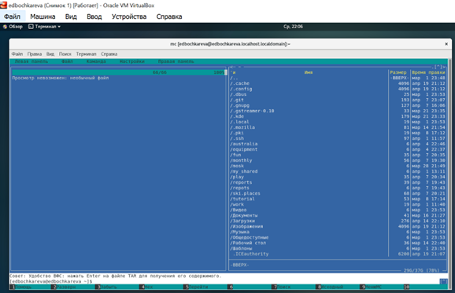

Рис.33: Рисунок 33

Быстрый просмотр -- это демонстрация содержимого файла или
информирование о том, «Просмотр невозможен: необычный файл».

## 4.8. Левая панель. Демонстрация «Порядок сортировки» (рис.34). {#левая-панель.-демонстрация-порядок-сортировки-рис.34. .unnumbered}

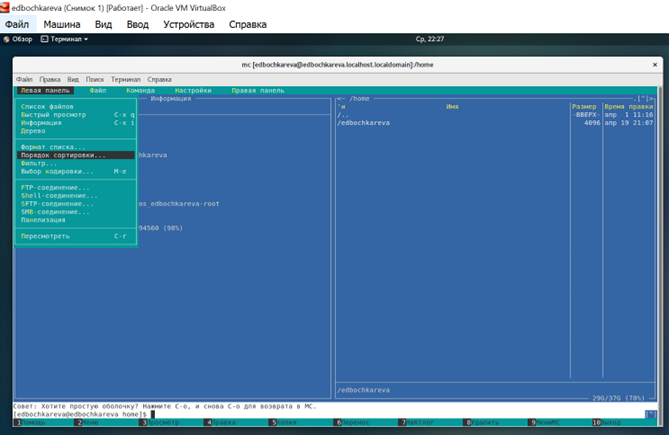

Рис.34: Рисунок 34

## 4.9 Левая панель. Подпункт «Порядок сортировки». Обзор выполнения команды после ввода клавиши Enter (рис.35).  {#левая-панель.-подпункт-порядок-сортировки.-обзор-выполнения-команды-после-ввода-клавиши-enter-рис.35. .unnumbered}

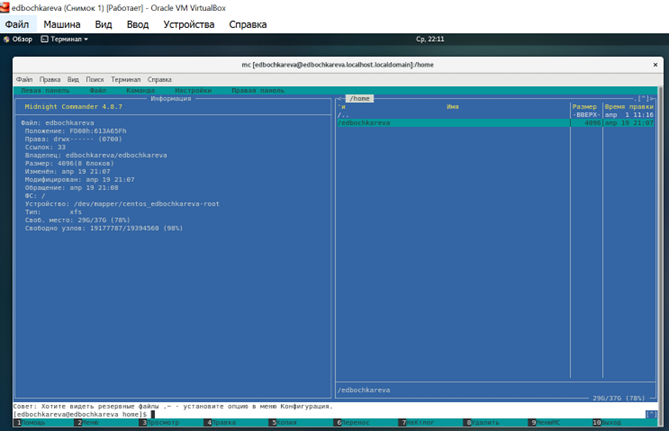

Рис.35: Рисунок 35

# Пункт 5. Используя возможности подменю «Файл», выполните:  {#пункт-5.-используя-возможности-подменю-файл-выполните .unnumbered}

#  {#section-1 .unnumbered}

## 5.1. Просмотр содержимого текстового файла. {#просмотр-содержимого-текстового-файла. .unnumbered}

## 5.1.1. Просмотр ( F3 ) --- позволяет посмотреть содержимое текущего (или выделенного) файла без возможности редактирования (рис.36). {#просмотр-f3-позволяет-посмотреть-содержимое-текущего-или-выделенного-файла-без-возможности-редактирования-рис.36. .unnumbered}

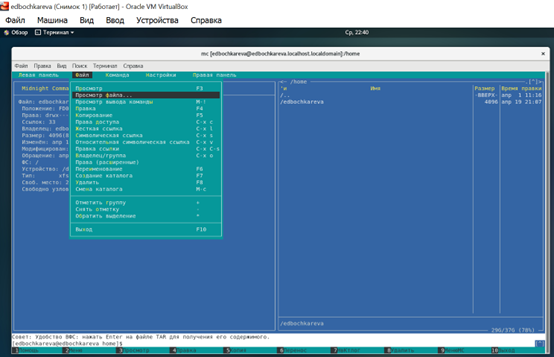

Рис.36: Рисунок 36

## 5.1.2. Просмотр файла после ввода команды «Enter» (рис.37). {#просмотр-файла-после-ввода-команды-enter-рис.37. .unnumbered}

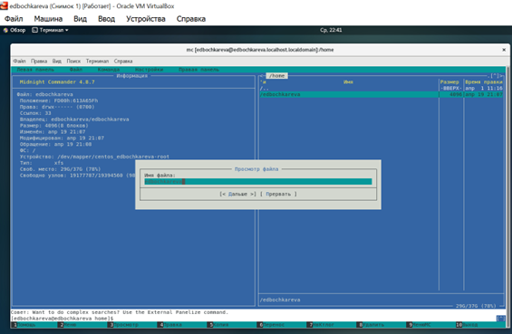

Рис.37: Рисунок 37

## 5.1.3. Просмотр файла после ввода команды «Enter». «Просмотр невозможен: необычный файл» (рис.38). {#просмотр-файла-после-ввода-команды-enter.-просмотр-невозможен-необычный-файл-рис.38. .unnumbered}

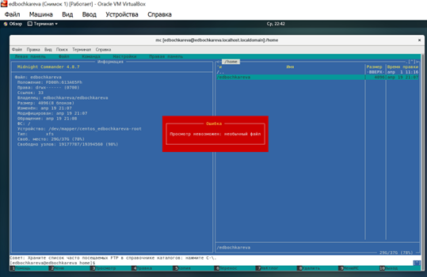

Рис.38: Рисунок 38

## 5.1.4. Редактирование содержимого текстового файла (без сохранения результатов редактирования) (рис.39). {#редактирование-содержимого-текстового-файла-без-сохранения-результатов-редактирования-рис.39. .unnumbered}

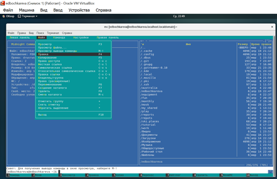

Рис.39: Рисунок 39

## 5.1.5. Создание каталога (рис.40). {#создание-каталога-рис.40. .unnumbered}

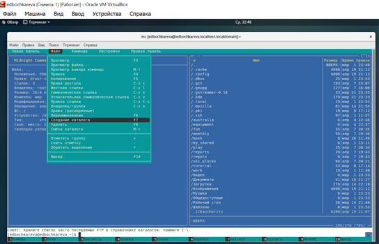

Рис.40: Рисунок 40

## 5.1.6. Создание каталога. Вводим имя каталога (рис.41). {#создание-каталога.-вводим-имя-каталога-рис.41. .unnumbered}

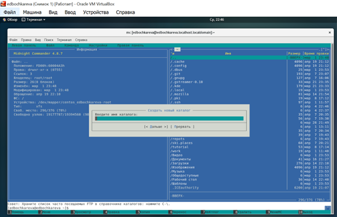

Рис.41: Рисунок 41

## 5.1.7. Создание каталога «edbochkareva» (рис.42). {#создание-каталога-edbochkareva-рис.42. .unnumbered}

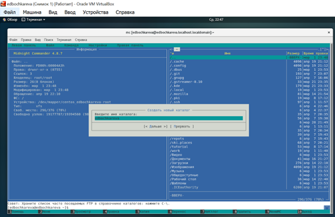

Рис.42: Рисунок 42

## 5.1.8. Просмотр пути каталога «edbochkareva» (рис.43). {#просмотр-пути-каталога-edbochkareva-рис.43. .unnumbered}

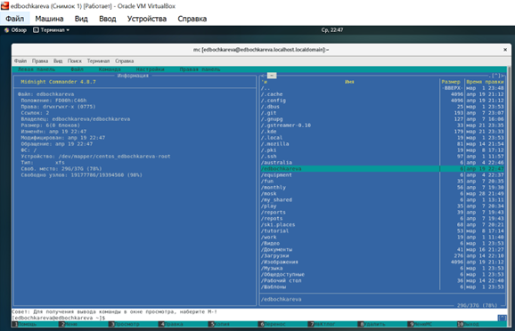

Рис.43: Рисунок 43

## 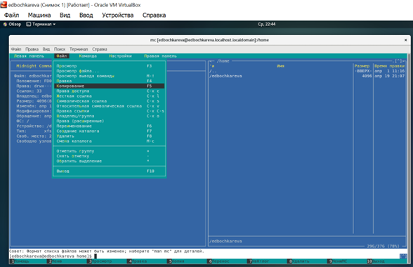

Рис.44: Рисунок 44

## 5.1.10. Демонстрация хода работы. Копирование в файлов в созданный каталог (рис.45) {#демонстрация-хода-работы.-копирование-в-файлов-в-созданный-каталог-рис.45 .unnumbered}

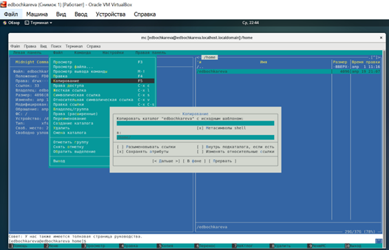

Рис.45: Рисунок 45

## 5.1.11. Демонстрация хода работы. Копирование файлов в созданный каталог (рис.46) {#демонстрация-хода-работы.-копирование-файлов-в-созданный-каталог-рис.46 .unnumbered}

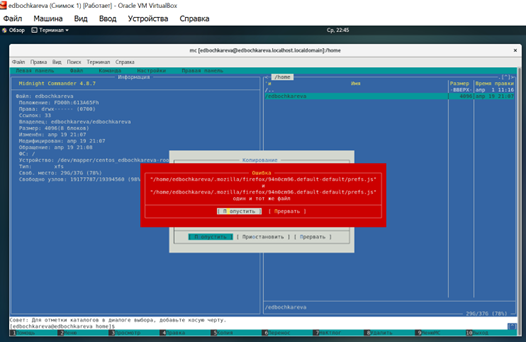

Рис.46: Рисунок 46

# Пункт 6. С помощью соответствующих средств подменю «Команда» осуществите:  {#пункт-6.-с-помощью-соответствующих-средств-подменю-команда-осуществите .unnumbered}

## 6.1. Поиск в файловой системе файла с заданными условиями (рис.47). {#поиск-в-файловой-системе-файла-с-заданными-условиями-рис.47. .unnumbered}

**(например, файла с расширением .c или .cpp, содержащего строку main)**

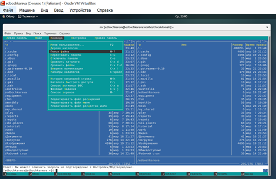

Рис.47: Рисунок 47

## 6.2. Поиск в файловой системе файла с заданными условиями «Шаблон имени», «Содержимое» (рис.48) {#поиск-в-файловой-системе-файла-с-заданными-условиями-шаблон-имени-содержимое-рис.48 .unnumbered}

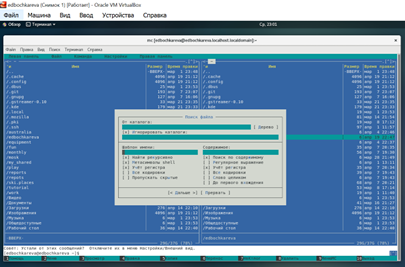

Рис.48: Рисунок 48

## 6.3. Вводим информацию с заданными условиями: «От каталога», «Шаблон имени», «Содержимое» (рис.49) {#вводим-информацию-с-заданными-условиями-от-каталога-шаблон-имени-содержимое-рис.49 .unnumbered}

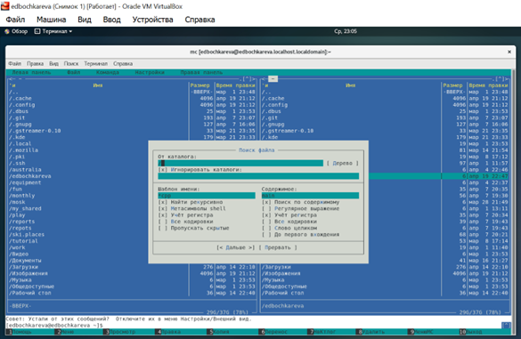

Рис.49: Рисунок 49

## 6.4. Демонстрация экрана по факту введения информации с заданными условиями: «От каталога», «Шаблон имени», «Содержимое» (рис.50) {#демонстрация-экрана-по-факту-введения-информации-с-заданными-условиями-от-каталога-шаблон-имени-содержимое-рис.50 .unnumbered}

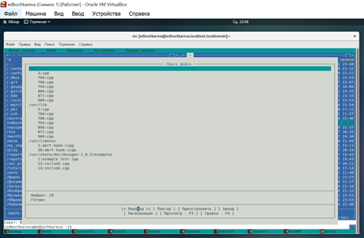

Рис.50: Рисунок 50

## 6.5. Осуществляем «Переход в каталог» (рис.51) {#осуществляем-переход-в-каталог-рис.51 .unnumbered}

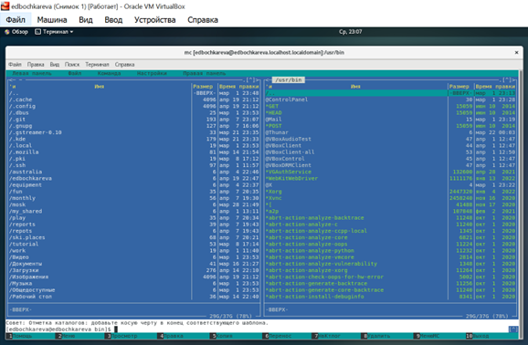

Рис.51: Рисунок 51

## 6.6. Выбор и повторение одной из предыдущих команд (рис.52). {#выбор-и-повторение-одной-из-предыдущих-команд-рис.52. .unnumbered}

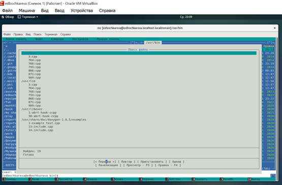

Рис.52: Рисунок 52

## 6.7. Выбор и повторение одной из предыдущих команд (рис.53). {#выбор-и-повторение-одной-из-предыдущих-команд-рис.53. .unnumbered}

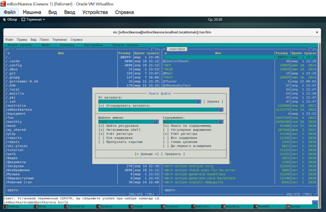

Рис.53: Рисунок 53

## 6.8. Осуществляем «Переход в домашний каталог» (рис.54). {#осуществляем-переход-в-домашний-каталог-рис.54. .unnumbered}

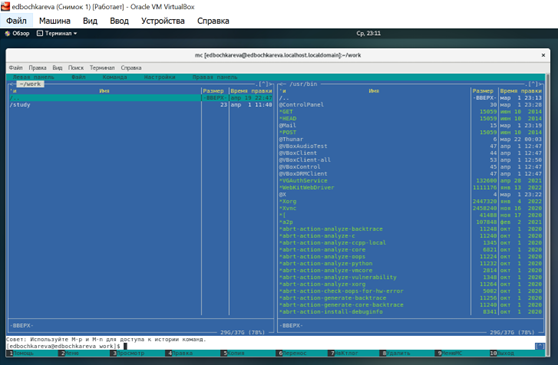

Рис.54: Рисунок 54

## 6.9. Анализ файла меню и файла расширений (рис.55). {#анализ-файла-меню-и-файла-расширений-рис.55. .unnumbered}

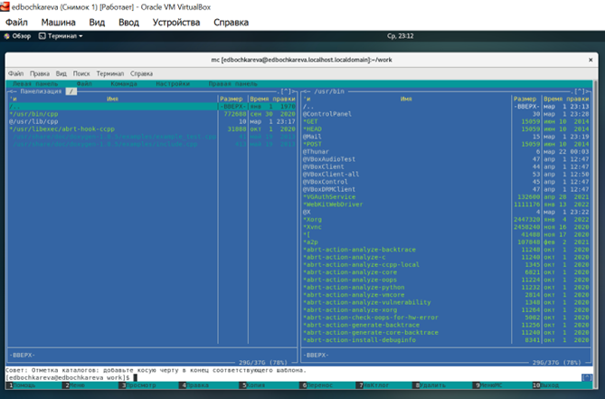

Рис.5: Рисунок 55

# Пункт 7. Вызовите подменю «Настройки». Освойте операции, определяющие структуру экрана mc (Full screen, Show Hidden Files и т.д.)  {#пункт-7.-вызовите-подменю-настройки.-освойте-операции-определяющие-структуру-экрана-mc-full-screen-show-hidden-files-и-т.д. .unnumbered}

**Полноэкранный режим (full screen)** --- режим работы программы, в
котором она отображается на весь экран устройства. Вспомогательные
элементы, элементы управления самой программы и операционной системы при
этом не видны.

## 7.1. Демонстрация экрана «Внешний вид» (рис.56). {#демонстрация-экрана-внешний-вид-рис.56. .unnumbered}

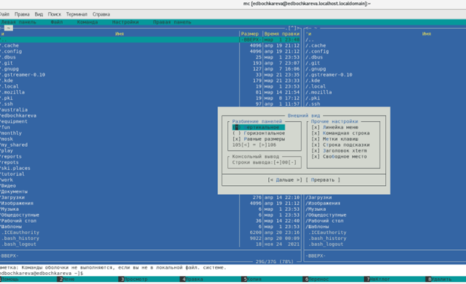

Рис.56: Рисунок 56

## 7.2. «Настройки. Конфигурации» (рис.57).  {#настройки.-конфигурации-рис.57. .unnumbered}

##  {#section-2 .unnumbered}

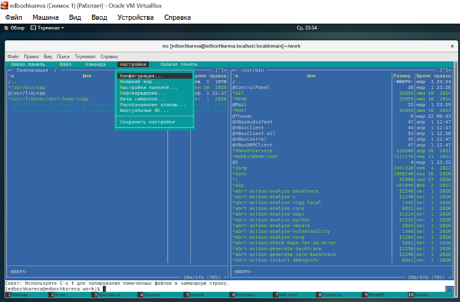

Рис.57: Рисунок 57

## 7.3. Демонстрация экрана «Настройки. Параметры конфигурации» (рис.58). {#демонстрация-экрана-настройки.-параметры-конфигурации-рис.58. .unnumbered}

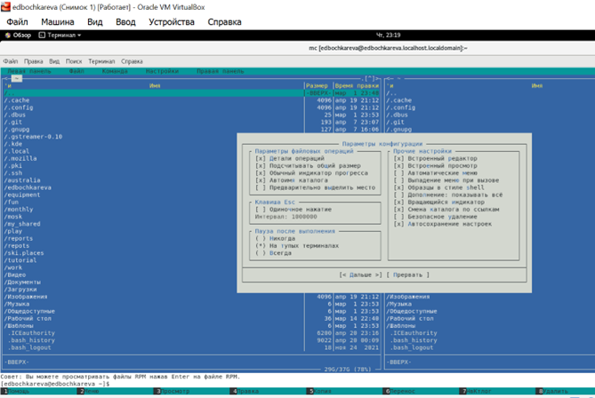

Рис.58: Рисунок 58

**7.4. Определение настроек структуры экрана (рис.59).**

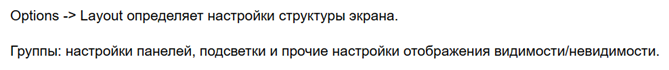

Рис.59: Рисунок 59

## 7.5. Демонстрация выполнения команды «Layout» (рис.60). {#демонстрация-выполнения-команды-layout-рис.60. .unnumbered}

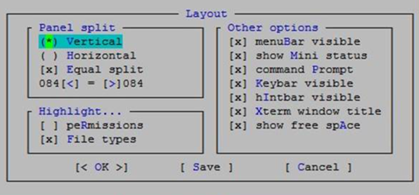

Рис.60: Рисунок 60

###### 5.2.6. Задание по встроенному редактору mc. {#задание-по-встроенному-редактору-mc. .unnumbered}

#  {#section-3 .unnumbered}

# Пункт 1. Создайте текстовой файл text.txt.  {#пункт-1.-создайте-текстовой-файл-text.txt. .unnumbered}

#  {#section-4 .unnumbered}

## Создать текстовый файл (рис.61).

MC имеет свой редактор для создания текстовых файлов, их просмотра и
редактирования**. Для создания текстовых файлов, необходимо открыть
текстовый редактор в режиме редактирования нажатием комбинации
клавиш Shift+F4.**

Для того, чтобы создать текстовый файл, нажимаю комбинацию клавиш
Shitf-F4, открывается **окно для создания текстового файла.**

При помощи команды F2 файл сохраняю на диске **(рис.61).**

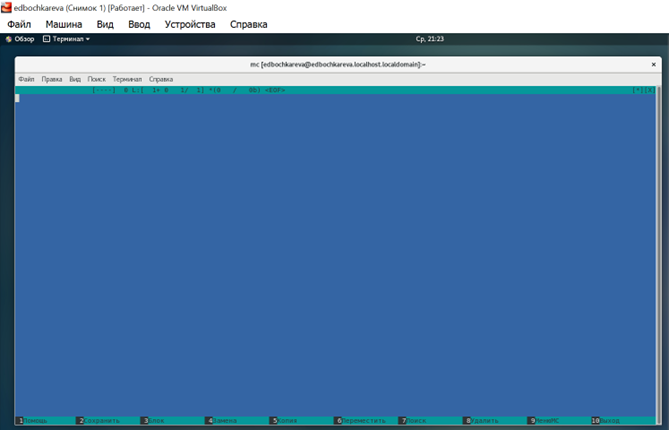

Рис.61: Рисунок 61

## 1.2. Текстовый редактор mc можно вызвать независимо от Midnight Commander просто из командной строки командой mcedit. Пример (рис.62). {#текстовый-редактор-mc-можно-вызвать-независимо-от-midnight-commander-просто-из-командной-строки-командой-mcedit.-пример-рис.62. .unnumbered}

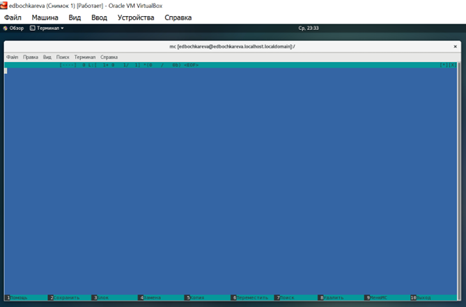

Рис.62: Рисунок 62

## «Файл. Новый» (рис.63).

**Для того, чтобы узнать, какие клавиши вызывают выполнение определенных
действий, достаточно просмотреть выпадающие меню, вызываемые нажатием
клавиши ‹F9› в окне редактора. Открываю**

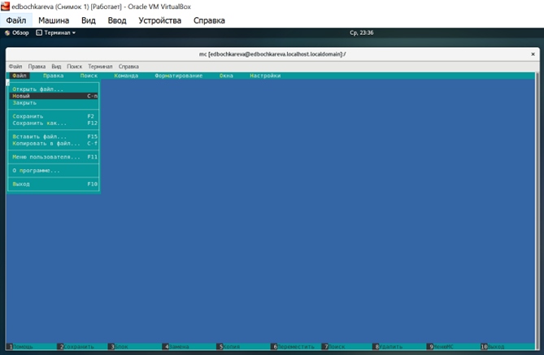

Рис.63: Рисунок 63

## 1.4.Нажимаем кнопку «Сохранить» и вводим имя текстового файла tet.txt. Нажимаю «Изменить окончания строк на: не изменять» (рис.64). {#нажимаем-кнопку-сохранить-и-вводим-имя-текстового-файла-tet.txt.-нажимаю-изменить-окончания-строк-на-не-изменять-рис.64. .unnumbered}

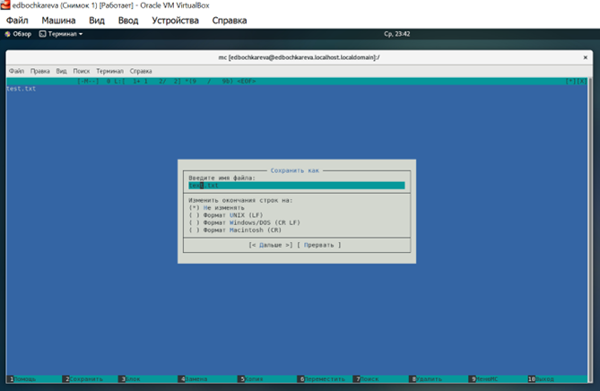

Рис.64: Рисунок 64

## 1.5.Нажимаю «Файл. Сохранить как\...» (рис.65). {#нажимаю-файл.-сохранить-как...-рис.65. .unnumbered}

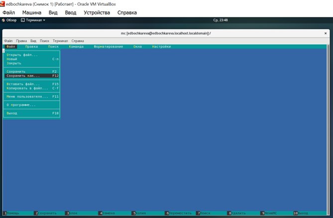

Рис.65: Рисунок 65

# Пункт 2. Откройте этот файл с помощью встроенного в mc редактора (рис.66).  {#пункт-2.-откройте-этот-файл-с-помощью-встроенного-в-mc-редактора-рис.66. .unnumbered}

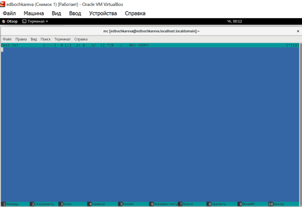

Рис.66: Рисунок 66

# Пункт 3. Вставьте в открытый файл небольшой фрагмент текста, скопированный из любого другого файла или Интернета. {#пункт-3.-вставьте-в-открытый-файл-небольшой-фрагмент-текста-скопированный-из-любого-другого-файла-или-интернета. .unnumbered}

#  {#section-5 .unnumbered}

## 3.1.Открываю браузер Firefox. Выбираю любой текст на свое усмотрение (рис.67). {#открываю-браузер-firefox.-выбираю-любой-текст-на-свое-усмотрение-рис.67. .unnumbered}

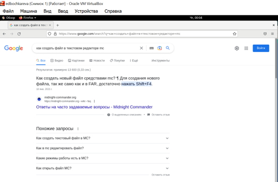

Рис.67: Рисунок 67

## 3.2. Скопировать текст, предварительно был открыт браузер Firefox (рис.68). {#скопировать-текст-предварительно-был-открыт-браузер-firefox-рис.68. .unnumbered}

Для того, **чтобы скопировать текст**, предварительно был открыт браузер
Firefox, с одной страницы был скопирован абзац текста с заголовком и
вставлен в редакторе mc **при помощи комбинации клавиш Shift-Insert
(рис.68).**

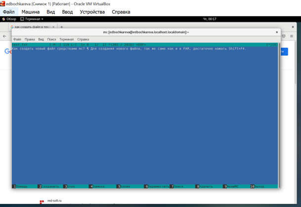

Рис.68: Рисунок 68

# Пункт 4. Проделайте с текстом следующие манипуляции, используя горячие клавиши:  {#пункт-4.-проделайте-с-текстом-следующие-манипуляции-используя-горячие-клавиши .unnumbered}

#  {#section-6 .unnumbered}

## 4.1. Удалите строку текста.  {#удалите-строку-текста. .unnumbered}

Строка текста была выделена при помощи клавиш F3 (в начале и конце
строки), после чего была нажата клавиша F8. Также можно было бы удалить
строку при помощи комбинации клавиш Ctrl-y.

## 4.1.1. Пример текста до удаления строки (рис.69). {#пример-текста-до-удаления-строки-рис.69. .unnumbered}

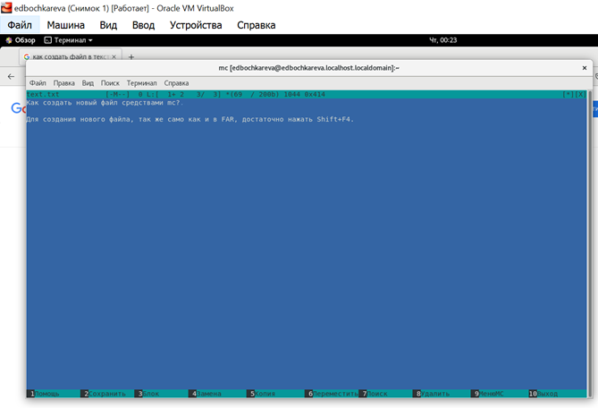

Рис.69: Рисунок 69

## 4.1.2. Пример текста после удаления строки (рис.70). {#пример-текста-после-удаления-строки-рис.70. .unnumbered}

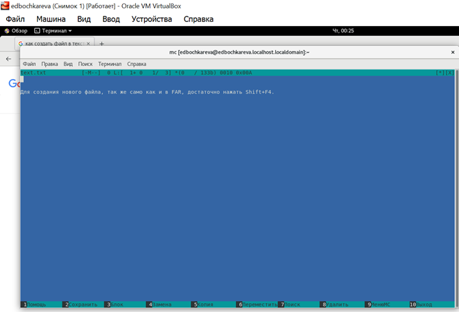

Рис.70: Рисунок 70

## 4.2. Выделите фрагмент текста и скопируйте его на новую строку.  {#выделите-фрагмент-текста-и-скопируйте-его-на-новую-строку. .unnumbered}

### 4.2.1. Нажимаю в меню «Правка», «Копировать блок» (рис.71). {#нажимаю-в-меню-правка-копировать-блок-рис.71. .unnumbered}


Рис.71: Рисунок 71

### 4.2.2. Демонстрация экрана после выполнения команды «Копировать блок» (рис.72). {#демонстрация-экрана-после-выполнения-команды-копировать-блок-рис.72. .unnumbered}

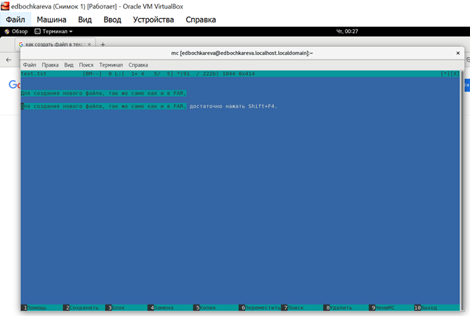

Рис.72: Рисунок 72

## 4.3. Выделите фрагмент текста и перенесите его на новую строку.  {#выделите-фрагмент-текста-и-перенесите-его-на-новую-строку. .unnumbered}

## 4.3.1. При помощи клавиши F3 были отмечены начало и конец предложения (рис.73). {#при-помощи-клавиши-f3-были-отмечены-начало-и-конец-предложения-рис.73. .unnumbered}

Далее курсор был перемещён на следующую строку, и была нажата клавиша
F5, что означает копирование выделенного текста.

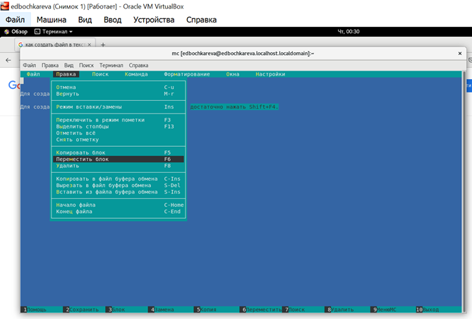

Рис.73: Рисунок 73

### 4.3.2. Демонстрация экрана после перенесения текста на новую строку (рис.74). {#демонстрация-экрана-после-перенесения-текста-на-новую-строку-рис.74. .unnumbered}

При помощи клавиши F3 были отмечены начало и конец предложения, далее
курсор был перемещён на следующую строку, и была нажата клавиша F6, что
означает перенос выделенного текста.

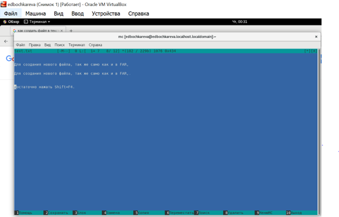

Рис.74: Рисунок 74

## 4.4. Сохраните файл.  {#сохраните-файл. .unnumbered}

Для сохранения файла была нажата клавиша F2.

## 4.5. Отмените последнее действие.  {#отмените-последнее-действие. .unnumbered}

Для отмены последнего действия (это был перенос текста) была нажата
**комбинация клавиш Ctrl-u (рис.75).**

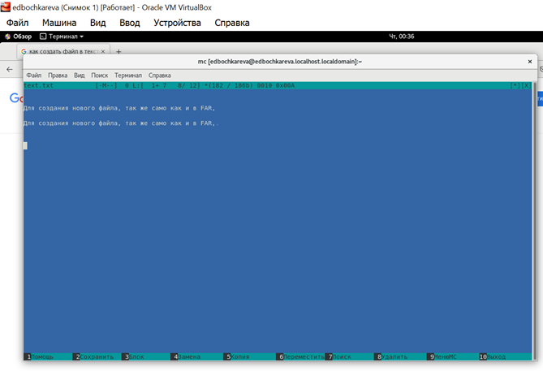

Рис.75: Рисунок 75

## 4.6. Перейдите в конец файла (нажав комбинацию клавиш) и напишите некоторый текст. {#перейдите-в-конец-файла-нажав-комбинацию-клавиш-и-напишите-некоторый-текст. .unnumbered}

### 4.6.1. Меню «Правка. Конец файла» (рис.76). {#меню-правка.-конец-файла-рис.76. .unnumbered}

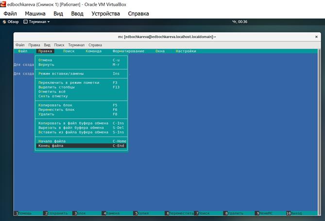

Рис.76: Рисунок 76

### 4.6.2. При помощи комбинации Ctrl-End был осуществлён переход в конец файла и был введён текст \"Конец текста\" (рис.77). {#при-помощи-комбинации-ctrl-end-был-осуществлён-переход-в-конец-файла-и-был-введён-текст-конец-текста-рис.77. .unnumbered}

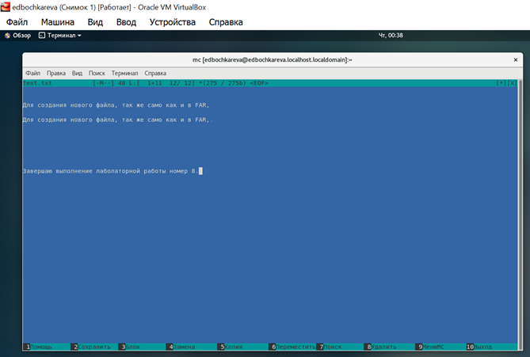

Рис.77: Рисунок 77

## 4.7. Перейдите в начало файла (нажав комбинацию клавиш) и напишите некоторый текст.  {#перейдите-в-начало-файла-нажав-комбинацию-клавиш-и-напишите-некоторый-текст. .unnumbered}

### 4.7.1. «Правка. Начало файла» (рис.78). {#правка.-начало-файла-рис.78. .unnumbered}

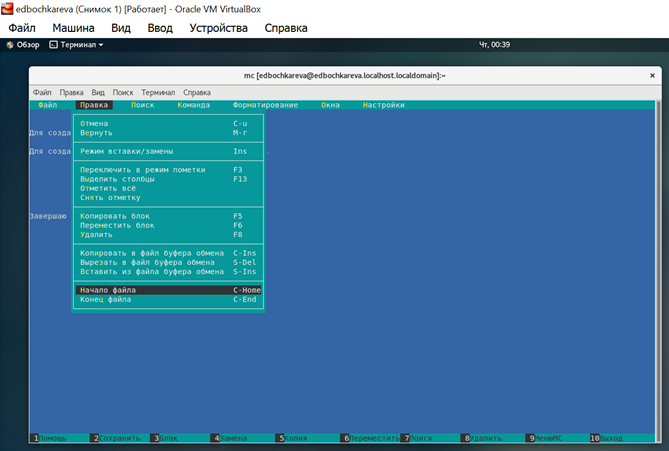

Рис.78: Рисунок 78

#### 4.7.1.1. При помощи комбинации Ctrl-Home был осуществлён переход в начало файла и был введён текст \"Начало текста\" (рис.79). {#при-помощи-комбинации-ctrl-home-был-осуществлён-переход-в-начало-файла-и-был-введён-текст-начало-текста-рис.79. .unnumbered}

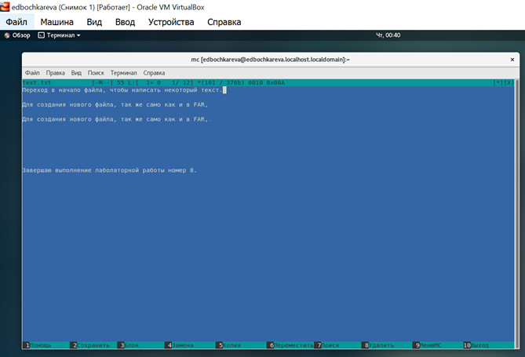

Рис.79: Рисунок 79

## 4.8. Сохраните и закройте файл.  {#сохраните-и-закройте-файл. .unnumbered}

**Для сохранения файла была нажата клавиша F2. Или нажимаем «Сохранить»
(рис.80).**

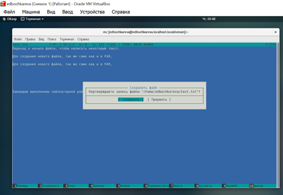

Рис.80: Рисунок 80

### 4.8.1. Далее, для выхода из редактора, дважды была нажата клавиша Es (рис.81). {#далее-для-выхода-из-редактора-дважды-была-нажата-клавиша-es-рис.81. .unnumbered}

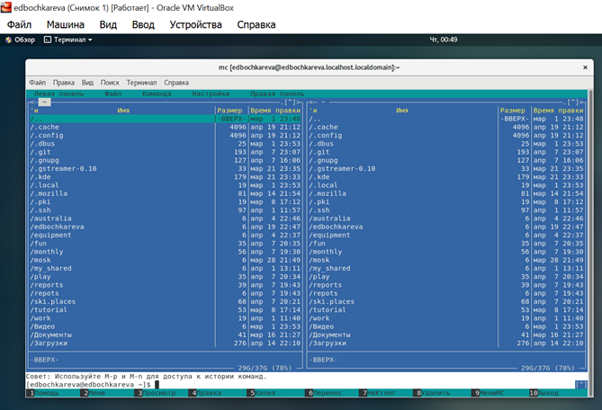

Рис.81: Рисунок 81

# Пункт 5. Откройте файл с исходным текстом на некотором языке программирования (например C или Java). {#пункт-5.-откройте-файл-с-исходным-текстом-на-некотором-языке-программирования-например-c-или-java. .unnumbered}

#  {#section-7 .unnumbered}

## 5.1. Клавишами «Вверх» и «Вниз» был выбран каталог «edbochkareva» (рис.82). {#клавишами-вверх-и-вниз-был-выбран-каталог-edbochkareva-рис.82. .unnumbered}

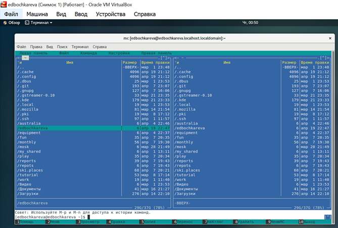

Рис.82: Рисунок 82

## 5.2. Клавишей «Enter» был осуществлён переход в каталог «edbochkareva» (рис.83). {#клавишей-enter-был-осуществлён-переход-в-каталог-edbochkareva-рис.83. .unnumbered}

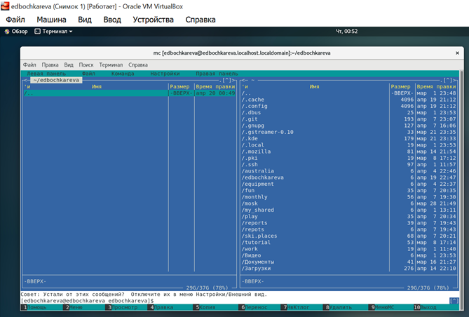

Рис.83: Рисунок 83

## 5.3. Далее там можно создать файл «app.cpp» на языке C++ и открыть при помощи команды F4 (рис.84). {#далее-там-можно-создать-файл-app.cpp-на-языке-c-и-открыть-при-помощи-команды-f4-рис.84. .unnumbered}

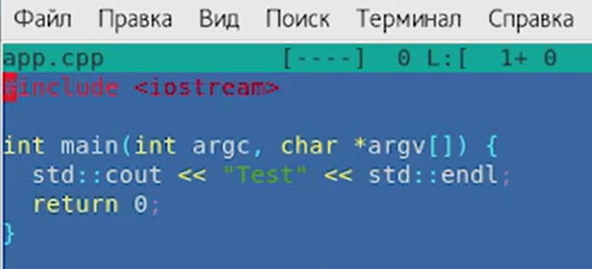

Рис.84: Рисунок 84

# Пункт 6. Используя меню редактора, включите подсветку синтаксиса, если она не включена, или выключите, если она включена. {#пункт-6.-используя-меню-редактора-включите-подсветку-синтаксиса-если-она-не-включена-или-выключите-если-она-включена. .unnumbered}

#  {#section-8 .unnumbered}

## 6.1. Выбираем пункт \"Настройки\" (рис.85). {#выбираем-пункт-настройки-рис.85. .unnumbered}

После нажатия на клавишу «Enter», открывается «Выпадающее меню «Вверх» и
«Вниз» **(рис.85).**

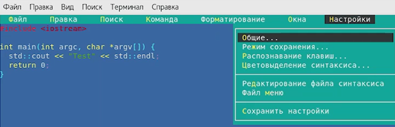

Рис.85: Рисунок 85

## 6.2. «Выбор цветовыделения синтаксиса (1 шаг)» (рис.86). {#выбор-цветовыделения-синтаксиса-1-шаг-рис.86. .unnumbered}

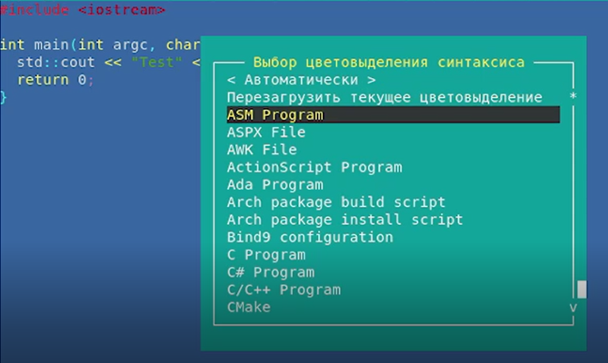

Рис.86: Рисунок 86

## 6.3. «Выбор цветовыделения синтаксиса (2 шаг)» (рис.87). {#выбор-цветовыделения-синтаксиса-2-шаг-рис.87. .unnumbered}

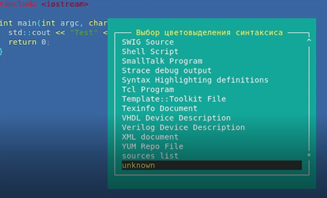

Рис.87: Рисунок 87

## 6.4. «Цветовыделение синтаксиса» (рис.88). {#цветовыделение-синтаксиса-рис.88. .unnumbered}

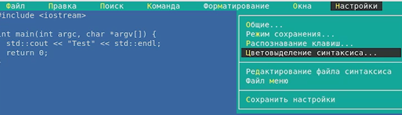

Рис.88: Рисунок 88

## 6.5. Демонстрация экрана после выполнения команды «Выбор цветовыделения синтаксиса» (рис.89). {#демонстрация-экрана-после-выполнения-команды-выбор-цветовыделения-синтаксиса-рис.89. .unnumbered}

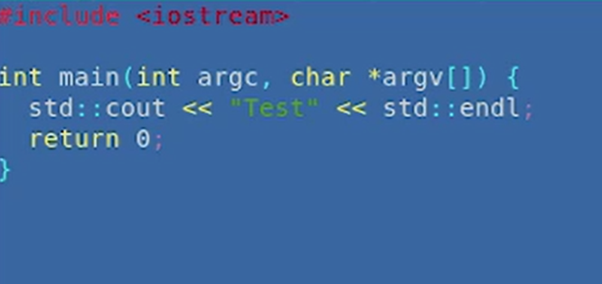

Рис.89: Рисунок 89

##### Ответы на контрольные вопросы: {#ответы-на-контрольные-вопросы .unnumbered}

> **1. Какие режимы работы есть в mc. Охарактеризуйте их.**

**Ответ:** При запуске программы mc открываются две панели,
предназначенные для перемещения по файловой системе и для осуществления
операций с файлами, типа копирования, удаления, открытия. Также панель
может быть настроена на показ содержимого выбранного в другой панели
файла. Кроме того, mc содержит встроенные редактор и просмотрщик файлов.
Также в mc можно скрыть панели, при помощи комбинации клавиш Ctrl-o.
**Существует четыре таких режима: Full, Brief, Long и User.**

1.  **Какие операции с файлами можно выполнить как с помощью команд
    shell, так и с помощью меню (комбинаций клавиш) mc? Приведите
    несколько примеров.**

**Ответ:** **Linux Shell --- это программа, которая также известна как
CLI (англ. Command Line Interface).** Она **передает команды от
пользователя операционной системы и отображает выходные данные, если
таковые имеются.**

При помощи команд оболочки и при помощи mc можно осуществлять, например,
следующие операции: **1) создание файла** (команда оболочки \"touch
file.txt\" или комбинация клавиш Shift-F4 в mc); **2) удаление файла**
(команда оболочки \"rm file.txt\" или клавиша F8 при выбранном в
соответствующей панели файле в mc); **3)** **переименование/перенос
файла** (команда оболочки \"mv file.txt file1.txt\" или клавиша F6 в
mc); **4) просмотр файла** (команда \"less file.txt\" или клавиша F3 в
mc).

**Примеры:**

Чтобы увидеть содержимое каталога используйте команду **ls**:

roo@server:\~# ls

mybase.sql

Downloads

site.zip

Использование команды **ls** с параметром **-a** позволит увидеть
скрытые файлы:

root@server:\~# ls -a

.htaccess

mybase.sql

Downloads

site.zip

Если же мы хотим создать файл с некоторым содержимым, воспользуемся
командой **echo**:

root@server:\~# echo Hello, my name is Linux \>\> readme.txt

Данная строка создаст файл readme.txt, содержащий строку Hello, my name
is Linux.

Для просмотра содержимого файла используем команду **cat**:

root@server:\~# cat readme.txt\
Hello, my name is Linux

Для просмотра файлов также можно использовать следующие команды:

**more** --- постраничный просмотр содержимого;\
**less** --- то же самое, но с возможностью пролистывания вверх-вниз;\
**head** --- покажет первые десять строк файла;\
**tail** --- покажет последние десять строк.

Также может понадобится создать каталог, для чего есть
команда **mkdir**:

root@server:\~# mkdir backups

Для удаления каталога существует команда **rmdir**. Она удалит каталог,
если он пуст:

root@server:\~# rmdir backups

Для рекурсивного удаления каталогов и файлов в них используйте
команду **rm**:

root@server:\~# rm -rf backups

удалит каталог backups, все файлы и каталоги в нем;

root@server:\~# rm readme.txt

удалит файл readme.txt.

Чтобы скопировать файлы применим команду **cp**. В формате **cp** "что
копировать"-"куда копировать":

root@server:\~# cp readme.txt backups

Для того, чтобы переместить файл, используем команду **mv**:

root@server:\~# mv readme.txt backups

Также **с помощью этой команды можно переименовать файл:**

root@server:\~# mv readme.txt readme.old

**Sudo **(англ. substitute user and do) --- это утилита, позволяющая
запускать команды от имени другого пользователя:

root@server:\~\$ sudo -iroot@server:\~\$

Она запустит Shell от имени суперпользователя
root. **Sudo** используется при необходимости запустить команду с
правами суперпользователя:

root@server:\~\$ sudo nano /etc/ssh/sshd_config

Данная строка откроет с правами администратора файл sshd_config в
текстовом редакторе nano.

Также могут возникать задачи, когда необходимо сменить владельца файла.
В этом случае на помощь придет команда **chown**:

root@server:\~# chown -R www-data:www-data /var/www/html/mysite.com

2.  **Опишите структуру меню левой (или правой) панели mc, дайте
    характеристику командам.**

**Ответ:** **В меню панели:**

1.  **Первая группа пунктов определяет назначение другой панели**
    (просмотр списка файлов, быстрый просмотр выделенного в данной
    панели файла, информация или дерево каталогов).

2.  **Вторая группа в меню содержит пункты, позволяющие определить
    формат списка файлов, порядок сортировки файлов, фильтр и выбор
    кодировки.**

3.  **Третья группа состоит из пунктов меню для подключения к сетевым
    ресурсам (по FTP, SSH, SFTP, SMB).**

4.  Последняя группа состоит из одного **пункта, для обновления списка
    файлов.**

#### Меню левой и правой (или верхней и нижней) панелей: {#меню-левой-и-правой-или-верхней-и-нижней-панелей .unnumbered}

Вид панелей, в которых отображаются списки файлов и каталогов, может
быть изменен через

пункты меню **Левая** **(или** **Верхняя** **)** и **Правая** **(или**
**Нижняя** **).**

**Формат** **списка\...**

Этот пункт меню предназначен для определения формата вывода списка
файлов в панели. Вы

можете выбрать один из 4 вариантов представления списка файлов:
**Стандартный**, **Укороченный**,

**Расширенный** и **Определяемый** **пользователем**.

В стандартном формате отображаются имя файла, его размер и время
последней модификации.

В укороченном (brief) формате отображаются только имена файлов, за счет
чего на панели

умещаются две колонки (и видно вдвое больше имен).

В расширенном (long) формате содержимое каталога представляется так, как
это делает

команда **ls** **-l**. В этом формате панель занимает весь экран.

Если вы выберете формат \"Определяемый пользователем\" (\"User\"), вы
должны будете задать

структуру отображаемой информации.

При задании структуры вначале указывается размер панели: \"half\"
(половина экрана) или

\"full\" (весь экран).

После размера панели можно указать, что на панели должно быть две
колонки. Это делается

добавлением цифры 2 в строку задания формата.

Далее надо перечислить имена полей с необязательным параметром ширины
поля. В качестве

имен полей могут использоваться:

**name** отображать имя файла.

**size** отображать размер файла.

**bsize** отображать размер в альтернативной форме, при которой
выводятся размеры файлов, а

для каталогов выводится только надпись \"ПОД-КАТ\" (\"SUB-DIR\") или
\"ВВЕРХ\"

(\"UP\--DIR\").

**type** отображать односимвольное поле типа. Этот символ может
принимать значения из

подмножества символов, выводимых командой **ls** **-F**: **\***
(asterisk) для исполняемых

файлов, **/** (slash) для каталогов, **@** (at-sign) для ссылок (links),
**=** (знак равенства)

для сокетов (sockets), **-** дефис (hyphen) для байт-ориентированных
устройств, **+** для

блок-ориентированных устройств, **\|** (pipe) для файлов типа FIFO,
**\~** (тильда) для

символических ссылок на каталоги, **!** (восклицательный знак) для
оборванных (stale)

символических ссылок (ссылок, указывающих в никуда).

**mark** Звездочка (asterisk) если файл помечен, пробел - если не
помечен.

**mtime** время последней модификации файла.

**atime** время последнего доступа к файлу.

**ctime** время последнего изменения файла.

**perm** строка, показывающая текущие права доступа к файлу.

**mode** восьмеричное представление текущих прав доступа к файлу.

**nlink** число ссылок на данный файл.

**ngid** идентификатор группы (GID, в цифровой форме).

**nuid** идентификатор пользователя (UID, в цифровой форме).

**owner** владелец файла.

**group** группа, имеющая права на файл.

**inode** номер inode файла.

Вы также можете использовать следующие имена полей для организации
вывода информации на

дисплей:

**space** Вставить пробел при выводе на дисплей.

**\|** Вставить вертикальную линию при выводе на дисплей.

Для того, чтобы задать фиксированную ширину поля, нужно добавить
двоеточие \':\', после

которого указать число позиций, которое отводится под это поле. Если
после числа поставить

символ \'+\', то указанное число будет интерпретироваться как
минимальная ширина поля, и,

если экран позволяет, поле будет расширено.

Например, **Стандартный** формат вывода задается строкой:

half type name \| size \| mtime

а **Расширенный** - строкой:

full perm space nlink space owner space group space size space mtime
space name

А вот пример удобного формата, определяемого пользователем:

half name \| size:7 \| type mode:3

Помимо того, что может задаваться формат вывода на панель списка файлов,
любую панель

можно перевести в один из следующих режимов:

**Информация**

В этом режиме на панель выводится информация о подсвеченном в другой
панели файле и

о текущей файловой системе (тип, свободное пространство и число
свободных inode).

**Дерево** Режим отображения дерева каталогов подобен тому, который вы
увидите, выбрав пункт

Дерево каталогов из меню \"Команды\" (\"Commands\"). Смотрите
соответствующий раздел.

**Быстрый** **просмотр**

В этом режиме панель переключается на отображение содержимого файла,
подсвеченного

в другой панели. Для вывода используется встроенная программа просмотра
файлов, так

что, если переключиться клавишей Tab в панель просмотра, вы сможете
использовать

все команды управления просмотром.

### Меню Left и Right {#меню-left-и-right .unnumbered}

**С помощью этих окон можно менять режимы отображения панелей.**

Режим просмотра файлов\... Этот режим используется для просмотра списка
файлов. Существует четыре таких режима: Full, Brief, Long и User. В
режиме Full отображается имя файла, размер файла и время последней
модификации.

В режиме Brief список файлов располагается в две колонки и состоит
только из имён файлов (поэтому в этом режиме отображается наибольшее
количество файлов, по сравнению с другими режимами). Режим Long
идентичен результату выполнения команды ls -l. В этом режиме панель
занимает весь экран.

При использовании режима User нужно указать параметр формата
отображения.

Этот параметр должен начинаться со спецификации размера панели: \"half\"
или \"full\" (при выборе full панель будет во весь экран, а при half -
лишь в половину ).

После спецификации размера панели можно указать режим отображения в две
колонки, путём добавления цифры \"2\" к параметру.

Далее можно указать имена полей и необязательный параметр размера поля.
Здесь даны возможные поля, которые могут использоваться:

**name**

> отображает имя файла.

**size**

> отображает размер файла.

**type**

> поле, размером в один символ, показывает тип файла. Этот символ один
> из тех, которые могут быть отображены командой ls -F : звёздочка - для
> выполняемых файлов, слэш - для каталогов, знак \'@\' - для ссылок,
> знак \'=\' - для сокетов, знак \'-\' - для символьных устройств, знак
> \'+\' - для блочных устройств, знак \'\|\' - для каналов данных, знак
> \'\~\' - для символических ссылок к каталогам и восклицательный знак
> для пустых символических ссылок (ссылок, которые ни на что не
> указывают).

**mtime**

> время последней модификации файла.

**atime**

> время последнего доступа к файлу.

**ctime**

> время создания файла.

**perm**

> строка, отображающая текущие права доступа к файлу.

**mode**

> текущее восьмеричное значение прав доступа к файлу.

**nlink**

> число ссылок к файлу.

**ngid**

> значение переменной GID (числовое).

**nuid**

> значение переменной UID (числовое).

**owner**

> владелец файла.

**group**

> группа, к которой принадлежит файл.

**inode**

> значение индексного дескриптора файла.

Также можно использовать следующие поля:

**space**

> пробел.

**mark**

> звёздочка, если файл помечен и пробел, если нет.
>
> В этом режиме отображается информация, связанная с текущим файлом и,
> по возможности, информация о текущей файловой системе.

**Tree**

> Этот режим идентичен функции отображения дерева каталогов. Просмотрите
> раздел по команде directory tree для более детальной информации.

**Quick View**

> В этом режиме панель перключается в режим вьюера, который показывает
> содержимое текущего файла. Если выбрать эту панель (нажав клавишу Tab
> или при помощи мыши), то здесь можно пользоваться стандартными
> командами вьюера.

**Sort Order\...**

> Существует восемь типов сортировки файлов: по имени, по расширению, по
> времени последней модификации файла, по времени последнего доступа к
> файлу, по времени модификации индексного дескриптора, по размеру, по
> значению индексного деакриптора и без порядка. В диалоговом окне Sort
> order можно выбрать тип сортировки, а также указать, что сортировку
> следует производить в обратном порядке.
>
> По умолчанию, каталоги сортируются в первую очередь, хотя это можно
> изменить ( меню Options, опция Mix all files).

**Filter\...**

> Эта команда позволяет указать шаблон (например, \*.tar.gz) для файлов,
> которые должны отображаться. Вне зависимости от шаблона, каталоги и
> ссылки к каталогам отображаются всегда.

**Reread**

> Эта команда читает заново список файлов и выводит его на экран. Её
> полезно использовать в случаях, когда другие процессы создают или
> уничтожают файлы.

3.  **Опишите структуру меню Файла mc, дайте характеристику командам.**

**Ответ:** **Меню «Файл» содержит пункты для просмотра файла, для
типовых операций (копирование, создание каталога и т.д.),** для работы с
жёсткими и символическими ссылками, для изменения владельца файла и прав
доступа к нему. Также там **есть пункты для работы с выделением файлов и
пункт для выхода из программы.**

mc - Визуальная оболочка для Unix-подобных систем.

**MC** поддерживает все
основные **операции** с **файлами**: **копирование**, перемещение,
архивация, изменение прав доступа, **создание** ссылок, **каталогов** и
другие. 

В MC используются клавиши от F1 до F10 для быстрого выполнения команд из
этого меню. Escape последовательностями для функциональных клавиш
являются последовательности terminfo от kf1 до kf10. Если терминал не
поддерживает функциональные клавиши, то этого же результата можно
добиться путём нажатия Escape, а затем цифровой клавиши от 1 до 9 и 0
(равносильно нажатию клавиш от F1 до F9 и F10 соответственно).

Меню File содержит следующие команды (в скобках даны соответствующие им
функциональные клавиши):

**Справка (F1)**

> Вызывает встроенный гипертекстовый вьюер помощи. Нажатие клавиши Tab
> приводит к выбору следующей ссылки, а Enter - к переходу по этой
> ссылке. Клавиши Space и Backspace позволяют перемещаться вперёд и
> назад. Для получения справки по используемым клавишам, нажмите F1 ещё
> раз.

**Меню (F2)**

> Вызывает меню пользователя. Оно позволяет создавать и добавлять
> дополнительные функции.

**Просмотр (F3, Shift-F3)**

> Показывает текущий файл. По умолчанию эта команда вызывает внутренний
> вьюер файлов. Если опция \"Use internal view\" не установлена, то
> вызывается внешний вьюер, указанный в переменной PAGER. Если эта
> переменная не определена, то вызывается команда \"view\". При нажатии
> Shift-F3, вьюер будет вызван без форматирования и предварительной
> обработки файла.

**Перенаправленный просмотр (A-!)**

> Эта функция запрашивает команду с параметрами (аргумент к текущему
> выбранному файлу) и результат перенаправляется во встроенный вюьер
> файлов.

**Редактирование (F4)**

> Обычно эта команда вызывает редактор \"vi\" или любой другой,
> указанный в переменной оболочки EDITOR.

**Копирование (F5)**

> Выдаёт диалоговое окно с каталогом назначения, которым по умолчанию
> принимается каталог неактивной панели, и копирует выделенный файл или
> группу помеченных файлов в каталог, указанный в этом окне. Копирование
> можно прервать в любой момент, нажав C-c или Escape. Для подробной
> информации по установке маски копируемых файлов (обычно \* или
> \^\\(.\*\\)\$, в зависимости от установки опции использования шаблонов
> оболочки) и возможных шаблонов каталога назначения см. команду
> копирование/переименование по маске

**Файл**

Программа Midnight Commander использует функциональные клавиши F1 - F10
как \"горячие\"

клавиши для команд, включенных в меню \"Файл\".
Escape-последовательности, генерируемые

клавишами F1-F10, соответствуют функциям terminfo kf1 - kf10. На
терминалах без поддержки

функциональных клавиш можно достичь аналогичного эффекта, нажав клавишу
ESC, а затем число

в диапазоне от 1 до 9 или 0 (соответствует F1 - F9 и F10).

Меню \"Файл\" содержит следующие команды (соответствующие \"горячие\"
клавиши указываются в

скобках):

**Просмотр** **файла**

Просмотреть файл, на который указывает подсветка. По умолчанию при этом
вызывается

встроенная программа просмотра, но, сняв отметку с опции \"Встроенный
просмотр\" (\"Use

internal view\") в пункте \"Конфигурация\" меню \"Настройки\"
(\"Options\"), можно вызывать

внешнюю программу просмотра, путь к которой должен быть указан в
переменной окружения

**PAGER**. Если переменная **PAGER** не определена, вызывается
встроенная программа. Если вместо

F3 нажать F13, встроенная программа просмотра не выполняет
предварительного форматирования

или обработки файла.

В разделе Параметры для внешних редакторов и программ просмотра описано,
как можно задать

параметры командной строки для внешних программ просмотра файлов.

**Просмотр** **вывода** **команды**

По этой команде на экране появляется строка ввода, в которой вы можете
ввести любую

команду с параметрами (по умолчанию предлагается использовать в качестве
параметра имя

подсвеченного файла). Вывод этой команды будет отображаться на экране
через встроенную

программу просмотра.

**Редактирование**

Вызывается редактор **vi**, либо редактор, указанный в переменной
окружения **EDITOR**, либо

встроенный редактор файлов (если включена опция \"Встроенный редактор\"
[(use_internal_edit)]{.underline}

в меню \"Настройки / Конфигурация\").

В разделе Параметры для внешних редакторов и программ просмотра описано,
как можно задать

параметры командной строки для внешних редакторов.

**Копирование**

Вызывается диалоговое окно, в котором предлагается скопировать
подсвеченный файл из

каталога, отображаемого в активной панели (или группу отмеченных файлов,
если в активной

панели отмечен хотя бы один файл) в каталог, отображаемый в пассивной
панели. Имя

каталога, в который будет производиться копирование, можно изменить.
Можно предварительно

резервировать место под новые файлы в каталоге назначения, выставив
конфигурационную опцию

preallocate_space. О том, как задать шаблон для имен копируемых файлов
(обычно это \* или

\^\\(.\*\\)\$, в зависимости от установки опции [Образцы]{.underline}
[в]{.underline} [стиле]{.underline} [shell]{.underline}
[(Shell]{.underline} [Patterns),]{.underline} и о

допустимых символах замены (wildcards) в строке целевого каталога вы
можете узнать,

просмотрев раздел Маски файлов для операций копирования/переименования.

4.  **Опишите структуру меню Команды mc, дайте характеристику
    командам.**

**Ответ:** **Основные пункты в меню Команда\" предназначены для вызова
меню пользователя, для поиска файлов, для сравнения файлов, для
просмотра истории командной строки. Также там же находятся пункты для
редактирования файлов расширений, меню и расцветки имён.**

**Меню** Command:

1.  **Команда** Directory tree показывает **структуру** каталогов
    системы. Меню Command:

2.  **Команда Directory tree** показывает структуру каталогов системы.

3.  **Команда Find file** позволяет находить указанные файлы.

4.  **Команда \"Swap panels\"** меняет местами содержимое панелей.

5.  **Команда \"Panels on/off\"** позволяет просмотреть результат
    последней выполнявшейся программы. Эта функция работает только на
    xterm и на Linux консоли.

6.  **Команда Compare directories (C-x d)** сравнивает содержимое
    панелей. После выполнения этой команды можно воспользоваться
    копированием для восполнения недостающих файлов в одной из панелей.
    Существует два метода сравнения. Быстрый метод сравнивает только
    имена файлов, размер и дату создания. Другой метод производит полное
    сравнение файлов, байт за байтом. Этот метод не будет работать, если
    компьютер не поддерживает системый вызов mmap(2).

7.  **Команда Command history** показывает список набираемых команд.
    Выбранная команда копируется в командную строку. Эта функция также
    доступна при использовании комбинаций A-p или A-n.

8.  **Горячий список каталогов (C-\\)** выполняет быструю смену текущего
    каталога на один из списка.

9.  **Команда External panelize** позволяет выполнять внешнюю программу,
    результат выполнения которой отображается в текущей панели.

10. **Команда Extension file edit** позволяет указывать программы,
    которые выполняются при попытке запуска, просмотра, редактирования и
    выполнения других действий над файлами с определёнными расширениями.

11. **Команда Menu file edit** используется для редактирования
    пользовательского меню (которое вызывается нажатием клавиши F2).

12. **Directory Tree** Эта команда показывает структуру каталогов. При
    выборе каталога из дерева, MC автоматически переходит в этот
    каталог.

13. **Существует два способа вызова дерева.** Один из них - из меню
    Commands. Другой способ заключается **в выборе функции tree view из
    меню Left или Right.**

14. Для ускорения работы, MC создаёт дерево путём сканирования
    небольшого количества каталогов**. Если каталога, который требуется
    просмотреть - нет, следует перейти в предыдущий каталог и нажать C-r
    ( или F2).**

```{=html}
<!-- -->
```
5.  **Опишите структуру меню Настройки mc, дайте характеристику
    командам.**

**Ответ:** В пункте \"Настройке\" меню mc находятся пункты меню для
редактирования конфигурации, изменения внешнего вида, настройки панелей
и для сохранения настроек. **Меню \'Настройки\' (\'Options\').**

1.  **Пункт «Конфигурация»** вызывает диалоговое окно, в котором вы
    можете поменять большинство установок программы Midnight Commander.

2.  **Пункт «Внешний вид» (Layout)** служит для задания настроек,
    определяющих положение и вид окна программы mc на экране.

3.  **Пункт «Подтверждения» (Confirmation)** вызывает диалоговое окно, в
    котором вы указываете, на выполнение каких действий программа будет
    требовать подтверждения.

4.  **Пункт «Биты символов» (Display bits)** вызывает диалоговое окно, в
    котором вы указываете, в каком формате ваш терминал будет
    обрабатывать (вводить и отображать на дисплее) информацию,
    представленную байтами (например, записанную в файле).

5.  **Пункт «Распознавание клавиш» (Learn keys)** вызывает диалоговое
    окно, в котором вы можете протестировать работу некоторых клавиш,
    которые работают не на всех типах терминалов, и связать ту реакцию
    системы, которая должна была последовать за нажатием отсутствующей
    клавиши, с нажатием другой клавиши или комбинации клавиш.

6.  **Пункт «Виртуальные ФС» (Virtual FS)** вызывает диалоговое окно, в
    котором вы можете задать значения некоторых параметров, связанных с
    использованием виртуальных файловых систем.

7.  **По команде «Сохранить настройки» (Save setup**) введенные значения
    параметров сохраняются в ini-файле программы.  

```{=html}
<!-- -->
```
6.  **Назовите и дайте характеристику встроенным командам mc.**

**Ответ:** **Midnight Commander (mc, МС)** -- текстовая
полнофункциональная программа, которая позволяет пользователю
**копировать, перемещать и удалять файлы и директории, производить поиск
файлов и запускать на выполнение команды оболочки.**

**Встроенные команды mc позволяют осуществлять основные операции с
файлами (копирование, удаление, редактирование).**

**Редактирование (F4)**

Вызывается редактор **vi**, либо редактор, указанный в переменной
окружения **EDITOR**, либо встроенный редактор файлов (если включена
опция \"Встроенный редактор\" *(use_internal_edit)* в меню \"Настройки /
Конфигурация\").

**Копирование (F5)**

Вызывается диалоговое окно, в котором предлагается скопировать
подсвеченный файл из каталога, отображаемого в активной панели (или
группу отмеченных файлов, если в активной панели отмечен хотя бы один
файл) в каталог, отображаемый в пассивной панели. Имя каталога, в
который будет производиться копирование, можно изменить. О том, как
задать шаблон для имен копируемых файлов (обычно это \* или
\^\\(.\*\\)\$, в зависимости от установки опции *Образцы в стиле shell
(Shell Patterns),* и о допустимых символах замены (wildcards) в строке
целевого каталога вы можете узнать, просмотрев раздел Маски файлов для
операций копирования/переименования.

**Переименование (F6)**

Вызывается диалоговое окно, в котором предлагается перенести
подсвеченный файл из каталога, отображаемого в активной панели (или
группу отмеченных файлов, если в активной панели отмечен хотя бы один
файл) в каталог, отображаемый в пассивной панели. Имя каталога, в
который будет производиться перенос, можно изменить, воспользовавшись
соответствующей строкой ввода.

В остальном диалоговое окно аналогично окну, появляющемуся при вызове
команды копировании файлов (смотрите выше).

**Удаление (F8)**

Удаляется файл, имя которого подсвечено (или группа файлов, имена
которых помечены) в активной панели. Операцию можно прервать,
нажав **C-c** или **ESC** во время ее исполнения.

7.  **Назовите и дайте характеристику командам встроенного редактора
    mc.**

**Ответ:** **Команды встроенного редактора позволяют проводить основные
операции, необходимые для редактирования файлов**.

Основное отличие от типовых команд в том, что, при копировании и
переносе текста, вместо буфера обмена, **используется выделение текста
клавишами F3** (для начала и для конца фрагмента), и, далее,
перенос/вставка текста непосредственно на новое место.

**MC имеет свою встроенную программу для просмотра содержимого текстовых
файлов:**

1.  Для ее **запуска выделите файл и нажмите \"F3\".**

2.  Вы также можете при необходимости **редактировать файл, выделив его
    и нажав \"F4\".**

3.  Затем, когда вы нажмете **клавишу \"F4\", MC будет использовать
    выбранный вами текстовый редактор.**

Встроенный редактор обеспечивает выполнение большинства функций
редактирования, присущих

полноэкранным редакторам текста. Он вызывается нажатием клавиши **F4**
при условии, что в

инициализационном файле установлена в 1 опция
[use_internal_edit]{.underline}. Размер редактируемого

файла не может превышать 64 Мегабайт. С помощью этого редактора можно
редактировать

двоичные файлы без потери данных.

Поддерживаются следующие возможности: копирование, перемещение,
удаление, вырезание и

вставка блоков текста; отмена предыдущих операций [(key]{.underline}
[for]{.underline} [key]{.underline} [undo);]{.underline} выпадающие
меню;

вставка файлов; макроопределения; поиск и замена по регулярным
выражениям; выделение

текста по комбинации клавиш shift-стрелки в стиле MSW-MAC (только для
linux-консоли);

переключение между режимами вставки-замены символа; а также операция
обработки блоков

текста командами оболочки (an option to pipe text blocks through shell
commands like

indent).

Разделы:

Опции в ini-файле для редактора

Редактор очень прост и практически не требует обучения. Для того, чтобы
узнать, какие

клавиши вызывают выполнение определенных действий, достаточно
просмотреть выпадающие меню,

которые вызываются нажатием клавиши F9 в окне редактора. Не
перечисленные в меню

комбинации клавиш: **Shift-\<клавиши** **стрелок\>** выделение блока
текста. **Ctrl-Ins** копирует блок

в файл **mcedit.clip**. **Shift-Ins** производит вставку последнего
скопированного в mcedit.clip

блока в позицию курсора. **Shift-Del** удаляет выделенный блок текста,
запоминая его в файле

**mcedit.clip**. По клавише Enter вставляются символы конца строки,
причем на следующей

строке автоматически устанавливается отступ. Работает выделение текста с
помощью мыши,

причем если удерживать клавишу Shift, то управление мышью осуществляется
терминальным

драйвером мыши.

Для того, чтобы определить макрос, нажмите **Ctrl-R**, после чего
введите строки команд,

которые должны быть выполнены. После завершения ввода команд снова
нажмите **Ctrl-R** и

свяжите макрос с какой-нибудь клавишей или комбинацией клавиш, нажав эту
клавишу

(комбинацию). Макрос будет вызываться нажатием **Ctrl-A** и назначенной
для него клавиши.

Макрос можно также вызвать нажатием любой из клавиш Meta (Alt), Ctrl,
или Esc и

назначенной макросу клавиши, при условии, что данная комбинация не
используется для вызова

какой-либо другой функции. Макрокоманды после определения записываются в
файл

в вашем домашнем каталоге. Вы можете удалить макрос

удалением соответствующей строки в этом файле.

По клавише **F19** (ее нет на обычной клавиатуре IBM PC, так что
придется пользоваться

соответствующим пунктом меню, вызываемым по клавише F9, или
переназначить клавишу) будет

осуществляться форматирование выделенного блока кода на языке C, C++ или
других.

Форматирование управляется файлом **/usr/share/mc/edit.indent.rc**
который при первом вызове

копируется в в вашем домашнем каталоге.

Встроенный редактор обрабатывает символы из второй половины кодовой
таблицы (160+). Но

когда редактируете бинарные файлы, лучше установить опцию **Биты**
**символов** из меню

\"Настройки\" в положение \"7 бит\", чтобы сохранить формат файла (to
keep the spacing clean).

Описать все функции встроенного редактора в данной подсказке невозможно.
Запомните

только, что все основные операции можно выполнить через пункты меню,
которое вызывается

нажатием клавиши **F9** в окне редактирования. Кроме того, можно
прочитать man-страницу по

команде **man** **mcedit** или **info** **mcedit**

#### Опции в ini-файле для редактора {#опции-в-ini-файле-для-редактора .unnumbered}

В данном разделе кратко описаны опции ini-файла, относящиеся к
редактору. Опции

записываются в секцию \[Midnight-Commander\].

[editor_wordcompletion_collect_entire_file]{.underline}

При автодополнении для сбора похожих слов слов просматривать весь
файл(1) или

только от начала до курсора (0)

8.  **Дайте характеристику средствам mc, которые позволяют создавать
    меню, определяемые пользователем.**

**Ответ:** В mc существует возможность редактировать меню операций над
файлами. Для этого редактируется файл \~/.config/mc/menu

> **10. Дайте характеристику средствам mc, которые позволяют выполнять
> действия, определяемые пользователем над текущим файлом.**
>
> **Ответ:** Меню **пользователя** -- это меню, состоящее из команд,
> определенных **пользователем**.
>
> При вызове меню используется **файл** \~/.**mc**.menu. Операции,
> которые можно проводить над текущим файлом могут определяться
> пользователем **через файл меню, в частности \~/.config/mc/menu.**
> Данный файл содержит настройки, которые срабатывают в зависимости от
> условий (например, в зависимости от расширения файла), то есть, набор
> пунктов меню для разных файлов может быть разный.

Формат этого файла достаточно прост. Строки, не начинающиеся с пробела
или табуляции, являются записями меню (для того чтобы у записи была
горячая клавиша, нужно, чтобы строка начиналась с буквы). Все строки,
начинающиеся с пробела или табуляции, являются командами, которые
выполняются при выборе записи.

При выборе записи все строки, принадлежащие ей, копируются в файл во
временном каталоге (обычно это /usr/tmp), а затем этот файл выполняется.
Это позволяет использовать стандартные конструкции, состоящие из команд
оболочки.

**Перед выполнением файла MC производит несложные макроподстановки:**

%f имя текущего файла.

%d имя текущего каталога.

%F имя текущего файла в неактивной панели.

%D имя текущего каталога неактивной панели.

%t помеченные файлы.

%T помеченные файлы из неактивной панели.

**Пример** файла mc.menu:

**A Сделать дамп текущего файла**

od -c %f

**B Редактировать сообщения об ошибке и посылка его root\'у**

vi /tmp/mail.\$\$

mail -s \"Midnight Commander bug\" root \< /tmp/mail.\$\$

**M Просмотреть почту**

emacs -f rmail

**N Просмотреть новости UseNet**

emacs -f gnus

**H Вызвать гипертекстовый информационный вьюер**

info

**J Рекурсивно копировать текущий каталог в другую панель**

tar cf - . \| (cd %D && tar xvpf -)

**K Создать файл-описание текущего каталога**

echo -n \"Name of distribution file: \"

**read tar**

ln -s %d \`dirname %d\`/\$tar

cd ..

tar cvhf \${tar}.tar \$tar

= f \*.tar.gz \| f \*.tgz & t n

**X Декомпрессировать tar файл**

tar xzvf %f

##### Выводы, согласованные с целью работы: {#выводы-согласованные-с-целью-работы .unnumbered}

> В данной работе было **проведено изучение файлового менеджера Midnight
> Commander**, были использованы такие его функции, как навигация по
> файловой системе, работа с файлами и каталогами, редактирование
> файлов, изменение настроек.
>
> Как видим, **Midnight Commander**  - **это достаточно мощный и удобный
> инструмент, позволяющий значительно упростить работу в консоли**,
> поэтому уметь эффективно работать с ним должен каждый системный
> администратор. 
