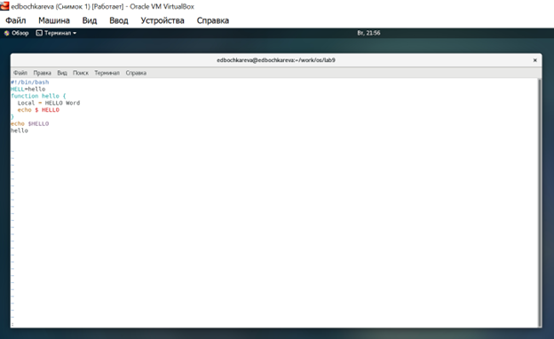
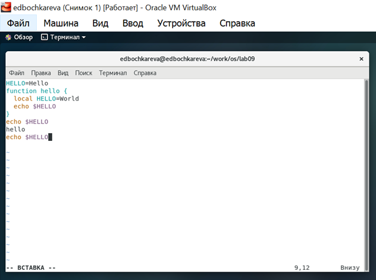

РОССИЙСКИЙ УНИВЕРСИТЕТ ДРУЖБЫ НАРОДОВ

**Факультет физико-математических и естественных наук**

**Кафедра прикладной информатики и теории вероятностей**

ОТЧЕТ

по лабораторной работе №9

**«Текстовой редактор vi»**

[дисциплина: Операционные системы]{.underline}

[Студентка:]{.underline}

[Бочкарева Елена Дмитриевна]{.underline}

Студенческий билет номер №: 1032207514

Группа:

[НПМбв-01-19]{.underline}

**МОСКВА**

2023

# Оглавление {#оглавление .TOC-Heading .unnumbered}

[**Цель работы:** [2](#цель-работы)](#цель-работы)

[**6.3. Последовательность выполнения работы:**
[2](#последовательность-выполнения-работы)](#последовательность-выполнения-работы)

[**1.** **Ознакомиться с теоретическим материалом.**
[2](#ознакомиться-с-теоретическим-материалом.)](#ознакомиться-с-теоретическим-материалом.)

[**2. Ознакомиться с редактором vi.**
[3](#ознакомиться-с-редактором-vi.)](#ознакомиться-с-редактором-vi.)

[**3.Выполнить упражнения, используя команды vi**
[3](#выполнить-упражнения-используя-команды-vi)](#выполнить-упражнения-используя-команды-vi)

[**6.3.1. Задание 1.** [3](#задание.)](#задание.)

[1.1. Запускаем операционную систему **(рис.1).**
[3](#запускаем-операционную-систему-рис.1.)](#запускаем-операционную-систему-рис.1.)

[1.2.Вхожу от имени пользователя edbochkareva. Ввожу пароль **(рис.2).**
[3](#вхожу-от-имени-пользователя-edbochkareva.-ввожу-пароль-рис.2.)](#вхожу-от-имени-пользователя-edbochkareva.-ввожу-пароль-рис.2.)

[1.3. Создание нового файла с использованием vi 9.
[4](#создание-нового-файла-с-использованием-vi-9.)](#создание-нового-файла-с-использованием-vi-9.)

[Создаю каталог с именем \~/work/os/lab09 **(рис.3).**
[4](#создаю-каталог-с-именем-workoslab09-рис.3.)](#создаю-каталог-с-именем-workoslab09-рис.3.)

[1.4.Для создания каталога выполняю команду: mkdir -p \~/work/os/lab09
(рис.4).
[4](#для-создания-каталога-выполняю-команду-mkdir--p-workoslab09-рис.4.)](#для-создания-каталога-выполняю-команду-mkdir--p-workoslab09-рис.4.)

**6.3.2.** [**Задание 2. Редактирование существующего
файла...**........................................................[11](#задание-2.-редактирование-существующего-файла.)](#задание-2.-редактирование-существующего-файла.)

[**Ответы на контрольные вопросы (пункт 6.5.):**
[24](#ответы-на-контрольные-вопросы-пункт-6.5.)](#ответы-на-контрольные-вопросы-пункт-6.5.)

[**Выводы, согласованные с целью работы:**
[29](#выводы-согласованные-с-целью-работы)](#выводы-согласованные-с-целью-работы)

#  {#section .unnumbered}

# **Цель работы:** {#цель-работы .unnumbered}

Познакомиться с операционной системой Linux. Получить практические
навыки работы с редактором vi, установленным по умолчанию практически во
всех дистрибутивах.

# **6.3. Последовательность выполнения работы:** {#последовательность-выполнения-работы .unnumbered}

## **Ознакомиться с теоретическим материалом.** 

Текстовым редактором (text editor) называют программу, которая
предназначена для редактирования (составления и изменения) файлов,
содержащих только текст, например: письмо, программа на языке C,
системный конфигурационный файл.

**vi** (от англ. visual, по-русски читается «ви-ай») --- серия
текстовых **редакторов** операционных систем семейства UNIX. **vi**. 

В любой момент при работе в редакторе vi мы находимся в одном из трёх
режимов редактора: *командный режим* (command mode), *режим
ввода* (insert mode) и *режим последней строки* (last line mode).

Ознакомилась с теоретическим материалом в лаболаторной работе в пункте
6.2.

## **2. Ознакомиться с редактором vi.**  {#ознакомиться-с-редактором-vi. .unnumbered}

Ознакомилась с теоретическим материалом в лаболаторной работе в пункте
6.2.

## **3.Выполнить упражнения, используя команды vi** {#выполнить-упражнения-используя-команды-vi .unnumbered}

# **6.3.1. Задание.** {#задание. .unnumbered}

### 1.1. Запускаем операционную систему **(рис.1).** {#запускаем-операционную-систему-рис.1. .unnumbered}

Рис.1: Рисунок 1

### 1.2.Вхожу от имени пользователя edbochkareva. Ввожу пароль **(рис.2).** {#вхожу-от-имени-пользователя-edbochkareva.-ввожу-пароль-рис.2. .unnumbered}

Рис.2: Рисунок 2

### 1.3. Создание нового файла с использованием vi 9. {#создание-нового-файла-с-использованием-vi-9. .unnumbered}

### Создаю каталог с именем \~/work/os/lab09 **(рис.3).** {#создаю-каталог-с-именем-workoslab09-рис.3. .unnumbered}

Рис.3: Рисунок 3

### 1.4.Для создания каталога выполняю команду: mkdir -p \~/work/os/lab09 (рис.4). {#для-создания-каталога-выполняю-команду-mkdir--p-workoslab09-рис.4. .unnumbered}

Рис.4: Рисунок 4

В результате создан полный путь, то есть, кроме каталога lab09 созданы
каталоги work и os (в случае их отсутствия) **(рис.5).**

#### **2. Перейдите во вновь созданный каталог.**  {#перейдите-во-вновь-созданный-каталог. .unnumbered}

Для перехода в созданный каталог использую команду: cd \~/work/os/lab09
**(рис.5).**

Рис.5: Рисунок 5

#### **3. Вызовите vi и создайте файл hello.sh vi hello.sh**  {#вызовите-vi-и-создайте-файл-hello.sh-vi-hello.sh .unnumbered}

Для того, чтобы создать в vi файл hello.sh в текущем каталоге, выполню
команду: vi hello.sh **(рис.6).**

Рис.6: Рисунок 6

#### **4. Нажмите клавишу #!/bin/bash HELL=Hello function hello { и вводите следующий текст. LOCAL HELLO=World echo \$HELLO } echo \$HELLO hello. Результат выполнения команды (рис.7).** {#нажмите-клавишу-binbash-hellhello-function-hello-и-вводите-следующий-текст.-local-helloworld-echo-hello-echo-hello-hello.-результат-выполнения-команды-рис.7. .unnumbered}

Рис.7: Рисунок 7

#### **5. Нажмите клавишу текста Esc для перехода в командный режим после завершения ввода текста.** {#нажмите-клавишу-текста-esc-для-перехода-в-командный-режим-после-завершения-ввода-текста. .unnumbered}

После нажатия на Esc редактор перешёл в командный режим **(рис.8).**

Рис.8: Рисунок 8

#### **6. Нажмите для перехода в режим последней строки и внизу вашего экрана появится приглашение в виде двоеточия. Результат выполнения команды (рис.9).** {#нажмите-для-перехода-в-режим-последней-строки-и-внизу-вашего-экрана-появится-приглашение-в-виде-двоеточия.-результат-выполнения-команды-рис.9. .unnumbered}

Рис.9: Рисунок 9

Была нажата **клавиша : и** в результате редактор перешёл в режим
последней строки **(рис.10).**

Рис.10: Рисунок 10

#### **7. Нажмите (записать) и (выйти), а затем нажмите клавишу для сохранения вашего текста и завершения работы.**  {#нажмите-записать-и-выйти-а-затем-нажмите-клавишу-для-сохранения-вашего-текста-и-завершения-работы. .unnumbered}

Были нажаты клавиши w и q, в результате была введена команда для выхода
с записью (wq).

После нажатия на Enter команда была выполнена, редактор был закрыт с
сохранением **(рис.11).**

Рис.11: Рисунок 11

Нажали клавишу ENTER **(рис.12).**

Рис.12: Рисунок 12

#### **8. Сделайте файл исполняемым chmod +x hello.sh 6.4.2.**  {#сделайте-файл-исполняемым-chmod-x-hello.sh-6.4.2. .unnumbered}

Для того, чтобы сделать файл выполняемым, была введена команда: chmod +x
**(рис.13).**

Рис.13: Рисунок 13

# **Задание 2. Редактирование существующего файла.**  {#задание-2.-редактирование-существующего-файла. .unnumbered}

#### **Вызовите vi на редактирование файла vi \~/work/os/lab06/hello.sh** 

Для того, чтобы отредактировать созданный на предыдущем шаге работы
файл, была введена команда: vi \~/work/os/lab06/hello.sh **(рис.14).**

**(рис.15).**

Рис.15: Рисунок 15

#### **Установите курсор в конец слова HELL второй строки.** 

Переход к концу слова HELL был осуществлён в два этапа.

Во-первых, была **введена команда 2G, означающая переход на строку номер
2,** результат выполнения команды показан **(рис.16).**

Рис.16: Рисунок 16

Далее, был осуществлён **переход в конец слова нажатиями клавиши l.**
Курсор оказался на второй букве L **(рис.17).**

Рис.17: Рисунок 17

#### **Перейдите в режим вставки и замените на HELLO. Нажмите командный режим.**

Для того, **чтобы перейти в режим вставки, и вставить символ после
символа L, была нажата клавиша a,** результат показан **(рис.18).**

Рис.18: Рисунок 18

Далее, была введена буква O, и ошибка в слове была исправлена, результат
показан **(рис.19).**

Рис.19: Рисунок 19

#### **Установите курсор на четвертую строку и сотрите слово LOCAL.** 

Для перехода на четвёртую строку была нажата клавиша Esc, чтобы перейти
в командный режим, далее была нажата последовательность клавиш 4G, после
чего двухкратным нажатием клавиши l курсор был перемещён к началу слова
LOCAL, и оно было побуквенно стёрто нажатием последовательности из двух
символов: dw. После чего указанное слово было стёрто (вместе с идущим за
ним пробелом) **(рис.20).**

Рис.20: Рисунок 20

#### **Перейдите в режим вставки и наберите следующий текст: local, нажмите для возврата в командный режим.** 

Для перехода в режим вставки была нажата клавиша i, после чего было
введено слово local (с пробелом в конце) **(рис.21).**

Рис.21: Рисунок 21

#### **Установите курсор на последней строке файла. Вставьте после неё строку, содержащую следующий текст: echo \$HELLO.**

Для ввода текста в конце файла, был осуществлён переход в командный
режим (клавишей Esc), далее была нажата клавиша L для перехода к
последней строке, далее была нажата клавиша \$ для перехода к концу
строки, далее была нажата клавиша a для того, чтобы перейти в режим
вставки, после чего была добавлена новая строка (нажатием Enter) и была
введена строка echo \$HELLO. Результат показан **(рис.22).**

Рис.22: Рисунок 22

#### **Нажмите для перехода в командный режим.** 

Для перехода в командный режим была нажата клавиша Esc

#### **Удалите последнюю строку.**

Для удаления последней строки (которая оставалась текущей после
выполнения предыдущей команды) была использована команда dd. Результат
выполнения команды показан на рисунке (последняя строка с echo \$HELLO
исчезла) **(рис.23).**

Рис.23: Рисунок 23

#### **Введите команду отмены изменений для отмены последней команды.** 

**Для отмены предыдущей команды была использована команда u,** после
нажатия на данную клавишу последняя строка вернулась, как видно
**(рис.24).**

Рис.24: Рисунок 24

#### **Введите символ для перехода в режим последней строки. Запишите произведённые изменения и выйдите из vi.** 

Для выхода с сохранением из редактора (находившегося в командном режиме)
была нажата последовательность символов :, w, q, Enter.

«Двоеточие» перевело редактор в режим последней строки **(рис.25).**

Рис.25: Рисунок 25

Далее была **введена команда wq для выхода с записью (рис.26).**

Рис.26: Рисунок 26

Был нажат Enter для выполнения команды). Результат выполнения команды
показан на рисунке **(рис.27).**

Рис.27: Рисунок 27

# **Ответы на контрольные вопросы (пункт 6.5.):** {#ответы-на-контрольные-вопросы-пункт-6.5. .unnumbered}

#### **Дайте краткую характеристику режимам работы редактора vi.** 

**ОТВЕТ: Режимы работы редактора vi** - это командный режим (в котором
вводятся команды для обработки текста), **режим вставки** (в котором
осуществляется ввод текста) и **режим последней (командной) строки** (в
котором также осуществляется ввод команд для редактирования текста,
отображаемых в самой нижней строке). По умолчанию работа начинается в
командном режиме. В режиме вставки клавиатура используется для набора
текста. **Для выхода в командный режим** используется клавиша **Esc или
комбинация Ctrl + c.**

#### **Как выйти из редактора, не сохраняя произведённые изменения?** 

**ОТВЕТ:** Для того, чтобы **выйти из vi не сохраняя изменения**,
**необходимо выйти из режима редактирования, нажав Esc** (если редактор
находится в нём), далее **нажать двоеточие (:), ввести там команду q! и
нажать Enter.**

#### **Назовите и дайте краткую характеристику командам позиционирования.** 

**ОТВЕТ: В редакторе vi есть команды для позиционирования курсора с его
перемещением на символ, слово, строку, предложение, абзац, страницу**.
Для этих задач могут использоваться как комбинации клавиш, так и ряд
алфавитных символов (которые, однако, не могут использоваться в режиме
редактирования, поскольку используются там по своему прямому
назначению).

**Для перемещения курсора на один символ** **используются стрелки
управления курсором или символы hjkl** (соответственно, влево, вниз,
вверх, вправо).

**Для перемещения на слово используются команды w, b и e (вперёд, назад,
в конец слова).** Для перемещения назад и впедёр на предожение
используются команды ( и ), для перемещения на абзац используются
команды { и }. Для перемещения курсора в начало строки используется 0,
для перемещения в конец - \$. Для перемещения курсора в начало первой
строки текста служит H, для перемещения в начало средней строки текста -
M, в начало последней.

**Четыре команды редактора vi позволяют осуществлять прокрутку текста
файла**. Команды \^f (\<CTRL\>f) и \^d (\<CTRL\>d) проводят прокрутку
экрана вперед, а команды \^b (\<CTRL\>b) и \^u (\<CTRL\>u) - прокрутку
экрана назад. Команда \^d осуществляет прокрутку на половину экрана,
чтобы отобразить текст, расположенный ниже окна.

**Операторы с позиционированием:** p/P - вспомнить фрагмент за/перед
\_ \[\"\<буква_буфер\>\] \<команда\> \[\<команда позиционирования\>\] -
весь фрагмент запоминается! или повтор команды для строки d - уничтожать
фрагмент y - запоминать фраг c - заменить фрагмент (==\> в режим ввода
) - сдвинуть влево/вправо ! команда - пропустить фрагмент через фильтр
https://docstore.mik.ua/solaris/vibegin.htm

#### **Что для редактора vi является словом?**

**ОТВЕТ:** Для редактора vi **словом является последовательность
алфавитно-цифровых символов, ограниченных пробелами и знаками
препинания**.

#### **Каким образом из любого места редактируемого файла перейти в начало (конец) файла?** 

**ОТВЕТ:** Чтобы **перейти в начало файла**, необходимо использовать
команду **H, gg или Ctrl-Home.**

Для того, чтобы **перейти в конец файла** (в конец последней строки),
необходимо **ввести G\\\$ или Ctrl-End.**

#### **Назовите и дайте краткую характеристику основным группам команд редактирования.** 

**ОТВЕТ: Команды редактирования** вводятся в командном режиме и
представляют из себя буквы английского алфавита в разном регистре, перед
которыми может стоять число, определяющее количество повторов
соответствующей операции, также командой может быть цифра (например, 0).
**Основные группы команд** - **это команды перемещения по тексту**
(например h, j, k, l для перемещения на один символ в каждом из
направлений, 0 для перехода в начало строки, \\\$ для перехода в конец
строки), **команды редактирования** (например a - вставка текста после
курсора, x - удалить один символ в буфер), **команды отмены и повторения
изменений** (u - отмена последнего действия, . - повторение), **команды
работы с буфером** (например Y - скопировать строку в буфер, P -
вставить текст из буфера перед курсором, p - вставить текст после
курсора).

**Редактирование текста:** x - уничтожить символ X - забой J - склеить
строки.

**Редактирование в режиме ввода ESC** - вернуться в командный режим
Забой - Забой \^W - Убрать слово \^U - Убрать строку \^V - Вставить
CRTL-символ\[ы\].

#### **Необходимо заполнить строку символами \$. Каковы ваши действия?** 

**ОТВЕТ:** Необходимо в режиме комманд **набрать количество символов,
которые нужно ввести, далее нажать i, после чего ввести необходимый
символ (в данном случае \$) и, далее, нажать Esc.** Например: 80i\$
введёт последовательность из 80 символов \$.

#### **Как отменить некорректное действие, связанное с процессом редактирования?** 

**ОТВЕТ: Чтобы отменить некорректное действие, необходимо нажать u в
режиме комманд.**

Команда undo отменяет одно или несколько изменений в том порядке, в
котором они были сделаны.

**Чтобы отменить изменения в Vi, используем команду u, :u или :undo:**

1.  Если вы находитесь в режиме вставки или в любом другом режиме,
    > **нажмите клавишу Esc, чтобы вернуться в обычный режим, который
    > также известен как командный режим**.

2.  **Введем u, чтобы отменить последнее изменение**. Например, если
    > хотим отменить 4 последних изменения, используем 4u.

3.  **Убедится, что набираем строчную u, а не прописную команду U,
    > которая отменяет все последние изменения в одной строке**. Если вы
    > случайно напечатаете U, вы можете отменить изменение с помощью u.

4.  **Используем команду undo, чтобы отменить изменения**, сделанные
    > любой другой командой, такой как удаление, вставка, поиск и замена
    > и т. д.

5.  **При работе в режиме вставки все изменения в тексте рассматриваются
    > как одна запись в дереве отмены**. Например, если переключаемся в
    > режим вставки и вводим пять строк, затем возвращаемся в нормальный
    > режим и нажимаем, u чтобы отменить изменения, все пять строк
    > удаляются.

#### **Назовите и дайте характеристику основным группам команд режима последней строки.** 

**Режим последней строки**═ --- это специальный **режим**, в котором
редактору даются сложные **команды**.

**Основные команды режима последней строки предназначены для
редактирования текста** (удаление (команда d), **перемещение** (команда
m), копирование (команда t)), **для записи в файл** (команда w), для
выхода из редактора (команда q), **для управления настройками 16 файл**
(команда w), **для выхода из редактора** (команда q), **для управления
настройками** (команда set).

#### **Как определить, не перемещая курсора, позицию, в которой заканчивается строка?** 

**ОТВЕТ:** Чтобы определить, позицию, в которой заканчивается строка, не
перемещая курсор, **можно использовать команду оболочки wc,
предназначенную для подсчёта количества символов.** Чтобы вызвать её для
обработки текущей строки, необходимо **ввести команду: .w !wc -c** Будет
выведена длина строки с учётом символа перевода строки. Номер последнего
символа строки будет на единицу меньше.

#### **Выполните анализ опций редактора vi (сколько их, как узнать их назначение и т.д.).** 

> **ОТВЕТ: Чтобы узнать опции командной строки редактора vi, следует
> запустить его с параметром -h или \--help: vi -h** Опции командной
> строки позволяют изменить стандартное поведение редактора vi. Наиболее
> важные из них - это **перейти к редактированию последней строки**
> (опция +) **или указанной строки** (+число), **выполнить команду после
> загрузки файла** (опция -s), **указать замену стандартному файлу
> .viminfo** (опция -i), **шифровать записываемые файлы** (опция -x).

#### **Как определить режим работы редактора vi?** 

**ОТВЕТ: Определить режим работы редактора vi можно по информации,
находящейся слева в самой нижней строке.** Там может быть, в частности,
\-- ВСТАВКА \--, \--ЗАМЕНА \--, \-- ВИЗУАЛЬНЫЙ РЕЖИМ \--, символы : и /,
а также текст может отсутствовать. Когда редактор vi находится в
командном режиме, информация о режиме отсутствует, за исключением
случаев, когда была нажато : для ввода команды или / для поиска (в этих
случаях в начале последней строке находится соответствующий символ). В
режиме вставки в нижней строке находится слово \-- ВСТАВКА \-- (или \--
ЗАМЕНА \--, в этом случае редактор не добавляет текст, а заменяет текст
на введённый). В визуальном режиме, предназначенном для выделения текста
для последующих операций над ним внизу выводится строка \-- ВИЗУАЛЬНЫЙ
РЕЖИМ \--.

#### **20. Постройте граф взаимосвязи режимов работы редактора vi.**

На Рисунке изображён граф взаимосвязи между режимами работы редактора
vi.

# **Выводы, согласованные с целью работы:** 

В процессе выполнения данной работы было осуществлено редактирование
текста при помощи редактора vi, используя функции ввода, редактирования,
и навигации по тексту.
