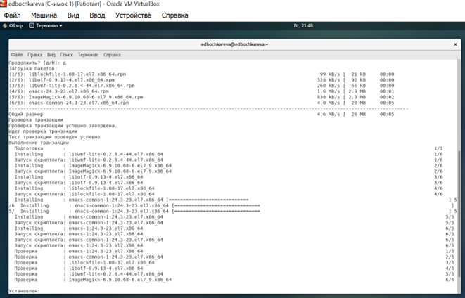
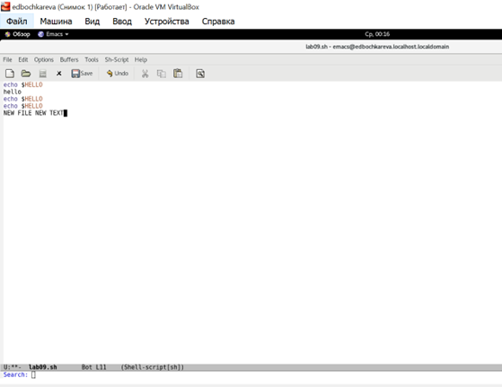

РОССИЙСКИЙ УНИВЕРСИТЕТ ДРУЖБЫ НАРОДОВ

**Факультет физико-математических и естественных наук**

**Кафедра прикладной информатики и теории вероятностей**

ОТЧЕТ

по лабораторной работе №10

**«Текстовой редактор emacs»**

[дисциплина: Операционные системы]{.underline}

[Студентка:]{.underline}

[Бочкарева Елена Дмитриевна]{.underline}

Студенческий билет номер №: 1032207514

Группа:

[НПМбв-01-19]{.underline}

**МОСКВА**

2023

# Оглавление {#оглавление .TOC-Heading .unnumbered}

[Цель работы: [4](#цель-работы)](#цель-работы)

[7.3. Последовательность выполнения работы:
[4](#последовательность-выполнения-работы)](#последовательность-выполнения-работы)

[Запускаем операционную систему (рис.1).
[5](#запускаем-операционную-систему-рис.1.)](#запускаем-операционную-систему-рис.1.)

[Вхожу от имени пользователя edbochkareva. Ввожу пароль (рис.2).
[6](#вхожу-от-имени-пользователя-edbochkareva.-ввожу-пароль-рис.2.)](#вхожу-от-имени-пользователя-edbochkareva.-ввожу-пароль-рис.2.)

[7.3.1. Основные команды emacs.
[6](#основные-команды-emacs.)](#основные-команды-emacs.)

[7.3.1.1. Открыть emacs (рис.3,4,5).
[6](#открыть-emacs-рис.345.)](#открыть-emacs-рис.345.)

[7.3.1.1.Установила редактор Emacs на CentOS 7 (рис.6).
[9](#установила-редактор-emacs-на-centos-7-рис.6.)](#установила-редактор-emacs-на-centos-7-рис.6.)

[7.3.1.2. Создать файл lab10.sh с помощью комбинации C-x C-f (рис.7)
[10](#создать-файл-lab10.sh-с-помощью-комбинации-c-x-c-f-рис.7)](#создать-файл-lab10.sh-с-помощью-комбинации-c-x-c-f-рис.7)

[7.3.1.2.Создать файл lab07.sh с помощью комбинации (рис.10)
[12](#создать-файл-lab07.sh-с-помощью-комбинации-рис.10)](#создать-файл-lab07.sh-с-помощью-комбинации-рис.10)

[Создать файл lab07.sh с помощью комбинации (рис.11)
[13](#создать-файл-lab07.sh-с-помощью-комбинации-рис.11)](#создать-файл-lab07.sh-с-помощью-комбинации-рис.11)

[7.3.1.3. Наберите текст (рис.12)
[15](#наберите-текст-рис.12)](#наберите-текст-рис.12)

[7.3.1.4. Сохранить файл с помощью комбинации C-x C-s (рис.13)
[16](#сохранить-файл-с-помощью-комбинации-c-x-c-s-рис.13)](#сохранить-файл-с-помощью-комбинации-c-x-c-s-рис.13)

[7.3.1.5. Проделать с текстом стандартные процедуры редактирования,
каждое действие должно осуществляться комбинацией клавиш.
[16](#проделать-с-текстом-стандартные-процедуры-редактирования-каждое-действие-должно-осуществляться-комбинацией-клавиш.)](#проделать-с-текстом-стандартные-процедуры-редактирования-каждое-действие-должно-осуществляться-комбинацией-клавиш.)

[7.3.1.5.1. Вырезать одной командой целую строку (С-k) (рис.14)
[17](#вырезать-одной-командой-целую-строку-с-k-рис.14)](#вырезать-одной-командой-целую-строку-с-k-рис.14)

[7.3.1.5.2. Вставить эту строку в конец файла (C-y) (рис.15)
[17](#вставить-эту-строку-в-конец-файла-c-y-рис.15)](#вставить-эту-строку-в-конец-файла-c-y-рис.15)

[7.3.1.5.3. Выделить область текста (C-space) (рис.16)
[17](#выделить-область-текста-c-space-рис.16)](#выделить-область-текста-c-space-рис.16)

[7.3.1.5.4. Скопировать область в буфер обмена (M-w) (рис.17)
[18](#скопировать-область-в-буфер-обмена-m-w-рис.17)](#скопировать-область-в-буфер-обмена-m-w-рис.17)

[7.3.1.5.5. Вставить область в конец файла (рис.18)
[18](#вставить-область-в-конец-файла-рис.18)](#вставить-область-в-конец-файла-рис.18)

[7.3.1.5.6. Вновь выделить эту область и на этот раз вырезать её (C-w)
(рис.19)
[18](#вновь-выделить-эту-область-и-на-этот-раз-вырезать-её-c-w-рис.19)](#вновь-выделить-эту-область-и-на-этот-раз-вырезать-её-c-w-рис.19)

[7.3.1.5.7. Отмените последнее действие (C-/) (рис.21)
[19](#отмените-последнее-действие-c--рис.21)](#отмените-последнее-действие-c--рис.21)

[7.3.1.6. Научитесь использовать команды по перемещению курсора.
[20](#научитесь-использовать-команды-по-перемещению-курсора.)](#научитесь-использовать-команды-по-перемещению-курсора.)

[7.3.1.6.1. Переместите курсор в начало строки (C-a) (рис.22)
[20](#переместите-курсор-в-начало-строки-c-a-рис.22)](#переместите-курсор-в-начало-строки-c-a-рис.22)

[7.3.1.6.2. Переместите курсор в конец строки (C-e) (рис.23)
[20](#переместите-курсор-в-конец-строки-c-e-рис.23)](#переместите-курсор-в-конец-строки-c-e-рис.23)

[7.3.1.6.3. Переместите курсор в начало буфера (M-\<) (рис.24)
[21](#переместите-курсор-в-начало-буфера-m--рис.24)](#переместите-курсор-в-начало-буфера-m--рис.24)

[7.3.1.6.4. Переместите курсор в конец буфера (M-\>) (рис.25)
[22](#переместите-курсор-в-конец-буфера-m--рис.25)](#переместите-курсор-в-конец-буфера-m--рис.25)

[7.3.1.7.1. Вывести список активных буферов на экран (C-x C-b) (рис.26)
[23](#вывести-список-активных-буферов-на-экран-c-x-c-b-рис.26)](#вывести-список-активных-буферов-на-экран-c-x-c-b-рис.26)

[7.3.1.7.2. Переместитесь во вновь открытое окно (C-x) o со списком
открытых буферов и переключитесь на другой буфер (рис.27)
[24](#переместитесь-во-вновь-открытое-окно-c-x-o-со-списком-открытых-буферов-и-переключитесь-на-другой-буфер-рис.27)](#переместитесь-во-вновь-открытое-окно-c-x-o-со-списком-открытых-буферов-и-переключитесь-на-другой-буфер-рис.27)

[7.3.1.7.3. Закройте это окно (C-x 0) (рис.28)
[24](#закройте-это-окно-c-x-0-рис.28)](#закройте-это-окно-c-x-0-рис.28)

[7.3.1.7.4. Теперь вновь переключайтесь между буферами, но уже без
вывода их списка на экран (C-x b) (рис.29)
[25](#теперь-вновь-переключайтесь-между-буферами-но-уже-без-вывода-их-списка-на-экран-c-x-b-рис.29)](#теперь-вновь-переключайтесь-между-буферами-но-уже-без-вывода-их-списка-на-экран-c-x-b-рис.29)

[7.3.1.8. Управление окнами.
[25](#управление-окнами.)](#управление-окнами.)

[7.3.1.8.1. Поделите фрейм на 4 части: разделите фрейм на два окна по
вертикали (C-x 3) (рис.30)
[25](#поделите-фрейм-на-4-части-разделите-фрейм-на-два-окна-по-вертикали-c-x-3-рис.30)](#поделите-фрейм-на-4-части-разделите-фрейм-на-два-окна-по-вертикали-c-x-3-рис.30)

[7.3.1.9. Режим поиска [31](#режим-поиска)](#режим-поиска)

[7.3.1.9.1. Переключитесь в режим поиска (C-s) и найдите несколько слов,
присутствующих в тексте (рис.36)
[31](#переключитесь-в-режим-поиска-c-s-и-найдите-несколько-слов-присутствующих-в-тексте-рис.36)](#переключитесь-в-режим-поиска-c-s-и-найдите-несколько-слов-присутствующих-в-тексте-рис.36)

[7.3.1.9.2. Переключайтесь между результатами поиска, нажимая C-s
(рис.37)
[32](#переключайтесь-между-результатами-поиска-нажимая-c-s-рис.37)](#переключайтесь-между-результатами-поиска-нажимая-c-s-рис.37)

[7.3.1.9.3. Выйдите из режима поиска, нажав C-g (рис.38)
[33](#выйдите-из-режима-поиска-нажав-c-g-рис.38)](#выйдите-из-режима-поиска-нажав-c-g-рис.38)

[7.3.1.9.4. Перейдите в режим поиска и замены (M-%), введите текст,
который следует найти и заменить, нажмите Enter, затем введите текст для
замены. После того как будут подсвечены результаты поиска, нажмите ! для
подтверждения замены (рис.39,40,41)
[33](#_Toc134133300)](#_Toc134133300)

[7.3.1.9.5. Испробуйте другой режим поиска, нажав M-s o. Объясните, чем
он отличается от обычного режима? (рис.42,43)
[35](#испробуйте-другой-режим-поиска-нажав-m-s-o.-объясните-чем-он-отличается-от-обычного-режима-рис.4243)](#испробуйте-другой-режим-поиска-нажав-m-s-o.-объясните-чем-он-отличается-от-обычного-режима-рис.4243)

[7.3.1.9.5. Испробуйте другой режим поиска, нажав M-s o. Объясните, чем
он отличается от обычного режима? (рис.44,45)
[35](#испробуйте-другой-режим-поиска-нажав-m-s-o.-объясните-чем-он-отличается-от-обычного-режима-рис.4445)](#испробуйте-другой-режим-поиска-нажав-m-s-o.-объясните-чем-он-отличается-от-обычного-режима-рис.4445)

[7.4.Ответы на контрольные вопросы:
[37](#ответы-на-контрольные-вопросы)](#ответы-на-контрольные-вопросы)

[7.4.1. Кратко охарактеризуйте редактор emacs.
[37](#кратко-охарактеризуйте-редактор-emacs.)](#кратко-охарактеризуйте-редактор-emacs.)

[7.4.2. Какие особенности данного редактора могут сделать его сложным
для освоения новичком?
[37](#какие-особенности-данного-редактора-могут-сделать-его-сложным-для-освоения-новичком)](#какие-особенности-данного-редактора-могут-сделать-его-сложным-для-освоения-новичком)

[7.4.3. Своими словами опишите, что такое буфер и окно в терминологии
emacs'а.
[37](#своими-словами-опишите-что-такое-буфер-и-окно-в-терминологии-emacsа.)](#своими-словами-опишите-что-такое-буфер-и-окно-в-терминологии-emacsа.)

[7.4.4. Можно ли открыть больше 10 буферов в одном окне?
[38](#можно-ли-открыть-больше-10-буферов-в-одном-окне)](#можно-ли-открыть-больше-10-буферов-в-одном-окне)

[7.4.5. Какие буферы создаются по умолчанию при запуске emacs?
[38](#какие-буферы-создаются-по-умолчанию-при-запуске-emacs)](#какие-буферы-создаются-по-умолчанию-при-запуске-emacs)

[7.4.6. Какие клавиши вы нажмѐте, чтобы ввести следующую комбинацию C-c
\| и C-c C-\|?
[38](#какие-клавиши-вы-нажмѐте-чтобы-ввести-следующую-комбинацию-c-c-и-c-c-c-)](#какие-клавиши-вы-нажмѐте-чтобы-ввести-следующую-комбинацию-c-c-и-c-c-c-)

[7.4.7. Как поделить текущее окно на две части?
[38](#как-поделить-текущее-окно-на-две-части)](#как-поделить-текущее-окно-на-две-части)

[7.4.8. В каком файле хранятся настройки редактора emacs?
[38](#в-каком-файле-хранятся-настройки-редактора-emacs)](#в-каком-файле-хранятся-настройки-редактора-emacs)

[7.4.9. Какую функцию выполняет клавиша \<- и можно ли еѐ переназначить?
[39](#какую-функцию-выполняет-клавиша---и-можно-ли-еѐ-переназначить)](#какую-функцию-выполняет-клавиша---и-можно-ли-еѐ-переназначить)

[7.4.10. Какой редактор вам показался удобнее в работе vi или emacs?
[39](#какой-редактор-вам-показался-удобнее-в-работе-vi-или-emacs)](#какой-редактор-вам-показался-удобнее-в-работе-vi-или-emacs)

[Выводы, согласованные с целью работы:
[39](#выводы-согласованные-с-целью-работы)](#выводы-согласованные-с-целью-работы)

# Цель работы: {#цель-работы .unnumbered}

#  {#section .unnumbered}

#### Познакомиться с операционной системой Linux. Получить практические навыки работы с редактором Emacs. {#познакомиться-с-операционной-системой-linux.-получить-практические-навыки-работы-с-редактором-emacs. .unnumbered}

# 7.3. Последовательность выполнения работы: {#последовательность-выполнения-работы .unnumbered}

> 7.3.1. Ознакомиться с теоретическим материалом.
>
> Ознакомилась с теоретическим материалом в пунктах лаболаторной работы
> 7.2.

2.  Ознакомиться с редактором emacs.

> Ознакомилась с редактором emacs.

3.  Выполнить упражнения «Основные команды emacs».

> Упражнения выполнила.

4.  Ответить на контрольные вопросы.

> Ответила на 10 контрольных вопросов в пункте 7.4.

## Запускаем операционную систему (рис.1). {#запускаем-операционную-систему-рис.1. .unnumbered}

##  {#section-1 .unnumbered}

Рис.1: Рисунок 1

## Вхожу от имени пользователя edbochkareva. Ввожу пароль (рис.2). {#вхожу-от-имени-пользователя-edbochkareva.-ввожу-пароль-рис.2. .unnumbered}

Рис.2: Рисунок 2

# Основные команды emacs.

## Открыть emacs (рис.3,4,5).

Устанавливаю Emacs через репозиторий EPEL. Текстовый редактор Emacs
доступен в официальном репозитории EPEL:

Рис.3: Рисунок 3

Рис.4: Рисунок 4

Рис.5: Рисунок 5

## 7.3.1.1.Установила редактор Emacs на CentOS 7 (рис.6). {#установила-редактор-emacs-на-centos-7-рис.6. .unnumbered}

Рис.6: Рисунок 6

## **Создать файл lab10.sh с помощью комбинации C-x C-f (рис.7)**

Рис.7: Рисунок 7

#### 7.3.1.2.1. **Создать файл lab10.sh с помощью комбинации C-x C-f (рис.8)** {#создать-файл-lab10.sh-с-помощью-комбинации-c-x-c-f-рис.8 .unnumbered}

Рис.8: Рисунок 8

#### 7.3.1.2.2. Запустила emacs. Основное меню (рис.9) {#запустила-emacs.-основное-меню-рис.9 .unnumbered}

Рис.9: Рисунок 9

## 7.3.1.2.Создать файл lab07.sh с помощью комбинации (рис.10) {#создать-файл-lab07.sh-с-помощью-комбинации-рис.10 .unnumbered}

Нажимаю клавиши ctr -x ctrl -f, создаю файл lab09. Открываю файл.

Рис.10: Рисунок 10

### Создать файл lab07.sh с помощью комбинации (рис.11) {#создать-файл-lab07.sh-с-помощью-комбинации-рис.11 .unnumbered}

Рис.11: Рисунок 11

## Наберите текст (рис.12)

Рис.12: Рисунок 12

## Сохранить файл с помощью комбинации C-x C-s (рис.13)

Рис.13: Рисунок 13

## Проделать с текстом стандартные процедуры редактирования, каждое действие должно осуществляться комбинацией клавиш.

### Вырезать одной командой целую строку (С-k) (рис.14)

Рис.14: Рисунок 14

### Вставить эту строку в конец файла (C-y) (рис.15)

Рис.15: Рисунок 15

### Выделить область текста (C-space) (рис.16)

> Клавиша «Пробел» (англ. Space) является одной из ключевых на
> клавиатуре пишущей машинки или компьютера. Имеет вид горизонтальной
> полосы в самом нижнем ряду.
>

Рис.16: Рисунок 16

### Скопировать область в буфер обмена (M-w) (рис.17)

Рис.17: Рисунок 17

### Вставить область в конец файла (рис.18)

Рис.18: Рисунок 18

### Вновь выделить эту область и на этот раз вырезать её (C-w) (рис.19)

Рис.19: Рисунок 19

Рис.20: Рисунок 20

### Отмените последнее действие (C-/) (рис.21)

Рис.21: Рисунок 21

## Научитесь использовать команды по перемещению курсора.

### Переместите курсор в начало строки (C-a) (рис.22)

Рис.22: Рисунок 22

### Переместите курсор в конец строки (C-e) (рис.23)

Рис.23: Рисунок 23

### Переместите курсор в начало буфера (M-\<) (рис.24)

Рис.24: Рисунок 24

### Переместите курсор в конец буфера (M-\>) (рис.25)

Рис.25: Рисунок 25

6.  **Управление буферами.**

### Вывести список активных буферов на экран (C-x C-b) (рис.26)

Рис.26: Рисунок 26

### Переместитесь во вновь открытое окно (C-x) o со списком открытых буферов и переключитесь на другой буфер (рис.27)

Рис.27: Рисунок 27

### Закройте это окно (C-x 0) (рис.28)

Рис.28: Рисунок 28

### Теперь вновь переключайтесь между буферами, но уже без вывода их списка на экран (C-x b) (рис.29)

Рис.29: Рисунок 29

## Управление окнами.

### Поделите фрейм на 4 части: разделите фрейм на два окна по вертикали (C-x 3) (рис.30)

Рис.30: Рисунок 30

#### 7.3.1.8.1.1. Поделила каждое из этих окон на две части по горизонтали (C-x 2)  (рис.31) {#поделила-каждое-из-этих-окон-на-две-части-по-горизонтали-c-x-2-рис.31 .unnumbered}

Рис.31: Рисунок 31

#### 7.3.1.8.1.1.2. Поделила каждое из этих окон на четыре части по горизонтали (рис.32)  {#поделила-каждое-из-этих-окон-на-четыре-части-по-горизонтали-рис.32 .unnumbered}

Рис.32: Рисунок 32

#### 7.3.1.8.1.1.3. Поделила каждое из этих окон на две части по горизонтали (рис.33)  {#поделила-каждое-из-этих-окон-на-две-части-по-горизонтали-рис.33 .unnumbered}

Рис.33: Рисунок 33

#### В каждом из четырёх созданных окон откройте новый буфер (файл) и вве дите несколько строк текста (рис.34)

Ввожу текст: NEW FILE NEW TEXT

Рис.34: Рисунок 34

#### В каждом из четырёх созданных окон откройте новый буфер (файл) и вве дите несколько строк текста (рис.35)

Рис.35: Рисунок 35

## Режим поиска

### Переключитесь в режим поиска (C-s) и найдите несколько слов, присутствующих в тексте (рис.36)

Рис.36: Рисунок 36

### Переключайтесь между результатами поиска, нажимая C-s (рис.37)

Рис.37: Рисунок 37

Наращиваемый **поиск** начинается, как только вы набрали первый знак
строки **поиска**. По мере того, как вы набираете
строку **поиска**, **Emacs** показывает вам, где эта строка (в том виде,
в каком вы ее уже набрали) может быть **найдена**. 

### Выйдите из режима поиска, нажав C-g (рис.38)

Рис.38: Рисунок 38

### Перейдите в режим поиска и замены (M-%), введите текст, который следует найти и заменить, нажмите Enter, затем введите текст для замены. После того как будут подсвечены результаты поиска, нажмите ! для подтверждения замены (рис.39,40,41)

Рис.39: Рисунок 39

Рис.40: Рисунок 40

Рис.41: Рисунок 41

### Испробуйте другой режим поиска, нажав M-s o. Объясните, чем он отличается от обычного режима? (рис.42,43)

Рис.42: Рисунок 42

### Испробуйте другой режим поиска, нажав M-s o. Объясните, чем он отличается от обычного режима? (рис.44,45)

Рис.43: Рисунок 43

Рассмотрим другой режим поиска, нажав M-s o. Этот режим выполняет поиск
не по строке, а по регулярному выражению (рисунок 44,45)

Рис.44: Рисунок 44

3.  

Рис.45: Рисунок 45

# 7.4.Ответы на контрольные вопросы: {#ответы-на-контрольные-вопросы .unnumbered}

## 7.4.1. Кратко охарактеризуйте редактор emacs.  {#кратко-охарактеризуйте-редактор-emacs. .unnumbered}

**ОТВЕТ:** **Emacs** - это текстовый редактор, который используется в
UNIX-подобных 16 операционных системах. Все команды могут выполняться с
помощью определенных комбинаций клавиш. **Emacs -- достаточно развитый
текстовый редактор.** Он предоставляет средства, которые дают "нечто
большее, чем простая вставка или удаление", а именно: Просмотр и
редактирование 2-х или более файлов (с возможностью перемещения текста
между файлами). **Emacs** (*И́макс,* *Ема́кс*, также *Е́макс*)  ---
семейство многофункциональных расширяемых [текстовых
редакторов](https://ru.wikipedia.org/wiki/%D0%A2%D0%B5%D0%BA%D1%81%D1%82%D0%BE%D0%B2%D1%8B%D0%B9_%D1%80%D0%B5%D0%B4%D0%B0%D0%BA%D1%82%D0%BE%D1%80).
Оригинальный EMACS был написан в 1976 году [Ричардом
Столлманом](https://ru.wikipedia.org/wiki/%D0%A1%D1%82%D0%BE%D0%BB%D0%BB%D0%BC%D0%B0%D0%BD,_%D0%A0%D0%B8%D1%87%D0%B0%D1%80%D0%B4_%D0%9C%D1%8D%D1%82%D1%82%D1%8C%D1%8E) и [Гаем
Стилом](https://ru.wikipedia.org/w/index.php?title=%D0%A1%D1%82%D0%B8%D0%BB,_%D0%93%D0%B0%D0%B9_%D0%9B%D1%8C%D1%8E%D0%B8%D1%81&action=edit&redlink=1)[^\[en\]^](https://en.wikipedia.org/wiki/Guy_L._Steele,_Jr.) (англ.)
как набор макросов для редактирования
([англ.](https://ru.wikipedia.org/wiki/%D0%90%D0%BD%D0%B3%D0%BB%D0%B8%D0%B9%D1%81%D0%BA%D0%B8%D0%B9_%D1%8F%D0%B7%D1%8B%D0%BA) Editor
MACroS) для
редактора [TECO](https://ru.wikipedia.org/wiki/Text_Editor_and_Corrector)^.^.
**Существует две основных разновидности emacs --- GNU Emacs и
XEmacs**. **GNU Emacs** --- это развитие оригинальной версии emacs,
написанной Столманом, а **XEmacs **--- это версия с некоторыми
добавлениями к интерфейсу и языку Emacs Lisp. О причинах, по которым
образовалось две версии, можно прочесть по
этому [адресу](http://www.jwz.org/doc/lemacs.html). В большинстве
случаев их поведение похоже друг на друга, но есть и некоторые отличия.
Поэтому некоторые пакеты расширений могут работать только с конкретной
версией emacs.

## 7.4.2. Какие особенности данного редактора могут сделать его сложным для освоения новичком?  {#какие-особенности-данного-редактора-могут-сделать-его-сложным-для-освоения-новичком .unnumbered}

**ОТВЕТ:** В редакторе многие операции выполняются с помощью клавиатуры
посредством ввода определенных сочетаний клавиш, а не с помощью
графического меню. Пользователю может быть сложно быстро запомнить
нужные сочетания, и где они применяются.

## **7.4.3. Своими словами опишите, что такое буфер и окно в терминологии emacs'а**.  {#своими-словами-опишите-что-такое-буфер-и-окно-в-терминологии-emacsа. .unnumbered}

**ОТВЕТ: Буфер -** это копия файла, которая в данный момент находится в
памяти, также может содержать результаты команд и другие данные. Окно -
область для отображения буфера.

## 7.4.4. Можно ли открыть больше 10 буферов в одном окне?  {#можно-ли-открыть-больше-10-буферов-в-одном-окне .unnumbered}

**ОТВЕТ:** Можно.

## 7.4.5. Какие буферы создаются по умолчанию при запуске emacs?  {#какие-буферы-создаются-по-умолчанию-при-запуске-emacs .unnumbered}

**ОТВЕТ:** При запуске создаются буферы GNU Emacs, scratch, messages.

**Буфер** --- это основная единица редактирования; один буфер
соответствует одному куску редактируемого текста. Можно иметь несколько
буферов, но в каждый конкретный момент редактируем только один
"выбранный" буфер, хотя когда используем несколько окон, то видимыми
могут быть несколько буферов.

##  {#section-2 .unnumbered}

## 7.4.6. Какие клавиши вы нажмѐте, чтобы ввести следующую комбинацию C-c \| и C-c C-\|?  {#какие-клавиши-вы-нажмѐте-чтобы-ввести-следующую-комбинацию-c-c-и-c-c-c- .unnumbered}

**ОТВЕТ:** Первая комбинация: вместе нажать Ctrl+c, отпустить, нажать
Shift+. Вторая комбинация: вместе нажать Ctrl+c, отпустить, вместе
нажать Ctrl+Shift+.

## 7.4.7. Как поделить текущее окно на две части?  {#как-поделить-текущее-окно-на-две-части .unnumbered}

**ОТВЕТ:** Поделить окно на две части можно введя команду C-x 3.

## 7.4.8. В каком файле хранятся настройки редактора emacs?  {#в-каком-файле-хранятся-настройки-редактора-emacs .unnumbered}

**ОТВЕТ:** Настройки хранятся в файле .emacs 17

## 7.4.9. Какую функцию выполняет клавиша \<- и можно ли еѐ переназначить?  {#какую-функцию-выполняет-клавиша---и-можно-ли-еѐ-переназначить .unnumbered}

##  {#section-3 .unnumbered}

**ОТВЕТ:** Одно нажатие - удаление одного символа слева от курсора.
Клавишу можно переназначить.

## 7.4.10. Какой редактор вам показался удобнее в работе vi или emacs?  {#какой-редактор-вам-показался-удобнее-в-работе-vi-или-emacs .unnumbered}

##  {#section-4 .unnumbered}

**ОТВЕТ:** Мне больше понравился редактор emacs. В vi показалось
неудобным постоянно переключаться из режима ввода текста в командный
режим, особенно когда необходимо перемещаться по тексту для внесения
правок. В vi нет подсветки синтаксиса.

# Выводы, согласованные с целью работы: {#выводы-согласованные-с-целью-работы .unnumbered}

> Я познакомилась с операционной системой Linux, получила практические
> навыки работы с редактором Emacs.
