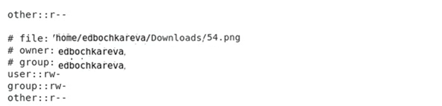
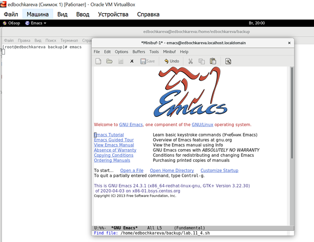

**РОССИЙСКИЙ УНИВЕРСИТЕТ ДРУЖБЫ НАРОДОВ**

**Факультет физико-математических и естественных наук**

**Кафедра прикладной информатики и теории вероятностей**

**ОТЧЕТ**

по лабораторной работе №11

**«Программирование в командном процессоре ОС UNIX. Командные файлы»**

[дисциплина: Операционные системы]{.underline}

[Студентка:]{.underline}

[Бочкарева Елена Дмитриевна]{.underline}

Студенческий билет номер №: 1032207514

Группа:

[НПМбв-01-19]{.underline}

**МОСКВА**

2023

# Оглавление {#оглавление .TOC-Heading}

[Цель работы [5](#цель-работы)](#цель-работы)

[8.3. Последовательность выполнения работы
[5](#последовательность-выполнения-работы)](#последовательность-выполнения-работы)

[1. Написать скрипт, который при запуске будет делать резервную копию
самого себя (то есть файла, в котором содержится его исходный код) в
другую директорию backup в вашем домашнем каталоге. При этом файл должен
архивироваться одним из архиваторов на выбор zip, bzip2 или tar. Способ
использования команд архивации необходимо узнать, изучив справку.
[5](#написать-скрипт-который-при-запуске-будет-делать-резервную-копию-самого-себя-то-есть-файла-в-котором-содержится-его-исходный-код-в-другую-директорию-backup-в-вашем-домашнем-каталоге.-при-этом-файл-должен-архивироваться-одним-из-архиваторов-на-выбор-zip-bzip2-или-tar.-способ-использования-команд-архивации-необходимо-узнать-изучив-справку.)](#написать-скрипт-который-при-запуске-будет-делать-резервную-копию-самого-себя-то-есть-файла-в-котором-содержится-его-исходный-код-в-другую-директорию-backup-в-вашем-домашнем-каталоге.-при-этом-файл-должен-архивироваться-одним-из-архиваторов-на-выбор-zip-bzip2-или-tar.-способ-использования-команд-архивации-необходимо-узнать-изучив-справку.)

[1.1 Запускаю программу emacs (рис.1).
[5](#запускаю-программу-emacs-рис.1.)](#запускаю-программу-emacs-рис.1.)

[1.2 Ввожу название задания №1 \~/lab11_1.sh (рис.2).
[6](#ввожу-название-задания-1-lab11_1.sh-рис.2.)](#ввожу-название-задания-1-lab11_1.sh-рис.2.)

[1.3. Открываю редактор для ввода текста (рис.3).
[6](#открываю-редактор-для-ввода-текста-рис.3.)](#открываю-редактор-для-ввода-текста-рис.3.)

[1.4. Ввожу скрипт по заданию №1 (рис.4).
[7](#ввожу-скрипт-по-заданию-1-рис.4.)](#ввожу-скрипт-по-заданию-1-рис.4.)

[1.5. Запускаю emacs и команду su (рис.5).
[8](#запускаю-emacs-и-команду-su-рис.5.)](#запускаю-emacs-и-команду-su-рис.5.)

[1.6. Ввожу команду chmod для lab11_1.sh (рис.6).
[8](#ввожу-команду-chmod-для-lab11_1.sh-рис.6.)](#ввожу-команду-chmod-для-lab11_1.sh-рис.6.)

[1.7. Ввожу команду ./lab11_1.sh(рис.7).
[8](#ввожу-команду-.lab11_1.shрис.7.)](#ввожу-команду-.lab11_1.shрис.7.)

[1.8. Запускаю emacs (рис.8).
[9](#запускаю-emacs-рис.8.)](#запускаю-emacs-рис.8.)

[1.9. Emacs. Захожу в папку home/edbochkareva/lab11_1.sh (рис.9).
[9](#emacs.-захожу-в-папку-homeedbochkarevalab11_1.sh-рис.9.)](#emacs.-захожу-в-папку-homeedbochkarevalab11_1.sh-рис.9.)

[1.10. Набираю команду ./lab_1.sh (рис.10).
[10](#набираю-команду-.lab_1.sh-рис.10.)](#набираю-команду-.lab_1.sh-рис.10.)

[1.11. Набираю текст скрипта (рис.11).
[10](#набираю-текст-скрипта-рис.11.)](#набираю-текст-скрипта-рис.11.)

[1.12. Просмотр действия, выполненного ранее на рис.11 (рис.12).
[10](#просмотр-действия-выполненного-ранее-на-рис.11-рис.12.)](#просмотр-действия-выполненного-ранее-на-рис.11-рис.12.)

[1.13. Ввожу команду ls-l (рис.13).
[10](#ввожу-команду-ls-l-рис.13.)](#ввожу-команду-ls-l-рис.13.)

[1.14. Просмотр содержимого по факту выполнения команды ls-l (рис.14).
[11](#просмотр-содержимого-по-факту-выполнения-команды-ls-l-рис.14.)](#просмотр-содержимого-по-факту-выполнения-команды-ls-l-рис.14.)

[1.15. Просмотр файлов с заданием №1 (рис.15).
[11](#просмотр-файлов-с-заданием-1-рис.15.)](#просмотр-файлов-с-заданием-1-рис.15.)

[1.16. Просмотр в папке home задания lab11_1.sh(рис.16).
[12](#просмотр-в-папке-home-задания-lab11_1.shрис.16.)](#просмотр-в-папке-home-задания-lab11_1.shрис.16.)

[1.17. Запускаю emacs, ввожу команду cd, mkdir (рис.17).
[12](#запускаю-emacs-ввожу-команду-cd-mkdir-рис.17.)](#запускаю-emacs-ввожу-команду-cd-mkdir-рис.17.)

[1.18. Просмотр содержимого ls- l (рис.18).
[12](#просмотр-содержимого-ls--l-рис.18.)](#просмотр-содержимого-ls--l-рис.18.)

[1.19. Запускаю emacs, указываю путь:
/home/edbochkareva/backup/lab11_1.sh(рис.19).
[13](#запускаю-emacs-указываю-путь-homeedbochkarevabackuplab11_1.shрис.19.)](#запускаю-emacs-указываю-путь-homeedbochkarevabackuplab11_1.shрис.19.)

[1.20. Просматриваю текст скрипта (рис.20).
[14](#просматриваю-текст-скрипта-рис.20.)](#просматриваю-текст-скрипта-рис.20.)

[1.21. Ввожу команду chmod +x lab11_1.sh(рис.21).
[14](#ввожу-команду-chmod-x-lab11_1.shрис.21.)](#ввожу-команду-chmod-x-lab11_1.shрис.21.)

[1.22. Ввожу команду ./ lab11_1.sh(рис.22).
[14](#ввожу-команду-.-lab11_1.shрис.22.)](#ввожу-команду-.-lab11_1.shрис.22.)

[1.23. Захожу в домашнюю папку: /home/edbochkareva/backup(рис.23).
[15](#захожу-в-домашнюю-папку-homeedbochkarevabackupрис.23.)](#захожу-в-домашнюю-папку-homeedbochkarevabackupрис.23.)

[1.24. Просматриваю содержимое скрипта lab11_1.sh (рис.24).
[15](#просматриваю-содержимое-скрипта-lab11_1.sh-рис.24.)](#просматриваю-содержимое-скрипта-lab11_1.sh-рис.24.)

[1.25. Ввожу команду ls-l (рис.25).
[15](#ввожу-команду-ls-l-рис.25.)](#ввожу-команду-ls-l-рис.25.)

[2. Написать пример командного файла, обрабатывающего любое произвольное
число аргументов командной строки, в том числе превышающее десять.
Например, скрипт может последовательно распечатывать значения всех
переданных аргументов.
[16](#написать-пример-командного-файла-обрабатывающего-любое-произвольное-число-аргументов-командной-строки-в-том-числе-превышающее-десять.-например-скрипт-может-последовательно-распечатывать-значения-всех-переданных-аргументов.)](#написать-пример-командного-файла-обрабатывающего-любое-произвольное-число-аргументов-командной-строки-в-том-числе-превышающее-десять.-например-скрипт-может-последовательно-распечатывать-значения-всех-переданных-аргументов.)

[2.1. Запускаю emacs (рис.26).
[16](#запускаю-emacs-рис.26.)](#запускаю-emacs-рис.26.)

[2.2. Набираю: [17](#набираю)](#набираю)

[/home/edbochkareva/lab11_2.sh(рис.27).
[17](#homeedbochkarevalab11_2.shрис.27.)](#homeedbochkarevalab11_2.shрис.27.)

[2.3. Открываю текстовый редактор для ввода текста, файл
lab11_2.sh(рис.28).
[17](#открываю-текстовый-редактор-для-ввода-текста-файл-lab11_2.shрис.28.)](#открываю-текстовый-редактор-для-ввода-текста-файл-lab11_2.shрис.28.)

[2.4. Просматриваю местонахождение файла lab11_2.sh(рис.29).
[18](#просматриваю-местонахождение-файла-lab11_2.shрис.29.)](#просматриваю-местонахождение-файла-lab11_2.shрис.29.)

[2.5. Ввожу команду ls-l. Выделила файл lab11_2.sh(рис.30).
[18](#ввожу-команду-ls-l.-выделила-файл-lab11_2.shрис.30.)](#ввожу-команду-ls-l.-выделила-файл-lab11_2.shрис.30.)

[2.6. Просматриваю местонахождение файла lab11_2.sh(рис.31).
[19](#просматриваю-местонахождение-файла-lab11_2.shрис.31.)](#просматриваю-местонахождение-файла-lab11_2.shрис.31.)

[2.7. Ввожу команду chmod +x b и указываю путь папки (рис.32).
[19](#ввожу-команду-chmod-x-b-и-указываю-путь-папки-рис.32.)](#ввожу-команду-chmod-x-b-и-указываю-путь-папки-рис.32.)

[2.8. Ввожу команду su и ls- l файла lab11_2.sh (рис.33).
[19](#ввожу-команду-su-и-ls--l-файла-lab11_2.sh-рис.33.)](#ввожу-команду-su-и-ls--l-файла-lab11_2.sh-рис.33.)

[2.9. Открываю emacs, набираю в строке путь:
home/edbochkareva/lab11_2.sh (рис.34).
[20](#открываю-emacs-набираю-в-строке-путь-homeedbochkarevalab11_2.sh-рис.34.)](#открываю-emacs-набираю-в-строке-путь-homeedbochkarevalab11_2.sh-рис.34.)

[2.10. Выполняю скрипт по заданию №2(рис.35).
[20](#выполняю-скрипт-по-заданию-2рис.35.)](#выполняю-скрипт-по-заданию-2рис.35.)

[2.11. root, файл lab11_2.sh(рис.36).
[21](#root-файл-lab11_2.shрис.36.)](#root-файл-lab11_2.shрис.36.)

[3. Написать командный файл --- аналог команды ls (без использования
самой этой команды и команды dir). Требуется, чтобы он выдавал
информацию о нужном каталоге и выводил информацию о возможностях доступа
к файлам этого каталога. Кулябов Д. С. и др. Операционные системы 65
[22](#написать-командный-файл-аналог-команды-ls-без-использования-самой-этой-команды-и-команды-dir.-требуется-чтобы-он-выдавал-информацию-о-нужном-каталоге-и-выводил-информацию-о-возможностях-доступа-к-файлам-этого-каталога.-кулябов-д.-с.-и-др.-операционные-системы-65)](#написать-командный-файл-аналог-команды-ls-без-использования-самой-этой-команды-и-команды-dir.-требуется-чтобы-он-выдавал-информацию-о-нужном-каталоге-и-выводил-информацию-о-возможностях-доступа-к-файлам-этого-каталога.-кулябов-д.-с.-и-др.-операционные-системы-65)

[3.1. Открываю emacs (рис.37).
[22](#открываю-emacs-рис.37.)](#открываю-emacs-рис.37.)

[3.2. Ввожу в строке «Finde file» путь для задания 3:
/home/edbochkareva/lab11_3.sh(рис.38).
[23](#ввожу-в-строке-finde-file-путь-для-задания-3-homeedbochkarevalab11_3.shрис.38.)](#ввожу-в-строке-finde-file-путь-для-задания-3-homeedbochkarevalab11_3.shрис.38.)

[3.3. Открываю редактор для ввода текста по заданию №3, файл
lab11_3.sh(рис.39).
[24](#открываю-редактор-для-ввода-текста-по-заданию-3-файл-lab11_3.shрис.39.)](#открываю-редактор-для-ввода-текста-по-заданию-3-файл-lab11_3.shрис.39.)

[3.4. Скрипт по заданию3, файл lab11_3.sh(рис.40).
[25](#скрипт-по-заданию3-файл-lab11_3.shрис.40.)](#скрипт-по-заданию3-файл-lab11_3.shрис.40.)

[3.5. Результат выполнения скрипта на рис.40 (рис.41).
[25](#результат-выполнения-скрипта-на-рис.40-рис.41.)](#результат-выполнения-скрипта-на-рис.40-рис.41.)

[3.6. Открываю emacs, ввожу команду chmod +x файл lab11_3.sh(рис.42).
[26](#открываю-emacs-ввожу-команду-chmod-x-файл-lab11_3.shрис.42.)](#открываю-emacs-ввожу-команду-chmod-x-файл-lab11_3.shрис.42.)

[3.7. Результат выполнения скрипта по заданию3, файл lab11_3.sh(рис.43).
[26](#результат-выполнения-скрипта-по-заданию3-файл-lab11_3.shрис.43.)](#результат-выполнения-скрипта-по-заданию3-файл-lab11_3.shрис.43.)

[3.8. Открываю emacs, ./ и указываю файл lab11_3.sh(рис.44).
[26](#открываю-emacs-.-и-указываю-файл-lab11_3.shрис.44.)](#открываю-emacs-.-и-указываю-файл-lab11_3.shрис.44.)

[4. Написать командный файл, который получает в качестве аргумента
командной строки формат файла (.txt, .doc, .jpg, .pdf и т.д.) и
вычисляет количество таких файлов в указанной директории. Путь к
директории также передаётся в виде аргумента командной строки.
[27](#написать-командный-файл-который-получает-в-качестве-аргумента-командной-строки-формат-файла-.txt-.doc-.jpg-.pdf-и-т.д.-и-вычисляет-количество-таких-файлов-в-указанной-директории.-путь-к-директории-также-передаётся-в-виде-аргумента-командной-строки.)](#написать-командный-файл-который-получает-в-качестве-аргумента-командной-строки-формат-файла-.txt-.doc-.jpg-.pdf-и-т.д.-и-вычисляет-количество-таких-файлов-в-указанной-директории.-путь-к-директории-также-передаётся-в-виде-аргумента-командной-строки.)

[4.1. Открываю emacs, скрипт по заданию4, ввожу название файла
lab11_4.sh(рис.45).
[27](#открываю-emacs-скрипт-по-заданию4-ввожу-название-файла-lab11_4.shрис.45.)](#открываю-emacs-скрипт-по-заданию4-ввожу-название-файла-lab11_4.shрис.45.)

[4.2. Ввожу скрипт по заданию №4, файл lab11_4.sh(рис.46).
[27](#ввожу-скрипт-по-заданию-4-файл-lab11_4.shрис.46.)](#ввожу-скрипт-по-заданию-4-файл-lab11_4.shрис.46.)

[4.3. Просматриваю «Домашнюю папку», файл lab11_4.sh(рис.47).
[28](#просматриваю-домашнюю-папку-файл-lab11_4.shрис.47.)](#просматриваю-домашнюю-папку-файл-lab11_4.shрис.47.)

[4.4. Ввожу команду ls- l, нахожу файл lab11_4.sh(рис.48).
[29](#ввожу-команду-ls--l-нахожу-файл-lab11_4.shрис.48.)](#ввожу-команду-ls--l-нахожу-файл-lab11_4.shрис.48.)

[4.5. Просматриваю наличие файлов по заданию №2,3,4: файлы lab11_2.sh,
lab11_3.sh, lab11_4.sh(рис.49).
[29](#просматриваю-наличие-файлов-по-заданию-234-файлы-lab11_2.sh-lab11_3.sh-lab11_4.shрис.49.)](#просматриваю-наличие-файлов-по-заданию-234-файлы-lab11_2.sh-lab11_3.sh-lab11_4.shрис.49.)

[8.5. Ответы на контрольные вопросы:
[30](#ответы-на-контрольные-вопросы)](#ответы-на-контрольные-вопросы)

[8.5.1. Объясните понятие командной оболочки. Приведите примеры
командных оболочек. Чем они отличаются?
[30](#объясните-понятие-командной-оболочки.-приведите-примеры-командных-оболочек.-чем-они-отличаются)](#объясните-понятие-командной-оболочки.-приведите-примеры-командных-оболочек.-чем-они-отличаются)

[8.5.2. Что такое POSIX? [30](#что-такое-posix)](#что-такое-posix)

[8.5.3. Как определяются переменные и массивы в языке программирования
bash?
[30](#как-определяются-переменные-и-массивы-в-языке-программирования-bash)](#как-определяются-переменные-и-массивы-в-языке-программирования-bash)

[8.5.4. Каково назначение операторов let и read?
[31](#каково-назначение-операторов-let-и-read)](#каково-назначение-операторов-let-и-read)

[8.5.5. Какие арифметические операции можно применять в языке
программирования bash?
[32](#какие-арифметические-операции-можно-применять-в-языке-программирования-bash)](#какие-арифметические-операции-можно-применять-в-языке-программирования-bash)

[8.5.6. Что означает операция (( ))?
[32](#что-означает-операция)](#что-означает-операция)

[8.5.7. Какие стандартные имена переменных Вам известны?
[32](#какие-стандартные-имена-переменных-вам-известны)](#какие-стандартные-имена-переменных-вам-известны)

[8.5.8. Что такое метасимволы?
[33](#что-такое-метасимволы)](#что-такое-метасимволы)

[8.5.9. Как экранировать метасимволы?
[34](#как-экранировать-метасимволы)](#как-экранировать-метасимволы)

[8.5.10. Как создавать и запускать командные файлы?
[35](#как-создавать-и-запускать-командные-файлы)](#как-создавать-и-запускать-командные-файлы)

[8.5.11. Как определяются функции в языке программирования bash?
[36](#как-определяются-функции-в-языке-программирования-bash)](#как-определяются-функции-в-языке-программирования-bash)

[8.5.12. Каким образом можно выяснить, является файл каталогом или
обычным файлом?
[36](#каким-образом-можно-выяснить-является-файл-каталогом-или-обычным-файлом)](#каким-образом-можно-выяснить-является-файл-каталогом-или-обычным-файлом)

[8.5.13. Каково назначение команд set, typeset и unset?
[37](#каково-назначение-команд-set-typeset-и-unset)](#каково-назначение-команд-set-typeset-и-unset)

[8.5.14. Как передаются параметры в командные файлы?
[38](#как-передаются-параметры-в-командные-файлы)](#как-передаются-параметры-в-командные-файлы)

[8.5.15. Назовите специальные переменные языка bash и их назначение.
[38](#назовите-специальные-переменные-языка-bash-и-их-назначение.)](#назовите-специальные-переменные-языка-bash-и-их-назначение.)

[Выводы, согласованные с целью работы.
[39](#выводы-согласованные-с-целью-работы.)](#выводы-согласованные-с-целью-работы.)

# Цель работы

**Изучить основы программирования в оболочке ОС UNIX/Linux. Научиться
писать небольшие командные файлы.**

# 8.3. Последовательность выполнения работы 

## 1. Написать скрипт, который при запуске будет делать резервную копию самого себя (то есть файла, в котором содержится его исходный код) в другую директорию backup в вашем домашнем каталоге. При этом файл должен архивироваться одним из архиваторов на выбор zip, bzip2 или tar. Способ использования команд архивации необходимо узнать, изучив справку. 

### 1.1 Запускаю программу emacs (рис.1).

Рис.1: Рисунок 1

### 1.2 Ввожу название задания №1 \~/lab11_1.sh (рис.2).

Рис.2: Рисунок 2

### 1.3. Открываю редактор для ввода текста (рис.3).

Рис.3: Рисунок 3

### 1.4. Ввожу скрипт по заданию №1 (рис.4).

**Переменная backupDir** содержит пусть к директории для резервных
копий, а **переменная file** имя файла скрипта. С помощью **команды
tar** создаем архив файла и командой mv переносим его в нужную папку.
После выполнения скрипта **в папке backup появляется архив с файлом
скрипта**.

Рис.4: Рисунок 4

### 1.5. Запускаю emacs и команду su (рис.5).

Рис.5: Рисунок 5

### 1.6. Ввожу команду chmod для lab11_1.sh (рис.6).

Рис.6: Рисунок 6

### 1.7. Ввожу команду ./lab11_1.sh(рис.7).

Рис.7: Рисунок 7

### 1.8. Запускаю emacs (рис.8).

Рис.8: Рисунок 8

### 1.9. Emacs. Захожу в папку home/edbochkareva/lab11_1.sh (рис.9).

Рис.9: Рисунок 9

### 1.10. Набираю команду ./lab_1.sh (рис.10).

Рис.10: Рисунок 10

### 1.11. Набираю текст скрипта (рис.11).

### 1.12. Просмотр действия, выполненного ранее на рис.11 (рис.12).

Рис.12: Рисунок 12

### 1.13. Ввожу команду ls-l (рис.13).

Рис.13: Рисунок 13

### 1.14. Просмотр содержимого по факту выполнения команды ls-l (рис.14).

Рис.14: Рисунок 14

### 1.15. Просмотр файлов с заданием №1 (рис.15).

Рис.15: Рисунок 15

### 1.16. Просмотр в папке home задания lab11_1.sh(рис.16).

Рис.16: Рисунок 16

### 1.17. Запускаю emacs, ввожу команду cd, mkdir (рис.17).

Рис.17: Рисунок 17

### 1.18. Просмотр содержимого ls- l (рис.18).

Рис.18: Рисунок 18

### 1.19. Запускаю emacs, указываю путь: /home/edbochkareva/backup/lab11_1.sh(рис.19).

Рис.19: Рисунок 19

### 1.20. Просматриваю текст скрипта (рис.20).

Рис.20: Рисунок 20

### 1.21. Ввожу команду chmod +x lab11_1.sh(рис.21).

Рис.21: Рисунок 21

### 1.22. Ввожу команду ./ lab11_1.sh(рис.22).

Рис.22: Рисунок 22

### 1.23. Захожу в домашнюю папку: /home/edbochkareva/backup(рис.23).

Рис.23: Рисунок 23

### 1.24. Просматриваю содержимое скрипта lab11_1.sh (рис.24).

Рис.24: Рисунок 24

### 1.25. Ввожу команду ls-l (рис.25).

Рис.25: Рисунок 25

## 2. Написать пример командного файла, обрабатывающего любое произвольное число аргументов командной строки, в том числе превышающее десять. Например, скрипт может последовательно распечатывать значения всех переданных аргументов. 

### 2.1. Запускаю emacs (рис.26).

Рис.26: Рисунок 26

### 2.2. Набираю:

###  /home/edbochkareva/lab11_2.sh(рис.27).

Рис.27: Рисунок 27

### 2.3. Открываю текстовый редактор для ввода текста, файл lab11_2.sh(рис.28).

Рис.28: Рисунок 28

### 2.4. Просматриваю местонахождение файла lab11_2.sh(рис.29).

С помощью цикла командой echo выводим все переданные на вход аргументы.

Рис.29: Рисунок 29

### 2.5. Ввожу команду ls-l. Выделила файл lab11_2.sh(рис.30).

Рис.30: Рисунок 30

### 2.6. Просматриваю местонахождение файла lab11_2.sh(рис.31).

Рис.31: Рисунок 31

### 2.7. Ввожу команду chmod +x b и указываю путь папки (рис.32).

Рис.32: Рисунок 32

### 2.8. Ввожу команду su и ls- l файла lab11_2.sh (рис.33).

Рис.33: Рисунок 33

### 2.9. Открываю emacs, набираю в строке путь: home/edbochkareva/lab11_2.sh (рис.34).

Рис.34: Рисунок 34

### 2.10. Выполняю скрипт по заданию №2(рис.35).

Рис.35: Рисунок 35

### 2.11. root, файл lab11_2.sh(рис.36).

Рис.36: Рисунок 36

## 3. Написать командный файл --- аналог команды ls (без использования самой этой команды и команды dir). Требуется, чтобы он выдавал информацию о нужном каталоге и выводил информацию о возможностях доступа к файлам этого каталога. Кулябов Д. С. и др. Операционные системы 65 

### 3.1. Открываю emacs (рис.37).

Рис.37: Рисунок 37

### 3.2. Ввожу в строке «Finde file» путь для задания 3: /home/edbochkareva/lab11_3.sh(рис.38).

Рис.38: Рисунок 38

### 3.3. Открываю редактор для ввода текста по заданию №3, файл lab11_3.sh(рис.39).

Рис.39: Рисунок 39

### 3.4. Скрипт по заданию3, файл lab11_3.sh(рис.40).

Вместо команд ls и dir используем команду getfacl.

На рисунке 40 видим результат выполнения скрипта, внешний вид отличается
от команд ls и dir, но отвечает требованиям задания.

Рис.40: Рисунок 40

### 3.5. Результат выполнения скрипта на рис.40 (рис.41).

Рис.41: Рисунок 41

### 3.6. Открываю emacs, ввожу команду chmod +x файл lab11_3.sh(рис.42).

Рис.42: Рисунок 42

### 3.7. Результат выполнения скрипта по заданию3, файл lab11_3.sh(рис.43).

Рис.43: Рисунок 43

### 3.8. Открываю emacs, ./ и указываю файл lab11_3.sh(рис.44).

Рис.44: Рисунок 44

### 4. Написать командный файл, который получает в качестве аргумента командной строки формат файла (.txt, .doc, .jpg, .pdf и т.д.) и вычисляет количество таких файлов в указанной директории. Путь к директории также передаётся в виде аргумента командной строки.

### 4.1. Открываю emacs, скрипт по заданию4, ввожу название файла lab11_4.sh(рис.45).

Рис.45: Рисунок 45

### 

### 4.2. Ввожу скрипт по заданию №4, файл lab11_4.sh(рис.46).

Для поиска используем команду find, в параметрах к ней указываем
директорию для поиска и формат файла, а результат выполнения
перенаправляем в команду wc. Полученный результат выводим с помощью
команды echo.

Рис.46: Рисунок 46

### 4.3. Просматриваю «Домашнюю папку», файл lab11_4.sh(рис.47).

Рис.47: Рисунок 47

### 4.4. Ввожу команду ls- l, нахожу файл lab11_4.sh(рис.48).

Рис.48: Рисунок 48

### 4.5. Просматриваю наличие файлов по заданию №2,3,4: файлы lab11_2.sh, lab11_3.sh, lab11_4.sh(рис.49).

Рис.49: Рисунок 49

# 8.5. Ответы на контрольные вопросы:

### 8.5.1. Объясните понятие командной оболочки. Приведите примеры командных оболочек. Чем они отличаются? 

**ОТВЕТ:** Командная оболочка - это программа для управления
операционной системой с помощью командной строки. Примеры командных
оболочек: bash, pdksh, tcsh, zsh. Кома́ндная оболо́чка
Unix (англ. Unix shell, часто просто «шелл» или «sh») --- командный
интерпретатор, используемый в операционных системах семейства Unix, в
котором пользователь может либо давать команды операционной системе по
отдельности, либо запускать скрипты, состоящие из списка команд.

### 8.5.2. Что такое POSIX? 

**ОТВЕТ:** **POSIX** - это стандарт, описывающий правила взаимодействия
операционной системы и программы.
POSIX ([англ.](https://ru.wikipedia.org/wiki/%D0%90%D0%BD%D0%B3%D0%BB%D0%B8%D0%B9%D1%81%D0%BA%D0%B8%D0%B9_%D1%8F%D0%B7%D1%8B%D0%BA) Portable Operating System Interface
 --- переносимый интерфейс [операционных
систем](https://ru.wikipedia.org/wiki/%D0%9E%D0%BF%D0%B5%D1%80%D0%B0%D1%86%D0%B8%D0%BE%D0%BD%D0%BD%D0%B0%D1%8F_%D1%81%D0%B8%D1%81%D1%82%D0%B5%D0%BC%D0%B0))
 --- набор стандартов, описывающих интерфейсы между [операционной
системой](https://ru.wikipedia.org/wiki/%D0%9E%D0%BF%D0%B5%D1%80%D0%B0%D1%86%D0%B8%D0%BE%D0%BD%D0%BD%D0%B0%D1%8F_%D1%81%D0%B8%D1%81%D1%82%D0%B5%D0%BC%D0%B0) и [прикладной
программой](https://ru.wikipedia.org/wiki/%D0%9F%D1%80%D0%B8%D0%BA%D0%BB%D0%B0%D0%B4%D0%BD%D0%BE%D0%B5_%D0%BF%D1%80%D0%BE%D0%B3%D1%80%D0%B0%D0%BC%D0%BC%D0%BD%D0%BE%D0%B5_%D0%BE%D0%B1%D0%B5%D1%81%D0%BF%D0%B5%D1%87%D0%B5%D0%BD%D0%B8%D0%B5) (системный [API](https://ru.wikipedia.org/wiki/%D0%98%D0%BD%D1%82%D0%B5%D1%80%D1%84%D0%B5%D0%B9%D1%81_%D0%BF%D1%80%D0%BE%D0%B3%D1%80%D0%B0%D0%BC%D0%BC%D0%B8%D1%80%D0%BE%D0%B2%D0%B0%D0%BD%D0%B8%D1%8F_%D0%BF%D1%80%D0%B8%D0%BB%D0%BE%D0%B6%D0%B5%D0%BD%D0%B8%D0%B9)),
библиотеку языка C и набор приложений и их интерфейсов. Стандарт создан
для обеспечения совместимости
различных [UNIX](https://ru.wikipedia.org/wiki/UNIX)-подобных
операционны х систем и переносимости прикладных программ на
уровне [исходного
кода](https://ru.wikipedia.org/wiki/%D0%98%D1%81%D1%85%D0%BE%D0%B4%D0%BD%D1%8B%D0%B9_%D0%BA%D0%BE%D0%B4),
но может быть использован и для не-Unix систем.

### 8.5.3. Как определяются переменные и массивы в языке программирования bash?

**ОТВЕТ:** Переменные и массивы не имеют типа.\
**Для определения переменной необходимо** указать ее имя и через знак
\"=\" присвоить ей значение. Для обращения к переменной перед ее именем
необходимо ставить символ \"\$\"\
**Для создания массива используется команда set -A.** За флагом следует
имя переменной и список значений, разделённых пробелами.

Bash-массивы имеют только численные индексы, но они не обязательны к
использованию, то есть вы не должны определять значения всех индексов в
явном виде. Массив целиком может быть определен путем заключения записей
в круглые скобки:

**arr=(Hello World)**

### 8.5.4. Каково назначение операторов let и read? 

**ОТВЕТ: let определяет**, что **следующие за ней символы являются
вычисляемым выражением.** Команда let производит арифметические операции
над числами и переменными. Примеры:

#!/bin/bash\
echo \"Введите a: \"\
read a\
echo \"Введите b: \"\
read b\
\
let \"c = a + b\" #сложение\
echo \"a+b= \$c\"\
let \"c = a / b\" #деление\
echo \"a/b= \$c\"\
let \"c \<\<= 2\" #сдвигает c на 2 разряда влево\
echo \"c после сдвига на 2 разряда: \$c\"\
let \"c = a % b\" \# находит остаток от деления a на b\
echo \"\$a / \$b. остаток: \$c \"

let позволяет использовать сокращения арифметических команд, тем самым
сокращая кол-во используемых переменных. Например: a = a+b эквивалентно
a +=b и т.д

**Команда read используется для чтения файлов** и введенных
пользователем данных из терминала.

### 8.5.5. Какие арифметические операции можно применять в языке программирования bash? 

**ОТВЕТ:** Сложение, вычитание, умножение, деление, возведение в
степень, значение по модулю, логические операции, побитовые операции.

Список математических операций стандартный:\
+ --- сложение\
--- --- вычитание\
\* --- умножение\
/ --- деление\
\*\* --- возведение в степень\
% --- модуль(деление по модулю), остаток от деления.

### 8.5.6. Что означает операция (( ))?

**ОТВЕТ:** Операция (()) обозначает математическое выражение.

На основе этого механизма **можно выполнять арифметические действия.**
Достаточно вместо одной пары скобок использовать две. Примеры:

\$(( expression ))

#!/bin/bash

\# Простая арифметика с двойными скобками

A=\$(( 4 + 5 ))

echo \$A \# 9

A=\$((3+5))

echo \$A \# 8

### 8.5.7. Какие стандартные имена переменных Вам известны? 

**ОТВЕТ:** Интерпретатор **\`bash\` использует как минимум три типа
переменных,** отличающихся областью видимости:

1.  A=BCD \# Локальная переменная, доступная из данного скрипта

2.  A=BCD cmd \# Именованный параметр, передаваемый в окружение
    программы cmd не влияющий на текущий скрипт\
    export

3.  A=BCD \# Глобальная переменная, видимая в текущем скрипте и в
    запускаемых программах

Переменные в bash не имеют типа. Можно считать, что переменная всегда
содержит текстовую строку. Если требуется интерпретация переменной как
числа, то проводится разбор строки слева. Значение определяют цифры до
первого нечислового символа. Строка не содержащая цифр интерпретируется
как 0.

**set -- выдает список всех переменных с их значениями**

Например, **\$BASH_SOURCE - путь и имя к текущему командному файлу.**

### 8.5.8. Что такое метасимволы? 

**ОТВЕТ:**

**Одна из самых мощных функций оболочки Linux Bash --- её способность
работать с файлами и эффективно перенаправлять их ввод и вывод. Для
этого можно использовать специальные символы --- метасимволы.**
Они придают командам оболочки особое значение, открывая вам выигрышные
комбинации Linux.

Один или несколько символов, которые имеют специальное значение и
используются в выражениях не в буквальном смысле. Например, могу
заменять один или несколько символов, указывать на тип символов.

Метсимовлы помогают при выводе списка, удалении и копировании файлов в
Linux. При этом функция каждого специального символа** **меняется в
зависимости от команды, с которой вы его используете.

**Примеры:**

Знак подстановки, который соответствует нулю или большим символам. Как
его можно использовать:

ls c\*

Output:

catfish.sh cat.txt cider.sh

Такой формат записи найдёт все файлы на букву с, независимо от
количества символов в имени файла.

ls c\*h

Output:

catfish.sh cider.sh

Так получаем файлы, которые начинаются на букву с и заканчиваются h. 

### 8.5.9. Как экранировать метасимволы? 

**ОТВЕТ:** Метасимволы экранируются с помощью символа \"\".
Экранирование отменяет специальное назначение метасимвола.

\\ Экранирование. Отменяет специальное значение следующего символа\
\\\\ Символ \"\\\"

**Командная оболочка предоставляет механизм, который называется
экранированием (quoting), для выборочного подавления нежелательной
подстановки.**

Например: **Двойные кавычки**. Если заключить текст в двойные кавычки,
все специальные символы потеряют свое специальное значение и будут
интерпретироваться как обычные символы. Исключение составляют:

-   \<html\>\$\</html\> -- знак доллара;

-   \<html\>\\\</html\> -- обратный слеш;

-   \<html\>\`\</html\> -- обратный апостроф.

То есть разбиение на слова, подстановка путей, подстановка тильды и
подстановка фигурных скобок выполняться не будут, но подстановка
параметров, подстановка значений арифметических выражений и подстановка
команд все еще будут выполняться.

**Благодаря двойным кавычкам** мы сможем обрабатывать имена файлов с
пробелами. Если **требуется подавить все подстановки, используйте
одиночные кавычки**. Ниже для сравнения приводятся результаты
неэкранированной команды и команды, экранированной двойными и одиночными
кавычками:

*\# Без кавычек*

echo \~ ./\*.txt {a..d} \$(echo John Doe) \$((2+2)) \$USER

/root ./Out.txt ./Two Worlds.txt a b c d John Doe 4 root

*\# Двойные кавычки*

echo \"\~ ./\*.txt {a..d} **\$(echo John Doe)** **\$((2+2)**)
**\$USER**\"

\~ ./\*.txt {a..d} John Doe 4 root

 

*\# Одиночные кавычки*

echo \'\~ ./\*.txt {a..d} \$(echo John Doe) \$((2+2)) \$USER\'

\~ ./\*.txt {a..d} \$(echo John Doe) \$((2+2)) \$USER

14 \'Two Worlds.txt\'

### 8.5.10. Как создавать и запускать командные файлы? 

**ОТВЕТ:** **Для создания командного файла:**

1.  Запустить текстовый редактор.

2.  Последовательно записать команды, располагая каждую команду на
    отдельной строке.

3.  Сохранить этот файл, сделайте его исполняемым, применив команду:

chmod   +x   имя_файла.

4.  Запустить созданный файл и проверить правильность выполнения команд.
    В случае нахождения ошибки, в текстовом редакторе внести изменения в
    командный файл, сохранить его и проверить еще раз.

Список команд необходимо записать в файл, а файлу присвоить право на
выполнение с помощью команды chmod + x и имя файла, где x - execute. Для
запуска нужно в командной строке терминала ввести директорию и имя
файла. Например, ./имя, если файл скрипта находится в домашней
директории.

***Командный файл (скрипт или сценарий)*** - это текстовый файл,
состоящий из команд интерпретатора. При запуске этого файла
последовательно выполняются все команды, содержащиеся в нем.

Как файл его можно создать командой cat или использовать текстовый
редактор, например, vi. Для тех, кто привык работать с текстовым
редактором, встроенным в файловый менеджер Midnight Commander (MC -
запуск), в котором имеется встроенный текстовый редактор с более
привычным интерфейсом.

Если вы работаете в графической оболочке, то воспользуйтесь, например,
редактором Leafpad.

*Cоздадим файл с именем cmd (в домашнем каталоге), в который запишем
следующие команды:*

**echo ** ** How do you do! **   (вывод строки на экран, приветствие)

**date **   (вывести текущую дату)

**pwd **   (вывести текущий каталог)

**ls **   (вывести оглавление текущего каталога)

**[Примечание:]{.underline}** Здесь и далее в скобках содержится
комментарий команды, включать его в командный файл не нужно!

Запустить этот файл можно или используя команду sh   \~/cmd

Или сделав этот файл исполняемым: chmod   +x   \~/cmd , т.е. в правах
доступа к файлу для всех пользователей (настройка по умолчанию)
разрешить выполнение этого файла ( +х). В Midnight Commander эту
операцию можно сделать, используя команду Файл - Права доступа, отметить
Запуск и поиск для владельца.

Если вы работаете в графической оболочке, то запустить командный файл
можно также с помощью команды Пуск - Выполнить.

### 8.5.11. Как определяются функции в языке программирования bash? 

**ОТВЕТ:** Функции определяются с помощью ключевого слова function.

Функция вызывается по ее имени, может принимать параметры и возвращать
результат работы. Одним словом, функции Bash работают так же, как и в
других языках программирования. Имя функции не должно совпадать ни с
одной из существующих команд или функций, а все команды в теле функции
пишутся с новой строки.

### 8.5.12. Каким образом можно выяснить, является файл каталогом или обычным файлом? 

**ОТВЕТ:** В Bash вы можете **использовать команду test, чтобы
проверить, существует ли файл, и определить тип файла.** Если вы хотите,
чтобы ваш сценарий был переносимым, вам следует предпочесть старую
команду test \[ , которая доступна во всех оболочках POSIX.

С помощью команды test с параметрами. Например, test -d имя_файла -
возвращает \"Истина\", если файл является каталогом.

### 8.5.13. Каково назначение команд set, typeset и unset? 

**ОТВЕТ:**

**set** **используется для объявления массивов.**

Вы можете использовать команду set для вывода списка переменных
окружения. В системах Ubuntu и Debian команда set также выведет список
функций командной оболочки после списка переменных командной оболочки.
Поэтому для ознакомления со всеми элементами списка переменных окружения
при работе с данными системами рекомендуется использовать команду set \|
more.\
**typeset используется для объявления целых чисел.**

Команда typeset являются встроенной и предназначеной для наложения
ограничений на переменные. Это попытка контроля над типами, которая
имеется во многих языках программирования.

Опции

-   -r (readonly, только для чтения). Попытка изменения таких переменных
    > завершается сообщением об ошибке.

-   -i (integer, целое число). Переменная объявляется как целое число.

-   -a (array, массив). Переменная объявляется массивом с числовыми
    > индексами.

-   -A (array, массив). Переменная объявляется как ассоциативный массив
    > (индексы задаются с помощью строк).

-   -x (export, экспорт). Переменная объявляется как доступная для
    > экспорта.

-   -g (global, глобальная). При использовании внутри функции делает
    > переменную глобальной.

**unset используется для изъятия переменных. Пример:**

\[paul@RHEL4b \~\]\$ MyVar=8472

\[paul@RHEL4b \~\]\$ echo \$MyVar

8472

\[paul@RHEL4b \~\]\$ unset MyVar

\[paul@RHEL4b \~\]\$ echo \$MyVar

\[paul@RHEL4b \~\]\$

### 8.5.14. Как передаются параметры в командные файлы?

**ОТВЕТ:** Параметры указываются после имени скрипта через пробел.

\$1-9 --- это параметры, которые будут указаны после скрипта при его
вызове. \$1 --- первый параметр, \$2 --- второй и так далее. Если
параметров больше 9, то для сдвига позиционных параметров используют
команду shift. В качестве аргумента можно использовать число,
указывающее, на сколько надо сдвинуть параметры.

В некоторых случаях нужно захватить все параметры, переданные
скрипту. Для этого можно воспользоваться переменными \$\* и \$@ . Обе
они содержат все параметры командной строки, что делает возможным доступ
к тому, что передано сценарию, без использования позиционных параметров.

### 8.5.15. Назовите специальные переменные языка bash и их назначение.

1.  \$\* --- отображается вся командная строка или параметры оболочки;\
    \$? --- код завершения последней выполненной команды;\
    \$\$ --- уникальный идентификатор процесса, в рамках которого
    выполняется командный процессор;\
    \$! --- номер процесса, в рамках которого выполняется последняя
    вызванная на выполнение в командном режиме команда;\
    \$- --- значение флагов командного процессора;\
    \${#name} --- возвращает целое значение длины строки в переменной
    name;\
    \${name\[n\]} --- обращение к n-му элементу массива;\
    \${name\[\*\]} --- перечисляет все элементы массива, разделённые
    пробелом;\
    \${name\[@\]} --- то же самое, но позволяет учитывать символы
    пробелы в самих переменных;\
    \${name:-value}--- если значение переменной name не определено, то
    оно будет заменено на указанное value;\
    \${name:value} --- проверяется факт существования переменной;\
    \${name=value} --- если name не определено, то ему присваивается
    значение value;\
    \${name?value} --- останавливает выполнение, если имя переменной не
    определено, и выводит value как сообщение об ошибке;\
    \${name+value} --- это выражение работает противоположно
    \${name-value}. Если переменная определена, то подставляется value;\
    \${name#pattern} --- представляет значение переменной name с
    удалённым самым коротким левым образцом (pattern);

# Выводы, согласованные с целью работы.

В данной работе были созданы простые BASH-скрипты для работы с файлами и
директориями, изучены особенности передачи параметров в командные файлы.
