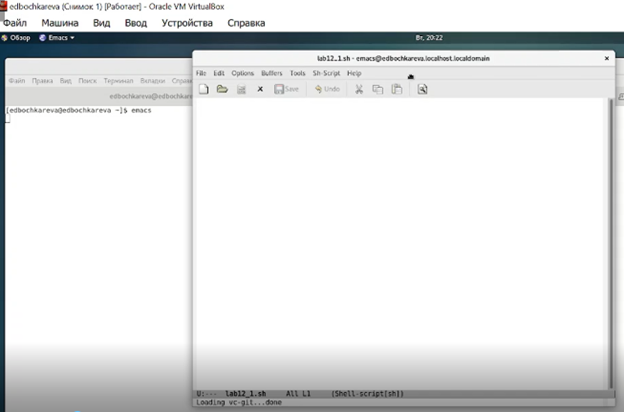
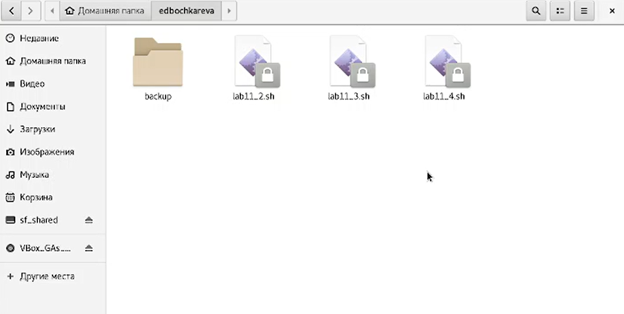
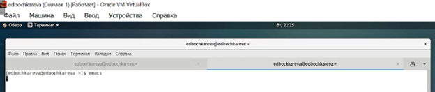
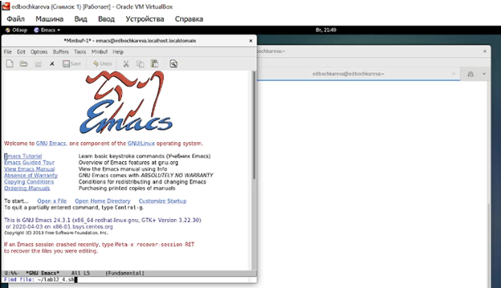

**РОССИЙСКИЙ УНИВЕРСИТЕТ ДРУЖБЫ НАРОДОВ**

**Факультет физико-математических и естественных наук**

**Кафедра прикладной информатики и теории вероятностей**

**ОТЧЕТ**

по лабораторной работе №12

**«Программирование**

**в командном процессоре ОС UNIX.**

**Ветвления и циклы».**

[дисциплина: Операционные системы]{.underline}

[Студентка:]{.underline}

[Бочкарева Елена Дмитриевна]{.underline}

Студенческий билет номер №: 1032207514

Группа:

[НПМбв-01-19]{.underline}

**МОСКВА**

2023

# Оглавление {#оглавление .TOC-Heading}

[9.1. Цель работы [4](#цель-работы)](#цель-работы)

[9.1.1. Запускаю операционную систему (рис.1).
[4](#запускаю-операционную-систему-рис.1.)](#запускаю-операционную-систему-рис.1.)

[9.1.2. Вхожу от имени пользователя edbochkareva. Ввожу пароль (рис.2).
[5](#_Toc135308170)](#_Toc135308170)

[9.2. Последовательность выполнения работы
[5](#последовательность-выполнения-работы)](#последовательность-выполнения-работы)

[9.2.1. Используя команды getopts grep, написать командный файл, который
анализирует командную строку с ключами: -- -iinputfile --- прочитать
данные из указанного файла; -- -ooutputfile --- вывести данные в
указанный файл; -- -pшаблон --- указать шаблон для поиска; -- -C ---
различать большие и малые буквы; -- -n --- выдавать номера строк. а
затем ищет в указанном файле нужные строки, определяемые ключом -p.
[5](#используя-команды-getopts-grep-написать-командный-файл-который-анализирует-командную-строку-с-ключами--iinputfile-прочитать-данные-из-указанного-файла--ooutputfile-вывести-данные-в-указанный-файл--pшаблон-указать-шаблон-для-поиска--c-различать-большие-и-малые-буквы--n-выдавать-номера-строк.-а-затем-ищет-в-указанном-файле-нужные-строки-определяемые-ключом--p.)](#используя-команды-getopts-grep-написать-командный-файл-который-анализирует-командную-строку-с-ключами--iinputfile-прочитать-данные-из-указанного-файла--ooutputfile-вывести-данные-в-указанный-файл--pшаблон-указать-шаблон-для-поиска--c-различать-большие-и-малые-буквы--n-выдавать-номера-строк.-а-затем-ищет-в-указанном-файле-нужные-строки-определяемые-ключом--p.)

[9.2.1.1. Открываю emacs (рис.3).
[6](#открываю-emacs-рис.3.)](#открываю-emacs-рис.3.)

[9.2.1.2. Запускаю текстовый редактор и наименование документу
lab12_1.sh (рис.4).
[7](#запускаю-текстовый-редактор-и-наименование-документу-lab12_1.sh-рис.4.)](#запускаю-текстовый-редактор-и-наименование-документу-lab12_1.sh-рис.4.)

[9.2.1.3. Скрипт для выполнения задания 1 (рис.5).
[8](#скрипт-для-выполнения-задания-1-рис.5.)](#скрипт-для-выполнения-задания-1-рис.5.)

[9.2.1.4. Ввожу команду chmod +x для lab12_1.sh (рис.6).
[8](#ввожу-команду-chmod-x-для-lab12_1.sh-рис.6.)](#ввожу-команду-chmod-x-для-lab12_1.sh-рис.6.)

[9.2.1.5. Ввожу команду ./lab12_1.sh(рис.7).
[8](#ввожу-команду-.lab12_1.shрис.7.)](#ввожу-команду-.lab12_1.shрис.7.)

[9.2.1.6. Ввожу ./для lab12_1.sh -1 ./lab12_1.sh -- o ./txt -p «#»
(рис.8).
[9](#ввожу-.для-lab12_1.sh--1-.lab12_1.sh-o-.txt--p-рис.8.)](#ввожу-.для-lab12_1.sh--1-.lab12_1.sh-o-.txt--p-рис.8.)

[9.2.1.7. Сохраняю файл в домашнюю папку home (рис.9).
[9](#сохраняю-файл-в-домашнюю-папку-home-рис.9.)](#сохраняю-файл-в-домашнюю-папку-home-рис.9.)

[9.2.1.8. Результат работы скрипта по заданию 1 (рис.6).
[9](#результат-работы-скрипта-по-заданию-1-рис.6.)](#результат-работы-скрипта-по-заданию-1-рис.6.)

[9.2.2. Написать на языке Си программу, которая вводит число и
определяет, является ли оно больше нуля, меньше нуля или равно нулю.
Затем программа завершается с помощью функции exit(n), передавая
информацию в о коде завершения в оболочку. Командный файл должен
вызывать эту программу и, проанализировав с помощью команды \$?, выдать
сообщение о том, какое число было введено.
[10](#написать-на-языке-си-программу-которая-вводит-число-и-определяет-является-ли-оно-больше-нуля-меньше-нуля-или-равно-нулю.-затем-программа-завершается-с-помощью-функции-exitn-передавая-информацию-в-о-коде-завершения-в-оболочку.-командный-файл-должен-вызывать-эту-программу-и-проанализировав-с-помощью-команды-выдать-сообщение-о-том-какое-число-было-введено.)](#написать-на-языке-си-программу-которая-вводит-число-и-определяет-является-ли-оно-больше-нуля-меньше-нуля-или-равно-нулю.-затем-программа-завершается-с-помощью-функции-exitn-передавая-информацию-в-о-коде-завершения-в-оболочку.-командный-файл-должен-вызывать-эту-программу-и-проанализировав-с-помощью-команды-выдать-сообщение-о-том-какое-число-было-введено.)

[9.2.2.1. Ввожу emacs (рис.11).
[10](#ввожу-emacs-рис.11.)](#ввожу-emacs-рис.11.)

[9.2.2.1. Открываю окно emacs (рис.12).
[11](#открываю-окно-emacs-рис.12.)](#открываю-окно-emacs-рис.12.)

[9.2.2.2. В строке «Find File» ввожу \~/lab12_2.sh (рис.14).
[12](#в-строке-find-file-ввожу-lab12_2.sh-рис.14.)](#в-строке-find-file-ввожу-lab12_2.sh-рис.14.)

[9.2.2.3. Открываю редактор emacs для ввода скрипта (рис.15).
[13](#открываю-редактор-emacs-для-ввода-скрипта-рис.15.)](#открываю-редактор-emacs-для-ввода-скрипта-рис.15.)

[9.2.2.4. Скрипт для выполнения задания 2 (рис.16).
[14](#скрипт-для-выполнения-задания-2-рис.16.)](#скрипт-для-выполнения-задания-2-рис.16.)

[9.2.2.5. Скрипт для выполнения задания 2 (рис.17).
[14](#скрипт-для-выполнения-задания-2-рис.17.)](#скрипт-для-выполнения-задания-2-рис.17.)

[9.2.2.6. Ввожу chmod +x для lab12_2.sh (рис.14).
[14](#_Toc135308188)](#_Toc135308188)

[9.2.3. Написать командный файл, создающий указанное число файлов,
пронумерованных последовательно от 1 до N (например 1.tmp, 2.tmp,
3.tmp,4.tmp и т.д.). Число файлов, которые необходимо создать,
передаётся в аргументы командной строки. Этот же командный файл должен
уметь удалять все созданные им файлы (если они существуют).
[15](#написать-командный-файл-создающий-указанное-число-файлов-пронумерованных-последовательно-от-1-до-n-например-1.tmp-2.tmp-3.tmp4.tmp-и-т.д..-число-файлов-которые-необходимо-создать-передаётся-в-аргументы-командной-строки.-этот-же-командный-файл-должен-уметь-удалять-все-созданные-им-файлы-если-они-существуют.)](#написать-командный-файл-создающий-указанное-число-файлов-пронумерованных-последовательно-от-1-до-n-например-1.tmp-2.tmp-3.tmp4.tmp-и-т.д..-число-файлов-которые-необходимо-создать-передаётся-в-аргументы-командной-строки.-этот-же-командный-файл-должен-уметь-удалять-все-созданные-им-файлы-если-они-существуют.)

[9.2.3.1. Ввожу emacs \~/lab12_2.sh (рис.19).
[15](#ввожу-emacs-lab12_2.sh-рис.19.)](#ввожу-emacs-lab12_2.sh-рис.19.)

[9.2.3.2. Открываю окно emacs (рис.20).
[16](#открываю-окно-emacs-рис.20.)](#открываю-окно-emacs-рис.20.)

[9.2.3.3. Ввожу в строке текст для обозначения третьего задания название
\~/lab12_3.sh (рис.21).
[17](#ввожу-в-строке-текст-для-обозначения-третьего-задания-название-lab12_3.sh-рис.21.)](#ввожу-в-строке-текст-для-обозначения-третьего-задания-название-lab12_3.sh-рис.21.)

[9.2.3.4. Открываю \~/lab12_3.sh для ввода скрипта по заданию 3
(рис.22).
[17](#открываю-lab12_3.sh-для-ввода-скрипта-по-заданию-3-рис.22.)](#открываю-lab12_3.sh-для-ввода-скрипта-по-заданию-3-рис.22.)

[9.2.3.5. Скрипт для выполнения задания 3 (рис.23).
[18](#скрипт-для-выполнения-задания-3-рис.23.)](#скрипт-для-выполнения-задания-3-рис.23.)

[9.2.3.6. Ввожу emacs (рис.24).
[18](#ввожу-emacs-рис.24.)](#ввожу-emacs-рис.24.)

[9.2.3.6. Ввожу chmod +x для lab12_3.sh (рис.25).
[18](#ввожу-chmod-x-для-lab12_3.sh-рис.25.)](#ввожу-chmod-x-для-lab12_3.sh-рис.25.)

[9.2.4. Написать командный файл, который с помощью команды tar
запаковывает в архив все файлы в указанной директории. Модифицировать
его так, чтобы запаковывались только те файлы, которые были изменены
менее недели тому назад (использовать команду find).
[19](#написать-командный-файл-который-с-помощью-команды-tar-запаковывает-в-архив-все-файлы-в-указанной-директории.-модифицировать-его-так-чтобы-запаковывались-только-те-файлы-которые-были-изменены-менее-недели-тому-назад-использовать-команду-find.)](#написать-командный-файл-который-с-помощью-команды-tar-запаковывает-в-архив-все-файлы-в-указанной-директории.-модифицировать-его-так-чтобы-запаковывались-только-те-файлы-которые-были-изменены-менее-недели-тому-назад-использовать-команду-find.)

[9.2.4.1. Ввожу emacs (рис.27).
[19](#ввожу-emacs-рис.27.)](#ввожу-emacs-рис.27.)

[9.2.4.2. Открываю окно emacs (рис.28).
[20](#открываю-окно-emacs-рис.28.)](#открываю-окно-emacs-рис.28.)

[9.2.4.3. В строке «Find File» ввожу \~/lab12_4.sh (рис.29).
[20](#в-строке-find-file-ввожу-lab12_4.sh-рис.29.)](#в-строке-find-file-ввожу-lab12_4.sh-рис.29.)

[9.2.4.4. Открываю редактор emacs для ввода скрипта (рис.30).
[21](#открываю-редактор-emacs-для-ввода-скрипта-рис.30.)](#открываю-редактор-emacs-для-ввода-скрипта-рис.30.)

[9.2.4.5. Скрипт для выполнения задания 4 (рис.31).
[21](#скрипт-для-выполнения-задания-4-рис.31.)](#скрипт-для-выполнения-задания-4-рис.31.)

[9.2.4.6. Ввожу chmod +x для lab12_4.sh (рис.32).
[22](#ввожу-chmod-x-для-lab12_4.sh-рис.32.)](#ввожу-chmod-x-для-lab12_4.sh-рис.32.)

[9.2.4.7. Домашний каталог lab12_4.sh (рис.33).
[22](#домашний-каталог-lab12_4.sh-рис.33.)](#домашний-каталог-lab12_4.sh-рис.33.)

[9.2.4.8. Результат работы скрипта по заданию 4 (рис.34).
[22](#результат-работы-скрипта-по-заданию-4-рис.34.)](#результат-работы-скрипта-по-заданию-4-рис.34.)

[9.4. Ответы на контрольные вопросы:
[22](#ответы-на-контрольные-вопросы)](#ответы-на-контрольные-вопросы)

[9.4.1.Каково предназначение команды getopts?
[22](#каково-предназначение-команды-getopts)](#каково-предназначение-команды-getopts)

[9.4.2. Какое отношение метасимволы имеют к генерации имён файлов?
[23](#какое-отношение-метасимволы-имеют-к-генерации-имён-файлов)](#какое-отношение-метасимволы-имеют-к-генерации-имён-файлов)

[9.4.3. Какие операторы управления действиями вы знаете?
[23](#какие-операторы-управления-действиями-вы-знаете)](#какие-операторы-управления-действиями-вы-знаете)

[9.4.4. Какие операторы используются для прерывания цикла?
[26](#какие-операторы-используются-для-прерывания-цикла)](#какие-операторы-используются-для-прерывания-цикла)

[9.4.5. Для чего нужны команды false и true?
[27](#для-чего-нужны-команды-false-и-true)](#для-чего-нужны-команды-false-и-true)

[9.4.6. Что означает строка if test -f man\$s/\$i.\$s, встреченная в
командном файле?
[27](#что-означает-строка-if-test--f-mansi.s-встреченная-в-командном-файле)](#что-означает-строка-if-test--f-mansi.s-встреченная-в-командном-файле)

[9.4.7. Объясните различия между конструкциями while и until?
[27](#объясните-различия-между-конструкциями-while-и-until)](#объясните-различия-между-конструкциями-while-и-until)

[Выводы, согласованные с целью работы
[29](#выводы-согласованные-с-целью-работы)](#выводы-согласованные-с-целью-работы)

## 

# 9.1. Цель работы 

Изучить основы программирования в оболочке ОС UNIX. Научится писать
более сложные командные файлы с использованием логических управляющих
конструкций и циклов.

## 9.1.1. Запускаю операционную систему (рис.1).

Рис.1: Рисунок 1

## 9.1.2. Вхожу от имени пользователя edbochkareva. Ввожу пароль (рис.2).

Рис.2: Рисунок 2

## 9.2. Последовательность выполнения работы

## 9.2.1. Используя команды getopts grep, написать командный файл, который анализирует командную строку с ключами: -- -iinputfile --- прочитать данные из указанного файла; -- -ooutputfile --- вывести данные в указанный файл; -- -pшаблон --- указать шаблон для поиска; -- -C --- различать большие и малые буквы; -- -n --- выдавать номера строк. а затем ищет в указанном файле нужные строки, определяемые ключом -p.

Сначала с помощью команды getopts определяю: какие ключи ждем из
командной строки. Двоеточие после ключа означает, что для него
обязателен параметр.

Например, для ключа \"i\" необходимо указать путь и имя файла, который я
буду анализировать.

Далее в конструкции case указываю, какие действия должны быть
произведены, если встретился определенный ключ. Для ключей \"i\", \"о\",
\"p\" записываю параметры из командной строки в переменные, а для
остальных присваиваю значение.

Поведение скрипта зависит от значений переменных CaseSensitive и
needLineNumber, поэтому с помощью конструкции if предусматриваю все
варианты действий, в данном случае их четыре.

## 9.2.1.1. Открываю emacs (рис.3).

Рис.3: Рисунок 3

## 9.2.1.2. Запускаю текстовый редактор и наименование документу lab12_1.sh (рис.4).

Рис.4: Рисунок 4

## 9.2.1.3. Скрипт для выполнения задания 1 (рис.5).

Рис.5: Рисунок 5

## 9.2.1.4. Ввожу команду chmod +x для lab12_1.sh (рис.6).

Рис.6: Рисунок 6

## 9.2.1.5. Ввожу команду ./lab12_1.sh(рис.7).

Рис.7: Рисунок 7

## 9.2.1.6. Ввожу ./для lab12_1.sh -1 ./lab12_1.sh -- o ./txt -p «#» (рис.8).

Рис.8: Рисунок 8

## 9.2.1.7. Сохраняю файл в домашнюю папку home (рис.9).

Рис.9: Рисунок 9

## 9.2.1.8. Результат работы скрипта по заданию 1 (рис.6).

Рис.10: Рисунок 10

##  9.2.2. Написать на языке Си программу, которая вводит число и определяет, является ли оно больше нуля, меньше нуля или равно нулю. Затем программа завершается с помощью функции exit(n), передавая информацию в о коде завершения в оболочку. Командный файл должен вызывать эту программу и, проанализировав с помощью команды \$?, выдать сообщение о том, какое число было введено.

Сначала создаю программу на языке Си. Она просит пользователя ввести
число, считывает его и определяет, является ли число больше нуля, меньше
нуля или равно 0.

В зависимости от результата на выход передается код. Если число равно
нулю, то на выход передается 0, если больше нуля - 1, меньше нуля - 2.

Далее в BASH-скрипте вызывается созданная программа. В зависимости от
полученного кода выводится пользователю сообщение.

## 9.2.2.1. Ввожу emacs (рис.11).

Рис.11: Рисунок 11

## 9.2.2.1. Открываю окно emacs (рис.12).

Рис.12: Рисунок 12

## 9.2.2.2. В строке «Find File» ввожу \~/lab12_2.sh (рис.14).

Рис.14: Рисунок 14

## 9.2.2.3. Открываю редактор emacs для ввода скрипта (рис.15).

Рис.15: Рисунок 15

## 9.2.2.4. Скрипт для выполнения задания 2 (рис.16).

Рис.16: Рисунок 16

## 9.2.2.5. Скрипт для выполнения задания 2 (рис.17).

Рис.17: Рисунок 17

[]{#_Toc135308188 .anchor}**9.2.2.6. Ввожу chmod +x для lab12_2.sh
(рис.14).**

Рис.18: Рисунок 18

##  9.2.3. Написать командный файл, создающий указанное число файлов, пронумерованных последовательно от 1 до N (например 1.tmp, 2.tmp, 3.tmp,4.tmp и т.д.). Число файлов, которые необходимо создать, передаётся в аргументы командной строки. Этот же командный файл должен уметь удалять все созданные им файлы (если они существуют).

С помощью команды getopts определю: какие ключи ожидаю из командной
строки. В этот раз жду ключ \"с\" с указанным количеством файлов для
создания и ключ \"r\", если файлы нужно удалить.

## 9.2.3.1. Ввожу emacs \~/lab12_2.sh (рис.19).

Рис.19: Рисунок 19

## 9.2.3.2. Открываю окно emacs (рис.20).

Рис.20: Рисунок 20

## 9.2.3.3. Ввожу в строке текст для обозначения третьего задания название \~/lab12_3.sh (рис.21).

Рис.21: Рисунок 21

## 9.2.3.4. Открываю \~/lab12_3.sh для ввода скрипта по заданию 3 (рис.22).

Рис.22: Рисунок 22

## 9.2.3.5. Скрипт для выполнения задания 3 (рис.23).

Рис.23: Рисунок 23

## 9.2.3.6. Ввожу emacs (рис.24).

Рис.24: Рисунок 24

## 9.2.3.6. Ввожу chmod +x для lab12_3.sh (рис.25).

Рис.25: Рисунок 25

**9.2.3.7. Результат работы скрипта по заданию 3 (рис.26).**

Рис.26: Рисунок 26

##  9.2.4. Написать командный файл, который с помощью команды tar запаковывает в архив все файлы в указанной директории. Модифицировать его так, чтобы запаковывались только те файлы, которые были изменены менее недели тому назад (использовать команду find).

Для начала перейду в указанную директорию (команда cd). Это нужно для
того, чтобы в архиве не отражался весь путь до файлов от корневого
каталога.

С помощью команды find ищу в указанном каталоге только файлы, которые
были созданы не позднее трех дней назад.

Результат работы команды find сразу перенаправляю для создания архива.

## 9.2.4.1. Ввожу emacs (рис.27).

!

Рис.27: Рисунок 27

## 9.2.4.2. Открываю окно emacs (рис.28).

Рис.28: Рисунок 28

## 9.2.4.3. В строке «Find File» ввожу \~/lab12_4.sh (рис.29).

Рис.29: Рисунок 29

## 9.2.4.4. Открываю редактор emacs для ввода скрипта (рис.30).

Рис.30: Рисунок 30

## 9.2.4.5. Скрипт для выполнения задания 4 (рис.31).

Рис.31: Рисунок 31

## 9.2.4.6. Ввожу chmod +x для lab12_4.sh (рис.32).

Рис.32: Рисунок 32

## 9.2.4.7. Домашний каталог lab12_4.sh (рис.33).

Рис.33: Рисунок 33

## 9.2.4.8. Результат работы скрипта по заданию 4 (рис.34).

Рис.34: Рисунок 34

# 9.4. Ответы на контрольные вопросы:

## 9.4.1.Каково предназначение команды getopts?

**ОТВЕТ:** Команда **getopts** определяет какие ключи программа ожидает
получить из командной строки.

Команда **getopts** является встроенной командой командной оболочки
bash, предназначенной для разбора параметров сценариев. Она обрабатывает
исключительно однобуквенные параметры как с аргументами, так и без них и
этого вполне достаточно для передачи сценариям любых входных данных.

Базовый синтаксис команды выглядит следующим образом:

\$ getopts строка-параметров переменная \[набор-параметров\]

Для разбора параметров сценария достаточно использовать
команду **getopts** в рамках цикла **while**.

## 9.4.2. Какое отношение метасимволы имеют к генерации имён файлов?

**ОТВЕТ:** Метасимволы используются при генерации имен файлов.

Например, **\* соответствует любой последовательности символов, одному
любому символу.**

**При генерации имен используют метасимволы:**

  -------------------------------------------------------------------------
  **\***         произвольная (возможно пустая) последовательность
                 символов;
  -------------- ----------------------------------------------------------
  **?**          один произвольный символ;

  **\[\...\]**   любой из символов, указанных в скобках перечислением и/или
                 с указанием диапазона;

  **cat f\***    выдаст все файлы каталога, начинающиеся с \"f\";

  **cat \*f\***  выдаст все файлы, содержащие \"f\";

  **cat          выдаст файлы данного каталога с однобуквенными
  program.?**    расширениями, скажем \"program.c\" и \"program.o\", но не
                 выдаст \"program.com\";

  **cat          выдаст файлы, которые начинаются с \"a\", \"b\", \"c\",
  \[a-d\]\***    \"d\". Аналогичный эффект дадут и команды \"cat
                 \[abcd\]\*\" и \"cat \[bdac\]\*\".
  -------------------------------------------------------------------------

## 9.4.3. Какие операторы управления действиями вы знаете?

**ОТВЕТ: &&, \|\|. ;. \$?. #, & и т.д. Приведу 10 основных операторов с
примерами и пояснениями.**

Цепочка **команд Linux** означает объединение нескольких команд и
выполнение их на основе оператора, используемого между ними.

Часто используемые операторы цепочек команд, с краткими описаниями и
соответствующими примерами, которые, несомненно, повысят,
производительность и позволят писать короткие и содержательные коды,
помимо сокращения нагрузки
на [**систему**](https://blog.sedicomm.com/2019/09/17/10-luchshih-analogov-team-viewer-dlya-linux-v-2019-godu/),
в разы. Примеры:

**1. Оператор амперсанда (&) в Linux**

Функция '**&**' -- заставит команду работать в фоновом режиме. Просто
введите команду с пробелом и '&'. Вы можете выполнить более одной
команды в фоновом режиме за один раз. Запустим одну команду в фоновом
режиме:

*** ping ­c5 www.sedicomm.com &***

**2. Оператор тока с запятой (;) в Linux**

Оператор точка с запятой позволяет запускать несколько команд за один
раз, и выполнение команды происходит последовательно.

***apt-get update ; apt-get upgrade***

Приведенная выше комбинация команд сначала выполнит обновление
репозитория, затем обновит систему и, наконец, создаст каталог «test» в
текущей рабочей директории.

**3. Оператор AND (&&) в Linux**

Оператор **AND** (&&) будет выполнять вторую команду только в том
случае, если при выполнении первой команды **SUCCEEDS**, т.е. состояние
выхода первой команды равно "**0**" --- программа выполнена успешно. Эта
команда очень полезна при проверке состояния выполнения последней
команды.

Например, я хочу посетить сайт sedicomm.com с помощью команды links в
терминале, но перед этим мне нужно проверить, является ли хост доступным
или нет.

***ping -c3 www.sedicomm.com &&***

**4. Оператор OR (\|\|) в Linux**

Оператор OR (\|\|) очень похож на оператор "**else"** в
программировании. Вышеуказанный оператор позволяет вам выполнять вторую
команду только в случае сбоя при выполнении первой команды, то есть
состояние выхода первой команды равно "**1**" --- программа выполнена НЕ
успешно».

Например, я хочу выполнить **«apt-get update»** из учетной записи без
полномочий **root**, и если первая команда не будет выполнена, тогда
будет выполнена вторая команда «links www.sedicomm.com».

***apt-get update \|\| ping -c3
[www.sedicomm.com](http://www.sedicomm.com)***

**5. Оператор NOT (!) в Linux**

Оператор NOT (!) очень похож на оператор "**кроме**". Эта команда
выполнит все, кроме предоставленного условия. Чтобы понять как это
работает, создайте каталог «sedicomm» в вашем домашнем каталоге и
перейдите к нему с помощью команды "**cd**".

***mkdir sedicomm***

***cd sedicomm***

**6. Оператор AND-OR (&& -- \|\|) в Linux**

Вышеуказанный оператор фактически является комбинацией оператора «AND» и
«OR». Это очень похоже на утверждение «если-еще».

Например, давайте сделаем **ping** на sedicomm.com, если успешно то
выведем на экран **'Verified'**, если ping не успешный, то выведен на
экран '**Host Down**'.

***ping -c3 www.sedicomm.com && echo \"Verified\" \|\| echo \"Host
Down\"***

**7. Оператор потока PIPE (\|) в Linux**

Этот оператор потока PIPE очень полезен, когда выходные данные первой
команды действуют как входные данные для второй команды. Например,
направьте вывод команды **«ls** **-l**» на **«less»** и посмотрите вывод
всего скрипта.

***ls -l \| less***

**8. Оператор комбинации команд {}**

Объедините две или более команд, вторая команда зависит от выполнения
первой команды.

Например, проверьте, доступен ли каталог **«bin»,** и выведите
соответствующий вывод.

***\[ -d \"bin\" \] \|\| { echo Directory does not exist, creating
directory now.; mkdir bin; } && echo Directory exists.***

**9. Оператор приоритета () в Linux**

Среди всех команд в Linux этот оператор позволяет выполнить конкретную
команду в порядке приоритета.

***Command_x1 && Command_x2 \|\| Command_x3 && Command_x4***

**10. Оператор конкатенации (\\) в Linux**

Оператор конкатенации (\\), как указывает имя, используется для
объединения больших команд в нескольких строках оболочки. Например,
команда ниже откроет текстовый файл test(1) .txt.

***nano test\\(1\\).txt***

## 9.4.4. Какие операторы используются для прерывания цикла?

**ОТВЕТ:** break, break n.

**Оператор break в Bash**

Оператор break завершает текущий цикл и передает управление программой
команде, которая следует за завершенным циклом. Он используется для
выхода из
цикла for , while , [until](https://routerus.com/bash-until-loop/) или select .
s Синтаксис оператора break имеет следующий вид:

***break \[n\]***

\[n\] --- необязательный аргумент и должен быть больше или равен 1. Если
задано \[n\] , завершается n-ый включающий цикл. break
1 эквивалентен break .

## 9.4.5. Для чего нужны команды false и true?

**ОТВЕТ:**

**Команда true** всегда возвращает ноль в качестве выходного статуса для
индикации успеха. true - выдает логическое значение \"истина\". Команда
true ничего не делает и успешно завершается. Как правило, используется в
процедурах на языке shell. Команда выдает нулевой код завершения.

**Команда false** всегда возвращает \"не-ноль\" в качестве выходного
статуса для индикации неудачи. false - выдает логическое значение
\"ложь\" Команда false ничего не делает, но завершается неудачно. Как
правило, используется в процедурах на языке shell.

## 9.4.6. Что означает строка if test -f man\$s/\$i.\$s, встреченная в командном файле?

**ОТВЕТ:** Это условие, которое вернет true, если файл(ы) с заданной
маской имени существует.

## 9.4.7. Объясните различия между конструкциями while и until?

**ОТВЕТ:**

while -- выполняет действие до тех пор, пока условие является истинным.

**until** -- будет выполняться до тех пор, пока условие не станет
истинным, т.е. пока оно является false.

**Простой пример, хорошо демонстрирующий принцип работы цикла while:**

***#!/bin/bash***

***count=0***

***while \[ \$count -lt 10 \]***

***do***

***(( count++ ))***

***echo \$count***

***done***

**Аналогично, но "в обратную сторону" работает и цикл until:**

***#!/bin/bash***

***count=0***

***until \[ \$count -gt 10 \]***

***do***

***(( count++ ))***

***echo \$count***

***done***

Тут мы задаём похожее условие, но вместо "пока переменная меньше 10" --
указываем "пока переменная не станет больше чем 10". Результат
выполнения:

***./loop.sh***

***1***

***2***

***3***

***4***

***5***

***6***

***7***

***8***

***9***

***10***

***11***

**Если же приведённый выше пример "бесконечного цикла" выполнить [с
использованием until -- о не выведет ничего, в отличии
от while:]{.underline}**

***#!/bin/bash***

***count=10***

***until \[ 1 = 1 \]***

***do***

***(( count++ ))***

***echo \$count***

***done***

Запускаем: ***./loop.sh***

Так как "*условие*" изначально "*истинно*" -- тело цикла выполняться не
будет.

# Выводы, согласованные с целью работы

Я изучила основы программирования в оболочке ОС UNIX, научилась писать
более сложные командные файлы с использованием логических управляющих
конструкций и циклов. В данной работе были созданы более сложные
BASH-скрипты, использующие для своей работы условные операторы, циклы,
сторонние программы, ключи для распознавания параметров.
