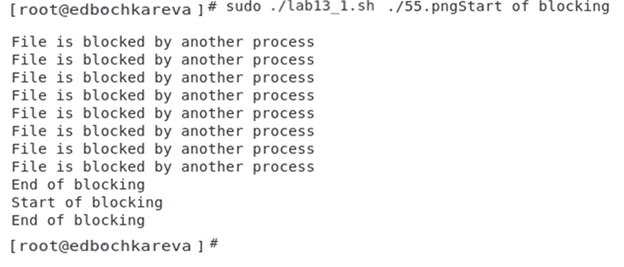

**РОССИЙСКИЙ УНИВЕРСИТЕТ ДРУЖБЫ НАРОДОВ**

**Факультет физико-математических и естественных наук**

**Кафедра прикладной информатики и теории вероятностей**

**ОТЧЕТ**

по лабораторной работе №13

**«Программирование в командном процессоре ОС UNIX. Расширенное
программирование».**

[дисциплина: Операционные системы]{.underline}

[Студентка:]{.underline}

[Бочкарева Елена Дмитриевна]{.underline}

Студенческий билет номер №: 1032207514

Группа:

[НПМбв-01-19]{.underline}

**МОСКВА**

2023

# Оглавление {#оглавление .TOC-Heading}

[10.1. Цель работы [4](#цель-работы)](#цель-работы)

[10.1.1. Запускаю операционную систему (рис.1)
[4](#запускаю-операционную-систему-рис.1)](#запускаю-операционную-систему-рис.1)

[10.1.2. Вхожу от имени пользователя edbochkareva. Ввожу пароль (рис.2).
[4](#вхожу-от-имени-пользователя-edbochkareva.-ввожу-пароль-рис.2.)](#вхожу-от-имени-пользователя-edbochkareva.-ввожу-пароль-рис.2.)

[10.2. Последовательность выполнения работы
[5](#последовательность-выполнения-работы)](#последовательность-выполнения-работы)

[10.2.1. Написать командный файл, реализующий упрощённый механизм
семафоров. Командный файл должен в течение некоторого времени t1
дожидаться освобождения ресурса, выдавая об этом сообщение, а дождавшись
его освобождения, использовать его в течение некоторого времени
t2\<\>t1, также выдавая информацию о том, что ресурс используется
соответствующим командным файлом (процессом). Запустить командный файл в
одном виртуальном терминале в фоновом режиме, перенаправив его вывод в
другой (\> /dev/tty#, где \# --- номер терминала куда перенаправляется
вывод), в котором также запущен этот файл, но не фоновом, а в
привилегированном режиме. Доработать программу так, чтобы имелась
возможность взаимодействия трёх и более процессов.
[5](#написать-командный-файл-реализующий-упрощённый-механизм-семафоров.-командный-файл-должен-в-течение-некоторого-времени-t1-дожидаться-освобождения-ресурса-выдавая-об-этом-сообщение-а-дождавшись-его-освобождения-использовать-его-в-течение-некоторого-времени-t2t1-также-выдавая-информацию-о-том-что-ресурс-используется-соответствующим-командным-файлом-процессом.-запустить-командный-файл-в-одном-виртуальном-терминале-в-фоновом-режиме-перенаправив-его-вывод-в-другой-devtty-где-номер-терминала-куда-перенаправляется-вывод-в-котором-также-запущен-этот-файл-но-не-фоновом-а-в-привилегированном-режиме.-доработать-программу-так-чтобы-имелась-возможность-взаимодействия-трёх-и-более-процессов.)](#написать-командный-файл-реализующий-упрощённый-механизм-семафоров.-командный-файл-должен-в-течение-некоторого-времени-t1-дожидаться-освобождения-ресурса-выдавая-об-этом-сообщение-а-дождавшись-его-освобождения-использовать-его-в-течение-некоторого-времени-t2t1-также-выдавая-информацию-о-том-что-ресурс-используется-соответствующим-командным-файлом-процессом.-запустить-командный-файл-в-одном-виртуальном-терминале-в-фоновом-режиме-перенаправив-его-вывод-в-другой-devtty-где-номер-терминала-куда-перенаправляется-вывод-в-котором-также-запущен-этот-файл-но-не-фоновом-а-в-привилегированном-режиме.-доработать-программу-так-чтобы-имелась-возможность-взаимодействия-трёх-и-более-процессов.)

[10.2.1.1. Открываю emacs (рис.3).
[6](#открываю-emacs-рис.3.)](#открываю-emacs-рис.3.)

[10.2.1.2. Ввожу в строке название файла ./дфи13_1.sh (рис.4).
[7](#ввожу-в-строке-название-файла-.дфи13_1.sh-рис.4.)](#ввожу-в-строке-название-файла-.дфи13_1.sh-рис.4.)

[10.2.1.3. Запускаю текстовый редактор с наименованием документа
lab13_1.sh (рис.5).
[7](#запускаю-текстовый-редактор-с-наименованием-документа-lab13_1.sh-рис.5.)](#запускаю-текстовый-редактор-с-наименованием-документа-lab13_1.sh-рис.5.)

[10.2.1.4. Пишу скрипт для выполнения задания №1 (рис.6).
[8](#пишу-скрипт-для-выполнения-задания-1-рис.6.)](#пишу-скрипт-для-выполнения-задания-1-рис.6.)

[10.2.1.5. Сохранила файл и скрипт в домашней папке (рис.7).
[8](#сохранила-файл-и-скрипт-в-домашней-папке-рис.7.)](#сохранила-файл-и-скрипт-в-домашней-папке-рис.7.)

[10.2.1.6. Проверяю скрипт по заданию 1 (рис.8).
[9](#проверяю-скрипт-по-заданию-1-рис.8.)](#проверяю-скрипт-по-заданию-1-рис.8.)

[10.2.1.7. Открываю emacs и запуск скрипта с перенаправлением вывода в
другой терминал(рис.9).
[9](#открываю-emacs-и-запуск-скрипта-с-перенаправлением-вывода-в-другой-терминалрис.9.)](#открываю-emacs-и-запуск-скрипта-с-перенаправлением-вывода-в-другой-терминалрис.9.)

[10.2.1.8. Результат работы обоих скриптов во втором терминале (рис.10).
[9](#результат-работы-обоих-скриптов-во-втором-терминале-рис.10.)](#результат-работы-обоих-скриптов-во-втором-терминале-рис.10.)

[10.2.2. Реализовать команду man с помощью командного файла. Изучите
содержимое каталога /usr/share/man/man1. В нем находятся архивы
текстовых файлов, содержащих справку по большинству установленных в
системе программ и команд. Каждый архив можно открыть командой less
сразу же просмотрев содержимое справки. Командный файл должен получать в
виде аргумента командной строки название команды и в виде результата
выдавать справку об этой команде или сообщение об отсутствии справки,
если соответствующего файла нет в каталоге man1.
[10](#реализовать-команду-man-с-помощью-командного-файла.-изучите-содержимое-каталога-usrsharemanman1.-в-нем-находятся-архивы-текстовых-файлов-содержащих-справку-по-большинству-установленных-в-системе-программ-и-команд.-каждый-архив-можно-открыть-командой-less-сразу-же-просмотрев-содержимое-справки.-командный-файл-должен-получать-в-виде-аргумента-командной-строки-название-команды-и-в-виде-результата-выдавать-справку-об-этой-команде-или-сообщение-об-отсутствии-справки-если-соответствующего-файла-нет-в-каталоге-man1.)](#реализовать-команду-man-с-помощью-командного-файла.-изучите-содержимое-каталога-usrsharemanman1.-в-нем-находятся-архивы-текстовых-файлов-содержащих-справку-по-большинству-установленных-в-системе-программ-и-команд.-каждый-архив-можно-открыть-командой-less-сразу-же-просмотрев-содержимое-справки.-командный-файл-должен-получать-в-виде-аргумента-командной-строки-название-команды-и-в-виде-результата-выдавать-справку-об-этой-команде-или-сообщение-об-отсутствии-справки-если-соответствующего-файла-нет-в-каталоге-man1.)

[10.2.2.1. Открываю emacs и ввожу в строке название файла ./lab13_2.sh
(рис.11).
[11](#открываю-emacs-и-ввожу-в-строке-название-файла-.lab13_2.sh-рис.11.)](#открываю-emacs-и-ввожу-в-строке-название-файла-.lab13_2.sh-рис.11.)

[10.2.2.2. Скрипт для выполнения задания №2 (рис.12).
[11](#скрипт-для-выполнения-задания-2-рис.12.)](#скрипт-для-выполнения-задания-2-рис.12.)

[10.2.2.3. Запуск скрипта №2 (рис.13).
[12](#запуск-скрипта-2-рис.13.)](#запуск-скрипта-2-рис.13.)

[10.2.2.4. Результат работы скрипта №2 (рис.14).
[12](#результат-работы-скрипта-2-рис.14.)](#результат-работы-скрипта-2-рис.14.)

[10.2.3. Используя встроенную переменную \$RANDOM, напишите командный
файл, генерирующий случайную последовательность букв латинского
алфавита. Учтите, что \$RANDOM выдаёт псевдослучайные числа в диапазоне
от 0 до 32767.
[13](#используя-встроенную-переменную-random-напишите-командный-файл-генерирующий-случайную-последовательность-букв-латинского-алфавита.-учтите-что-random-выдаёт-псевдослучайные-числа-в-диапазоне-от-0-до-32767.)](#используя-встроенную-переменную-random-напишите-командный-файл-генерирующий-случайную-последовательность-букв-латинского-алфавита.-учтите-что-random-выдаёт-псевдослучайные-числа-в-диапазоне-от-0-до-32767.)

[10.2.3.1. Открываю emacs и ввожу в строке название файла ./lab13_3.sh
(рис.15).
[13](#открываю-emacs-и-ввожу-в-строке-название-файла-.lab13_3.sh-рис.15.)](#открываю-emacs-и-ввожу-в-строке-название-файла-.lab13_3.sh-рис.15.)

[10.2.3.2. Пишу скрипт для выполнения задания №3 (рис.16).
[13](#пишу-скрипт-для-выполнения-задания-3-рис.16.)](#пишу-скрипт-для-выполнения-задания-3-рис.16.)

[10.2.3.3. Результат работы скрипта для задания №3 (рис.17).
[14](#результат-работы-скрипта-для-задания-3-рис.17.)](#результат-работы-скрипта-для-задания-3-рис.17.)

[10.4. Ответы на контрольные вопросы
[14](#ответы-на-контрольные-вопросы)](#ответы-на-контрольные-вопросы)

[10.4.1. Найдите синтаксическую ошибку в следующей строке: while \[\$1
!= \"exit\"\]
[15](#найдите-синтаксическую-ошибку-в-следующей-строке-while-1-exit)](#найдите-синтаксическую-ошибку-в-следующей-строке-while-1-exit)

[10.4.2. Как объединить (конкатенация) несколько строк в одну?
[15](#_Toc136031656)](#_Toc136031656)

[10.4.3. Найдите информацию об утилите seq. Какими иными способами можно
реализовать её функционал при программировании на bash?
[15](#найдите-информацию-об-утилите-seq.-какими-иными-способами-можно-реализовать-её-функционал-при-программировании-на-bash)](#найдите-информацию-об-утилите-seq.-какими-иными-способами-можно-реализовать-её-функционал-при-программировании-на-bash)

[10.4.4. Какой результат даст вычисление выражения \$((10/3))?
[17](#_Toc136031658)](#_Toc136031658)

[10.4.5. Укажите кратко основные отличия командной оболочки zsh от bash.
[17](#_Toc136031659)](#_Toc136031659)

[10.4.6. Проверьте, верен ли синтаксис данной конструкции for ((a=1; a
\<= LIMIT; a++)) [19](#_Toc136031660)](#_Toc136031660)

[10.4.7. Сравните язык bash с какими-либо языками программирования.
Какие преимущества у bash по сравнению с ними? Какие недостатки?
[19](#_Toc136031661)](#_Toc136031661)

[Выводы, согласованные с целью работы
[23](#выводы-согласованные-с-целью-работы)](#выводы-согласованные-с-целью-работы)

# 10.1. Цель работы

Изучить основы программирования в оболочке ОС UNIX. Научиться писать
более сложные командные файлы с использованием логических управляющих
конструкций и циклов.

### 10.1.1. Запускаю операционную систему (рис.1)

Рис.1: Рисунок 1

### 10.1.2. Вхожу от имени пользователя edbochkareva. Ввожу пароль (рис.2).

Рис.2: Рисунок 2

# 10.2. Последовательность выполнения работы

## 

### 10.2.1. Написать командный файл, реализующий упрощённый механизм семафоров. Командный файл должен в течение некоторого времени t1 дожидаться освобождения ресурса, выдавая об этом сообщение, а дождавшись его освобождения, использовать его в течение некоторого времени t2\<\>t1, также выдавая информацию о том, что ресурс используется соответствующим командным файлом (процессом). Запустить командный файл в одном виртуальном терминале в фоновом режиме, перенаправив его вывод в другой (\> /dev/tty#, где \# --- номер терминала куда перенаправляется вывод), в котором также запущен этот файл, но не фоновом, а в привилегированном режиме. Доработать программу так, чтобы имелась возможность взаимодействия трёх и более процессов.

Скрипт принимает на вход файл для блокировки. В бесконечном цикле буду
пытаться установить блокировку на файл с помощью команды flock.

Если удалось заблокировать файл, то выведу сообщения о начале и
окончании блокировки, выйду из цикла с помощью оператора break.

Если заблокировать не удалось, то выведу сообщение о том, что файл
заблокирован другим процессом, подожду 1 секунду и буду пытаться снова
заблокировать файл до тех пор, пока не получится.

Далее проверю работу скрипта. В первом терминале запущу скрипт в фоновом
режиме, перенаправив вывод во второй терминал.

Во втором терминале запущу скрипт с тем же файлом для блокировки. Видим,
что скрипт из первого терминала заблокировал файл, об этом говорит
сообщение \"Start of blocking\". После этого скрипт из второго терминала
пытается получить доступ, но не выходит и выводится сообщение \"File is
blocked by another process\". Далее первый скрипт снимает блокировку с
файла, а второй устанавливает.

## 10.2.1.1. Открываю emacs (рис.3).

Рис.3: Рисунок 3

## 10.2.1.2. Ввожу в строке название файла ./дфи13_1.sh (рис.4).

Рис.4: Рисунок 4

## 10.2.1.3. Запускаю текстовый редактор с наименованием документа lab13_1.sh (рис.5).

Рис.5: Рисунок 5

## 10.2.1.4. Пишу скрипт для выполнения задания №1 (рис.6).

Рис.6: Рисунок 6

## 10.2.1.5. Сохранила файл и скрипт в домашней папке (рис.7).

Рис.7: Рисунок 7

## 10.2.1.6. Проверяю скрипт по заданию 1 (рис.8).

Рис.8: Рисунок 8

## 10.2.1.7. Открываю emacs и запуск скрипта с перенаправлением вывода в другой терминал(рис.9).

Рис.9: Рисунок 9

### 10.2.1.8. Результат работы обоих скриптов во втором терминале (рис.10).

Рис.10: Рисунок 10

## 10.2.2. Реализовать команду man с помощью командного файла. Изучите содержимое каталога /usr/share/man/man1. В нем находятся архивы текстовых файлов, содержащих справку по большинству установленных в системе программ и команд. Каждый архив можно открыть командой less сразу же просмотрев содержимое справки. Командный файл должен получать в виде аргумента командной строки название команды и в виде результата выдавать справку об этой команде или сообщение об отсутствии справки, если соответствующего файла нет в каталоге man1. 

Для поиска пути к справке воспользу.cm командой whereis.

С помощью ключей -m -M и пути \"/usr/share/man/man1\" укажу ей, что ищем
справки (мануалы) в конкретной директории. Ключ -f указывает на то, что
это должен быть файл, а \$1 - имя команды, переданное через параметры
скрипта. Команда возвращает не только путь, но и лишний текст.

Избавлюсь от него с помощью команды cut, разделив строку по пробелу и
оставив только вторую часть. Далее полученный путь передам команде less,
которая выводит содержимое справки на экран.\
Далее с помощью созданного скрипта вызываю справку по команде ls.

## 10.2.2.1. Открываю emacs и ввожу в строке название файла ./lab13_2.sh (рис.11).

Рис.11: Рисунок 11

### 10.2.2.2. Скрипт для выполнения задания №2 (рис.12). 

Рис.12: Рисунок 12

### 10.2.2.3. Запуск скрипта №2 (рис.13). 

Рис.13: Рисунок 13

### 10.2.2.4. Результат работы скрипта №2 (рис.14). 

Рис.14: Рисунок 14

### 10.2.3. Используя встроенную переменную \$RANDOM, напишите командный файл, генерирующий случайную последовательность букв латинского алфавита. Учтите, что \$RANDOM выдаёт псевдослучайные числа в диапазоне от 0 до 32767.

### 10.2.3.1. Открываю emacs и ввожу в строке название файла ./lab13_3.sh (рис.15).

Рис.15: Рисунок 15

### 10.2.3.2. Пишу скрипт для выполнения задания №3 (рис.16).

В переменной symSet соберу в одну строку все символы, которые доступны
для формирования последовательности.

Далее в цикле случайным образом выбираю позицию символа в сформированной
строке и добавляю его к результату.

Длина последовательности передается как параметр скрипта.\
Для ограничения диапазона встроенной переменной \$RANDOM воспользуюсь
следующей формулой:\
\$RANDOM % (max значение диапазона) + (min значение диапазона)

Рис.16: Рисунок 16

### 10.2.3.3. Результат работы скрипта для задания №3 (рис.17).

Рис.17: Рисунок 17

# 10.4. Ответы на контрольные вопросы

## 10.4.1. Найдите синтаксическую ошибку в следующей строке: while \[\$1 != \"exit\"\]

**ОТВЕТ:** \$1 необходимо взять в кавычки \" \".

[]{#_Toc136031656 .anchor}**10.4.2. Как объединить (конкатенация)
несколько строк в одну?**\
**ОТВЕТ:** **Первый способ**: с помощью оператора \"+=\" (этот способ
используется в задании 3). **Второй способ**: допустим, у нас есть две
переменные, которые содержат последовательность символов - \$a, \$b.
Объединим их в переменной c - c=\"\$a\$b\".

### 10.4.3. Найдите информацию об утилите seq. Какими иными способами можно реализовать её функционал при программировании на bash? 

**ОТВЕТ:** **Seq перечисляет числа в границах указанного диапазона.**

seq --- утилита, используемая в unix-системах для генерации
последовательности. Впервые появилась в Research Unix версии 8 в 1985
году и не была адаптирована другими вариантами Unix (такими как
коммерческие Unix или BSD).

Позднее была перенесена в [Plan
9](https://ru.wikipedia.org/wiki/Plan_9) и оттуда была скопирована в
некоторые BSD-системы, в том числе
во [FreeBSD](https://ru.wikipedia.org/wiki/FreeBSD). Другая версия
утилиты была написана в 1994 году Ульрихом Дреппером для
проекта [GNU](https://ru.wikipedia.org/wiki/GNU), и стала основной в
дистрибутивах [Linux](https://ru.wikipedia.org/wiki/Linux) как
часть [GNU Coreutils](https://ru.wikipedia.org/wiki/GNU_Coreutils).
Команда доступна в виде отдельного пакета для [Microsoft
Windows](https://ru.wikipedia.org/wiki/Microsoft_Windows) как часть
коллекции UnxUtils.

В самом простом варианте использования --- seq *N* --- выводит на печать
все целые числа от 1 до *N* в последовательности; эта возможность часто
применялась в ранних версиях Bash для циклов, когда команда for могла
перебирать только списки:

*\# Удалить file1..file17:*

**for** n **in** \`seq 17\`

**do**

rm \"file\$n\"

**done**

Команда seq выводит последовательность целых или действительных чисел,
подходящую для передачи в другие программы.

Например, seq 1 5 вернет 1 2 3 4 5.

Команда seq может пригодиться в различных других командах и циклах для
генерации последовательности чисел.

Общий синтаксис команды «seq»:

\# seq \[options\] specification

Примеры:

1\. Чтобы просто напечатать последовательность чисел, начиная с 1,
используйте следующую команду:

\# seq 4

1

2

3

4

По умолчанию команда seq начинает печатать последовательность чисел от
1, если не указано иное.

2\. Вы также можете указать верхний и нижний пределы для
последовательности чисел, сгенерированных командой «seq»:

\# seq 6 9

6

7

8

9

3\. Если нам нужно сгенерировать некоторую другую арифметическую
прогрессию, мы можем использовать команду seq, синтаксис которой показан
здесь:

\# seq \[start\] \[incr\] \[stop\]

Эта команда сгенерирует числа start, start + incr, start + incr +
incr... вплоть до остановки. Давайте разберемся с этим на примере:

\# seq 1 3 10

1

4

7

10

Иной способ - указывать диапазон в фигурных скобках {}.

Например, чтобы вывести на экран: echo {1..5}; чтобы использовать в
цикле: for i in {1..5}.

[]{#_Toc136031658 .anchor}**10.4.4. Какой результат даст вычисление
выражения \$((10/3))?\
ОТВЕТ:** Результат - 3.

[]{#_Toc136031659 .anchor}**10.4.5. Укажите кратко основные отличия
командной оболочки zsh от bash.**\
**ОТВЕТ:** **Bash - более универсальная оболочка, используется намного
чаще.**

Название [BASH](https://www.gnu.org/software/bash/) происходит от
\"Bourne again shell\" (еще одна командная оболочка Борна). Появилась в
1987 году, как усовершенствованный вариант командной оболочки Bourne
shell (sh, автор Стивен Борн). Поскольку фамилия Bourne (Борн) созвучна
со словом born (рожденный), появился каламбур \"Born again shell\"
(рожденная вновь командная оболочка).

BASH, как и все shell, представляет собой командный процессор,
работающий в текстовом окне в интерактивном режиме. Поддерживает
различные сокращения и переменные, операторы цикла, контроль и
подстановку вывода результатов, автодополнение имен файлов и каталогов.
Синтаксис BASH и другие особенности языка были заимствованы его автором
Брайаном Фоксом из [SH](https://ru.wikipedia.org/wiki/Bourne_shell).

BASH --- одна из первых программ, которую Линус Торвальдс (создатель
Linux) портировал на Linux. BASH --- самая распространенная оболочка
Linux и каждый пользователь, который хоть раз открывал терминал,
взаимодействовал с ней.

**Ключевые особенности BASH:**

1.  Огромное количество пользователей используют BASH, так как эта
    оболочка установлена по умолчанию в большинстве систем Linux

2.  Командный процессор BASH имеет множество встроенных команд

3.  BASH не имеет встроенного выражения с подстановочными знаками
    (**\***,**?**,**\[\]**), которые используются для поиска шаблонов,
    аналогично регулярному выражению

4.  Символ **\#** рассматривается как комментарий в сценарии BASH

5.  Имеет крайне скромные (ограниченные возможности) настройки

6.  Пользовательские параметры конфигурации находятся в домашнем разделе
    в файле /home/.bashrc

**Zsh имеет возможность индивидуальной настройки под конкретного
пользователя и его задачи, более гибкая в этом плане чем bash.**

Первая версия [ZSH](https://www.zsh.org/) была написана Паулем
Фалстадом, когда он был студентом Принстонского университета в 1990
году. Название оболочки произошло от учетной записи \"zsh\"
университетского ассистента Пауля по имени Чжун Шао. В настоящее время
проект развивается энтузиастами под руководством Питера Стефенсона в
рамках свободно распространяемого ПО.

ZSH является расширенным аналогом BASH и имеет с ним обратную
совместимость, добавляя ему большое количество улучшений.

**Ключевые особенности ZSH:**

1.  Встроенное автозаполнение с расширенным функционалом. Клавиша
    TAB **⇆** используется для автоматического дополнения (завершения)
    любой команды, которую вы хотите запустить. Помимо автозаполнения
    она выводит раскрывающийся список всех возможных файлов и каталогов

2.  Поддерживает встроенные выражения с подстановочными знаками
    (**\***, **?**, **\[\]**)

3.  Более настраиваемый, чем BASH

4.  Поддерживает различные плагины, расширяющие функционал и темы для
    кастомизации внешнего вида.

5.  [[Oh My Zsh]{.underline}](https://ohmyz.sh/) --- наиболее известный
    фреймворк для применения разнообразных настроек оболочки

6.  Пользовательские параметры конфигурации находятся в домашнем разделе
    в файле /home/.zshrc

[]{#_Toc136031660 .anchor}**10.4.6. Проверьте, верен ли синтаксис данной
конструкции for ((a=1; a \<= LIMIT; a++))**\
**ОТВЕТ:** Перед LIMIT необходимо указать символ \$.

[]{#_Toc136031661 .anchor}**10.4.7. Сравните язык bash с какими-либо
языками программирования. Какие преимущества у bash по сравнению с ними?
Какие недостатки?**

**ОТВЕТ:** В bash, как и в большинстве языков программирования, есть
условные операторы, циклы, переменные, функции, арифметические,
логические и другие операции.

Bash используется для автоматизации повторяющихся задач, таких как
управление файлами, настройка рабочей среды и прочее. Те же задачи могут
выполняться с помощью python.

Bash позволяет писать Shell-сценарии с минимальной грамматикой. Если
нужно выполнить несколько команд, достаточно поместить их в сценарий
Bash построчно.

Преимущество python в том, что он кроссплатформенный, в то время как
bash-скрипты могу работать только в Unix-подобных системах. В тоже
время, python более медленный по сравнению с bash, что может отражаться
на производительности при больших объемах.

Python --- популярная альтернатива Bash для написания сценариев
настройки среды, сборки и выпуска. Я знаю, что проект Electron
использует Python
для [сценариев ](https://github.com/electron/electron/tree/main/script)нескольких
утилит. В Python нельзя выполнять команды напрямую, поскольку это не
командный язык. Но запуск команд и перехват вывода реализуются проще
простого с помощью модуля subprocess

Используя встроенные функции Python, можно писать современные сложные
Shell-сценарии. Но, в отличие от Bash, интерпретатор Python изначально
не поддерживает выполнение процесса. Поэтому, если нужно упростить
сценарий Python, чтобы он больше походил на Bash, используется такой
инструмент, как Shellpy

Python --- язык, очень удобный для разработчиков. Кроме того, он
поставляется со многими полезными встроенными библиотеками.
Интерпретатор Python предустановлен почти во все Unix-подобные
операционные системы. Поэтому Python также является хорошей
альтернативой для написания переносимых автоматизированных сценариев.

Но в отличие от других языков, для Python характерно медленное время
выполнения программы. Когда вы используете некоторые библиотеки, Python
работает слишком медленно даже по сравнению с Bash. Такие инструменты,
как Shellpy и Plumbum, предлагают удобные API для работы с процессами и
командами. Тем не менее, вам придется настроить и написать
дополнительный код.

Bash --- это командный язык, а не язык программирования общего
назначения. Поэтому с усложнением логики вашего автоматизированного
сценария он становится более запутанным и менее читаемым. Кроме того,
Bash все и всегда воспринимает как команду, потому что это командный
язык.

Bash поддерживает процессы нативно. Иначе говоря, вы можете инициировать
другие двоичные файлы в качестве команд. Например, если вам нужно
выполнить двоичный ping, можете написать команду ping в своих сценариях
Bash. Есть несколько способов отображения графического интерфейса с
помощью сценариев Bash.

У Bash нет стандартного API, однако он поставляется с простыми
встроенными функциями (например, со встроенной тестовой обработкой).
Однако часто придется создавать процессы для обработки данных. Таким
образом, Bash работает очень медленно по сравнению с другими языками,
предназначенными для создания автоматизированных сценариев.

JavaScript был создан как язык сценариев для веб-браузера, чтобы сделать
веб-страницы более динамичными.

Инструмент zx предоставляет почти все возможности, необходимые для
написания Shell-скриптов. Встроенная поддержка JSON в JavaScript --- это
отличная возможность для создания сложных и современных Shell-скриптов.
Но ни один движок CI/CD, как и популярная Unix или Unix-подобная
операционная система, не предоставляют по умолчанию среду выполнения
Nodejs и менеджер пакетов.

У нас есть много языков программирования общего назначения. Мы можем
ранжировать их по популярности, но выделить лучший по общим
характеристикам невозможно. Если бы был такой идеальный язык
программирования, то все разработчики использовали бы его. Поскольку
такого языка нет, каждому из нас приходится выбирать подходящий язык
программирования в соответствии с нашими потребностями.

Делайте свой выбор между Bash, Python и JavaScript при написании
Shell-сценариев, основываясь на следующих фактах и условиях:

-   Если вам нужно часто инициировать процессы и писать небольшой
    > переносимый Shell-сценарий для Unix или Unix-подобных операционных
    > систем, Bash, несомненно, будет хорошим выбором. Например, я
    > написал [сценарий](https://github.com/neutralinojs/neutralinojs/blob/main/build_linux.sh) Bash
    > для сборки двоичных файлов проекта с открытым исходным кодом,
    > основанного на пользовательской архитектуре.

-   Если вам нужно написать кроссплатформенный Shell-скрипт для
    > обработки некоторых данных и выполнения определенных команд,
    > можете выбрать Python. Например, в проекте Electron есть
    > несколько [сценариев](https://github.com/electron/electron/tree/main/script/release/uploaders) Python
    > для обработки и загрузки файлов. Однако не стоит ожидать высокой
    > производительности от Shell-сценариев на базе Python.

-   JavaScript отлично подходит для тех же сценариев, что и Python.
    > Однако, в отличие от Python, JavaScript имеет некоторые
    > дополнительные преимущества. JavaScript быстр, изначально
    > поддерживает JSON и имеет впечатляющие встроенные функции. Я нашел
    > несколько сценариев Shell на базе Javascript в
    > каталоге [сценариев](https://github.com/facebook/react-native/tree/main/scripts) репозитория
    > React Native.

# Выводы, согласованные с целью работы

В процессе выполнения работы я изучила основы программирования в
оболочке ОС UNIX, научилась писать более сложные командные файлы с
использованием логических управляющих конструкций и циклов.

В данной работе были созданы более сложные BASH-скрипты, использующие
для своей работы условные операторы, циклы, сторонние программы, ключи
для распознавания параметров параллельное выполнение.
