**РОССИЙСКИЙ УНИВЕРСИТЕТ ДРУЖБЫ НАРОДОВ**

**Факультет физико-математических и естественных наук**

**Кафедра прикладной информатики и теории вероятностей**

**ОТЧЕТ**

по лабораторной работе №14

**«Средства, применяемые при разработке программного обеспечения в ОС
типа UNIX/Linux».**

[дисциплина: Операционные системы]{.underline}

[Студентка:]{.underline}

[Бочкарева Елена Дмитриевна]{.underline}

Студенческий билет номер №: 1032207514

Группа:

[НПМбв-01-19]{.underline}

**МОСКВА**

2023

# Оглавление {#оглавление .TOC-Heading}

[11.1. Цель работы [3](#цель-работы)](#цель-работы)

[11.1.1. Запускаю операционную систему (рис.1)
[3](#запускаю-операционную-систему-рис.1)](#запускаю-операционную-систему-рис.1)

[11.1.2. Вхожу от имени пользователя edbochkareva. Ввожу пароль (рис.2).
[3](#вхожу-от-имени-пользователя-edbochkareva.-ввожу-пароль-рис.2.)](#вхожу-от-имени-пользователя-edbochkareva.-ввожу-пароль-рис.2.)

[11.3. Последовательность выполнения работы
[4](#последовательность-выполнения-работы)](#последовательность-выполнения-работы)

[11.3.8. Описание и комментарии по созданию кода в соответствии с
заданием лаболаторной работы:
[4](#описание-и-комментарии-по-созданию-кода-в-соответствии-с-заданием-лаболаторной-работы)](#описание-и-комментарии-по-созданию-кода-в-соответствии-с-заданием-лаболаторной-работы)

[11.5. Ответы на контрольные вопросы
[20](#ответы-на-контрольные-вопросы)](#ответы-на-контрольные-вопросы)

[11.5.1. Как получить информацию о возможностях программ gcc, make, gdb
и др.?
[20](#как-получить-информацию-о-возможностях-программ-gcc-make-gdb-и-др.)](#как-получить-информацию-о-возможностях-программ-gcc-make-gdb-и-др.)

[11.5.2. Назовите и дайте краткую характеристику основным этапам
разработки приложений в UNIX.
[21](#назовите-и-дайте-краткую-характеристику-основным-этапам-разработки-приложений-в-unix.)](#назовите-и-дайте-краткую-характеристику-основным-этапам-разработки-приложений-в-unix.)

[11.5.3. Что такое суффикс в контексте языка программирования? Приведите
примеры использования.
[21](#что-такое-суффикс-в-контексте-языка-программирования-приведите-примеры-использования.)](#что-такое-суффикс-в-контексте-языка-программирования-приведите-примеры-использования.)

[11.5.4. Каково основное назначение компилятора языка С в UNIX?
[22](#каково-основное-назначение-компилятора-языка-с-в-unix)](#каково-основное-назначение-компилятора-языка-с-в-unix)

[11.5.5. Для чего предназначена утилита make?
[23](#для-чего-предназначена-утилита-make)](#для-чего-предназначена-утилита-make)

[11.5.6. Приведите пример структуры Makefile. Дайте характеристику
основным элементам этого файла.
[23](#приведите-пример-структуры-makefile.-дайте-характеристику-основным-элементам-этого-файла.)](#приведите-пример-структуры-makefile.-дайте-характеристику-основным-элементам-этого-файла.)

[11.5.7. Назовите основное свойство, присущее всем программам отладки.
Что необходимо сделать, чтобы его можно было использовать?
[24](#назовите-основное-свойство-присущее-всем-программам-отладки.-что-необходимо-сделать-чтобы-его-можно-было-использовать)](#назовите-основное-свойство-присущее-всем-программам-отладки.-что-необходимо-сделать-чтобы-его-можно-было-использовать)

[11.5.8. Назовите и дайте основную характеристику основным командам
отладчика gdb.
[24](#назовите-и-дайте-основную-характеристику-основным-командам-отладчика-gdb.)](#назовите-и-дайте-основную-характеристику-основным-командам-отладчика-gdb.)

[11.5.9. Опишите по шагам схему отладки программы, которую Вы
использовали при выполнении лабораторной работы.
[25](#опишите-по-шагам-схему-отладки-программы-которую-вы-использовали-при-выполнении-лабораторной-работы.)](#опишите-по-шагам-схему-отладки-программы-которую-вы-использовали-при-выполнении-лабораторной-работы.)

[11.5.10. Прокомментируйте реакцию компилятора на синтаксические ошибки
в программе при его первом запуске.
[26](#прокомментируйте-реакцию-компилятора-на-синтаксические-ошибки-в-программе-при-его-первом-запуске.)](#прокомментируйте-реакцию-компилятора-на-синтаксические-ошибки-в-программе-при-его-первом-запуске.)

[11.5.11. Назовите основные средства, повышающие понимание исходного
кода программы.
[26](#назовите-основные-средства-повышающие-понимание-исходного-кода-программы.)](#назовите-основные-средства-повышающие-понимание-исходного-кода-программы.)

[11.5.12. Каковы основные задачи, решаемые программой splint
[28](#каковы-основные-задачи-решаемые-программой-splint)](#каковы-основные-задачи-решаемые-программой-splint)

[Примеры команды Split в Linux
[28](#примеры-команды-split-в-linux)](#примеры-команды-split-в-linux)

[1. Разделите файлы на несколько файлов
[28](#разделите-файлы-на-несколько-файлов)](#разделите-файлы-на-несколько-файлов)

[2. Разделите файлы на несколько файлов с определенными номерами строк
[29](#разделите-файлы-на-несколько-файлов-с-определенными-номерами-строк)](#разделите-файлы-на-несколько-файлов-с-определенными-номерами-строк)

[3. Разделение файлов на n файлов
[29](#разделение-файлов-на-n-файлов)](#разделение-файлов-на-n-файлов)

[5. Разделите и укажите длину суффикса
[29](#разделите-и-укажите-длину-суффикса)](#разделите-и-укажите-длину-суффикса)

[6. Разделить с помощью числового суффикса заказа
[29](#разделить-с-помощью-числового-суффикса-заказа)](#разделить-с-помощью-числового-суффикса-заказа)

[7. Добавьте шестнадцатеричные суффиксы для разделения файлов
[29](#добавьте-шестнадцатеричные-суффиксы-для-разделения-файлов)](#добавьте-шестнадцатеричные-суффиксы-для-разделения-файлов)

[8. Разделите файлы на несколько файлов определенного размера
[30](#разделите-файлы-на-несколько-файлов-определенного-размера)](#разделите-файлы-на-несколько-файлов-определенного-размера)

[9. Разбивка файлов на несколько с определенным размером файла
[30](#разбивка-файлов-на-несколько-с-определенным-размером-файла)](#разбивка-файлов-на-несколько-с-определенным-размером-файла)

[Выводы, согласованные с целью
[30](#выводы-согласованные-с-целью)](#выводы-согласованные-с-целью)

# 11.1. Цель работы

Приобрести простейшие навыки разработки, анализа, тестирования и отладки
приложений в ОС типа UNIX/Linux на примере создания на языке
программирования С калькулятора с простейшими функциями.

## 11.1.1. Запускаю операционную систему (рис.1)

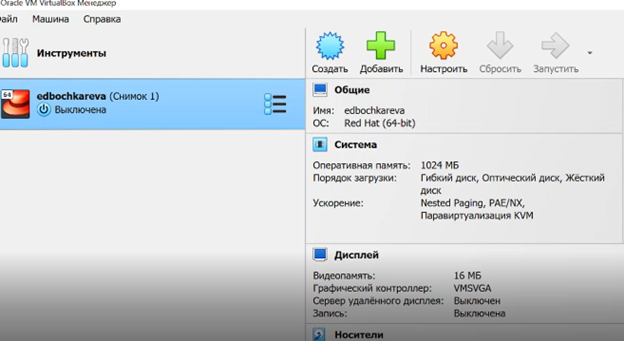

Рис.1: Рисунок 1

## 11.1.2. Вхожу от имени пользователя edbochkareva. Ввожу пароль (рис.2).

Рис.2: Рисунок 2

# 11.3. Последовательность выполнения работы

11.3.1. В домашнем каталоге создайте подкаталог \~/work/os/lab_prog.

11.3.2. Создайте в нём файлы: calculate.h, calculate.c, main.c. Это
будет примитивнейший калькулятор, способный складывать, вычитать,
умножать и делить, возводить число в степень, брать квадратный корень,
вычислять sin, cos, tan. При запуске он будет запрашивать первое число,
операцию, второе число. После этого программа выведет результат и
остановится. Кулябов Д. С. и др.

11.3.3. Выполните компиляцию программы посредством gcc: gcc -c
calculate.c gcc -c main.c gcc calculate.o main.o -o calcul -lm

11.3.4. При необходимости исправьте синтаксические ошибки.

11.3.5. Создайте Makefile со следующим содержанием: Кулябов Д. С. и др.

11.3.6. С помощью gdb выполните отладку программы calcul (перед
использованием gdb исправьте Makefile)

11.3.7. С помощью утилиты splint попробуйте проанализировать коды файлов
calculate.c и main.c.

# 11.3.8. Описание и комментарии по созданию кода в соответствии с заданием лаболаторной работы:

1.  В домашнем каталоге создадим подкаталог \~/work/os/lab_prog.

2.  В каталоге создадим файлы calculate.c, calculate.h, main.c

3.  Выполним компиляцию программы с помощью gcc.

4.  Создадим Makefile (рисунок 5). Makefile описывает правила обработки
    файлов и необходим для отслеживания связей между файлами. Далее
    следует описание созданного Makefile:

-   в начале файла указаны три переменные, значения которых используются
    в командах ниже.

-   первая цель - calcul, она зависит от файлов calculate.o и main.o.
    Ниже со знака табуляции приведена команда для компиляции calcul.

-   в свою очередь цель calculate.o зависит от calculate.c и
    calculate.h. Ниже также указана команда для компиляции цели.

-   цель main.o зависит от файлов main.c и calculate.h

-   в последнюю очередь указана команда для удаления файлов, связанных с
    программой.

5.  Выполним отладку скомпилированной программы calcul с помощью команды
    gdb.

6.  Запустим отладчик с помощью команды gdb ./calcul.

7.  Запустим программу для отладки при помощи команды run

8.  Посмотрим постраничный вывод исходного кода программы calcul

9.  Выведем на экран исходный код с 12 по 15 строку - команда list 12,15

10. Просмотрим код файла calculate.c - list calculate.c:20,29

11. Установим точку остановки в файле calculate.c на строке 21 с помощью
    команды break 21

12. Выведем информацию об имеющихся точках остановки - команда info
    breakpionts

13. Запустим программу на отладку, чтобы убедиться, что точка остановки
    сработала.

14. С помощью команды backtrace увидим какие функции вызывались от
    начала и до текущего места программы.

15. Выведем значение переменной Numeral с помощью команды print

16. Выведем значение переменной Numeral с помощью команды display

17. Уберем точки остановки

18. С помощью команды splint проанализируем код файлов calculate.c и
    main.c Утилита покажет предупреждающие сообщения о спорных местах в
    коде и варианты их решения.

В домашнем каталоге создадим подкаталог \~/work/os/lab_prog.

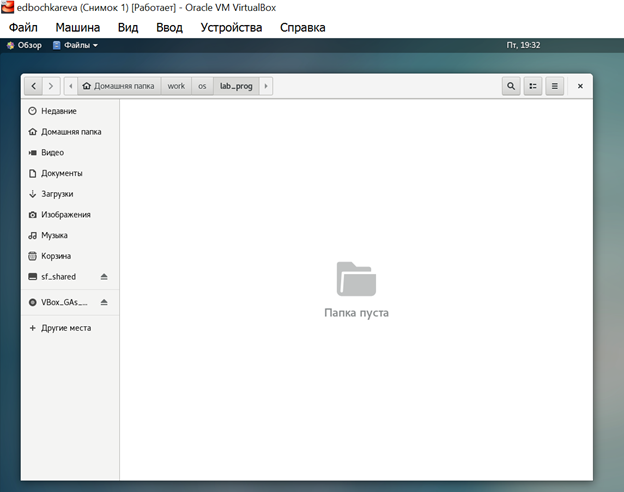

Рис.3: Рисунок 3

Запускаю emacs

Рис.4: Рисунок 4

Открываю редактор emacs

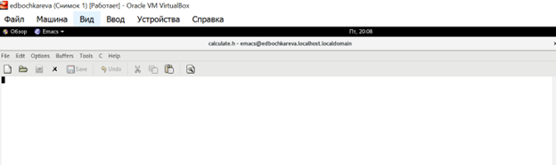

Рис.5: Рисунок 5

Выполняю компиляцию программы с помощью gcc

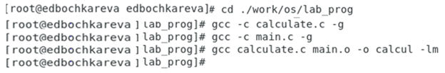

Рис.6: Рисунок 6

Создаю файл calculate.h

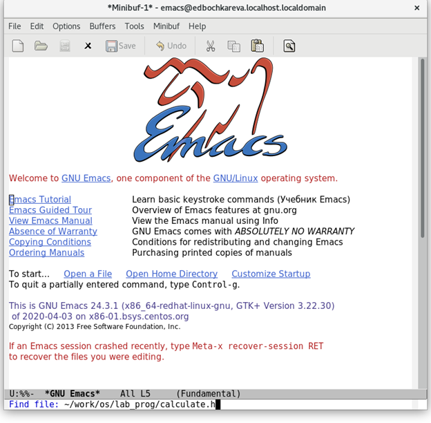

Рис.7: Рисунок 7

> Создаю Makefile. Makefile описывает правила обработки файлов и
> необходим для отслеживания связей между файлами.
>
> Описание созданного Makefile:

-   в начале файла указаны три переменные, значения которых используются
    в командах ниже.

-   первая цель - calcul, она зависит от файлов calculate.o и main.o.

-   ниже со знака табуляции приведена команда для компиляции calcul.

-   в свою очередь цель calculate.o зависит от calculate.c и
    calculate.h.

-   ниже также указана команда для компиляции цели.

-   цель main.o зависит от файлов main.c и calculate.h

-   в последнюю очередь указана команда для удаления файлов, связанных с
    программой.

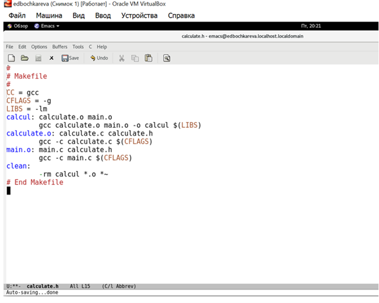

Рис.8: Рисунок 8

Создаю файл calculate.c

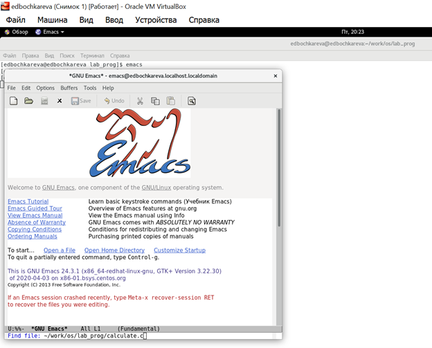

Рис.9: Рисунок 9

Ввожу //calculate.c

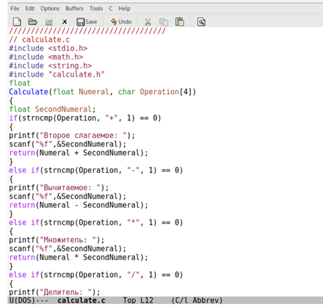

Рис.10: Рисунок 10

Ввожу //calculate.h

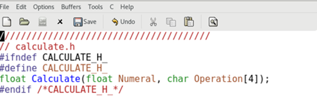

Рис.11: Рисунок 11

Ввожу //main.c

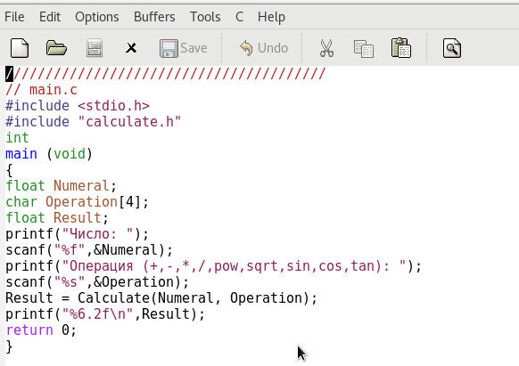

Рис.12: Рисунок 12

Набираю команды cd и gcc:

Рис.13: Рисунок 13

Ввожу ls./

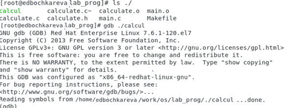

Рис.14: Рисунок 14

Выполнение кода по заданию

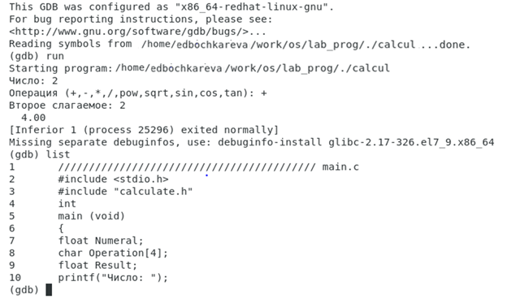

Рис.15: Рисунок 15

Выполнение кода по заданию

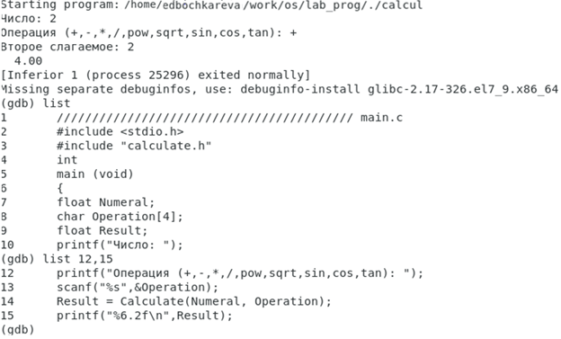

Рис.16: Рисунок 16

Выполнение кода по заданию

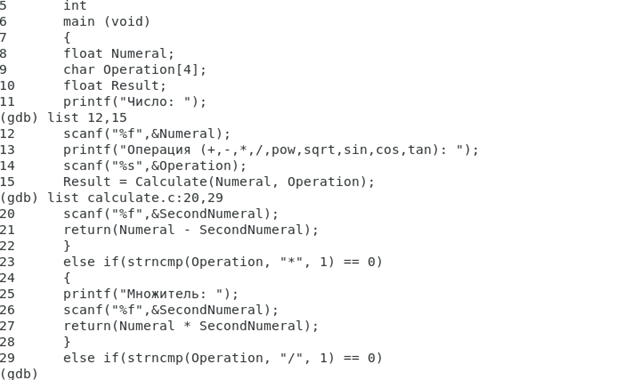

Рис.17: Рисунок 17

Выполнение кода по заданию

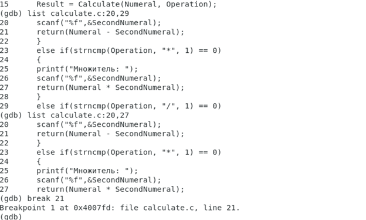

Рис.18: Рисунок 18

Выполнение кода по заданию

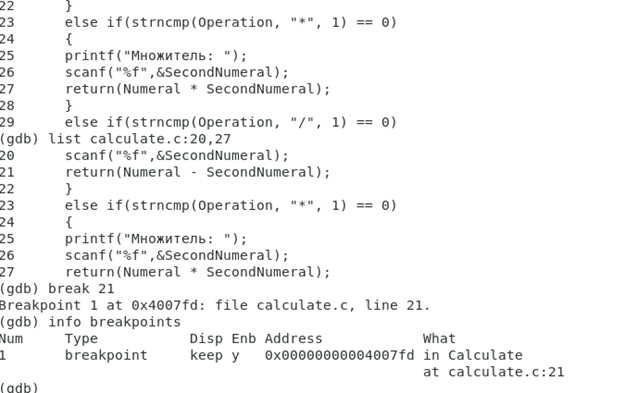

Рис.19: Рисунок 19

Выполнение кода по заданию

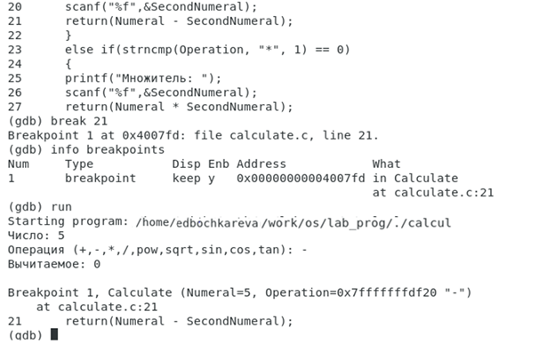

Рис.20: Рисунок 20

Выполнение кода по заданию

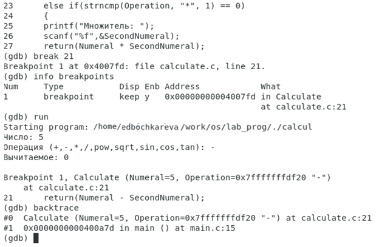

Рис.21: Рисунок 21

Выполнение кода по заданию

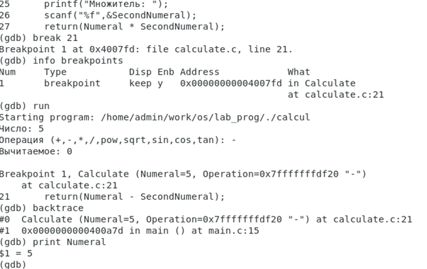

Рис.22: Рисунок 22

Выполнение кода по заданию

Рис.23: Рисунок 23

Выполнение кода по заданию

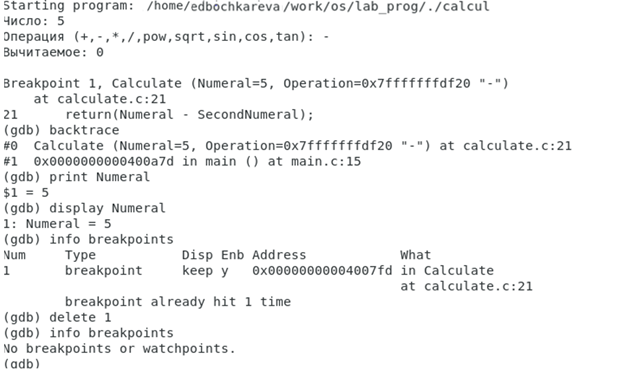

Рис.24: Рисунок 24

# 11.5. Ответы на контрольные вопросы 

## 11.5.1. Как получить информацию о возможностях программ gcc, make, gdb и др.?

**ОТВЕТ:** Информацию можно получить с помощью команды man \<имя
команды, информацию о которой хотим получить\>.

**GNU Compiler Collection (обычно используется сокращение GCC) ---**
набор [компиляторов](https://ru.wikipedia.org/wiki/%D0%9A%D0%BE%D0%BC%D0%BF%D0%B8%D0%BB%D1%8F%D1%82%D0%BE%D1%80) для
различных [языков
программирования](https://ru.wikipedia.org/wiki/%D0%AF%D0%B7%D1%8B%D0%BA_%D0%BF%D1%80%D0%BE%D0%B3%D1%80%D0%B0%D0%BC%D0%BC%D0%B8%D1%80%D0%BE%D0%B2%D0%B0%D0%BD%D0%B8%D1%8F),
разработанный в рамках [проекта
GNU](https://ru.wikipedia.org/wiki/%D0%9F%D1%80%D0%BE%D0%B5%D0%BA%D1%82_GNU).
GCC является [свободным программным
обеспечением](https://ru.wikipedia.org/wiki/%D0%A1%D0%B2%D0%BE%D0%B1%D0%BE%D0%B4%D0%BD%D0%BE%D0%B5_%D0%BF%D1%80%D0%BE%D0%B3%D1%80%D0%B0%D0%BC%D0%BC%D0%BD%D0%BE%D0%B5_%D0%BE%D0%B1%D0%B5%D1%81%D0%BF%D0%B5%D1%87%D0%B5%D0%BD%D0%B8%D0%B5),
распространяется в том числе [фондом свободного программного
обеспечения](https://ru.wikipedia.org/wiki/%D0%A4%D0%BE%D0%BD%D0%B4_%D1%81%D0%B2%D0%BE%D0%B1%D0%BE%D0%B4%D0%BD%D0%BE%D0%B3%D0%BE_%D0%BF%D1%80%D0%BE%D0%B3%D1%80%D0%B0%D0%BC%D0%BC%D0%BD%D0%BE%D0%B3%D0%BE_%D0%BE%D0%B1%D0%B5%D1%81%D0%BF%D0%B5%D1%87%D0%B5%D0%BD%D0%B8%D1%8F) (FSF)
на условиях [GNU GPL](https://ru.wikipedia.org/wiki/GNU_GPL) и [GNU
LGPL](https://ru.wikipedia.org/wiki/GNU_Lesser_General_Public_License) и
является ключевым компонентом [GNU
toolchain](https://ru.wikipedia.org/wiki/GNU_toolchain). Он используется
как стандартный компилятор
для [свободных](https://ru.wikipedia.org/wiki/%D0%A1%D0%B2%D0%BE%D0%B1%D0%BE%D0%B4%D0%BD%D0%BE%D0%B5_%D0%BF%D1%80%D0%BE%D0%B3%D1%80%D0%B0%D0%BC%D0%BC%D0%BD%D0%BE%D0%B5_%D0%BE%D0%B1%D0%B5%D1%81%D0%BF%D0%B5%D1%87%D0%B5%D0%BD%D0%B8%D0%B5) [UNIX-подобных
операционных
систем](https://ru.wikipedia.org/wiki/Unix-%D0%BF%D0%BE%D0%B4%D0%BE%D0%B1%D0%BD%D0%B0%D1%8F_%D0%BE%D0%BF%D0%B5%D1%80%D0%B0%D1%86%D0%B8%D0%BE%D0%BD%D0%BD%D0%B0%D1%8F_%D1%81%D0%B8%D1%81%D1%82%D0%B5%D0%BC%D0%B0).

Изначально названный GNU C Compiler, поддерживал только
язык [Си](https://ru.wikipedia.org/wiki/%D0%A1%D0%B8_(%D1%8F%D0%B7%D1%8B%D0%BA_%D0%BF%D1%80%D0%BE%D0%B3%D1%80%D0%B0%D0%BC%D0%BC%D0%B8%D1%80%D0%BE%D0%B2%D0%B0%D0%BD%D0%B8%D1%8F)).
Позднее GCC был расширен для компиляции [исходных
кодов](https://ru.wikipedia.org/wiki/%D0%98%D1%81%D1%85%D0%BE%D0%B4%D0%BD%D1%8B%D0%B9_%D0%BA%D0%BE%D0%B4) на
таких языках программирования,
как [C++](https://ru.wikipedia.org/wiki/C%2B%2B), Objective-C, [Java](https://ru.wikipedia.org/wiki/Java), [Фортран](https://ru.wikipedia.org/wiki/%D0%A4%D0%BE%D1%80%D1%82%D1%80%D0%B0%D0%BD), Ada, [Go](https://ru.wikipedia.org/wiki/Go), [GAS](https://ru.wikipedia.org/wiki/GNU_Assembler) и [D](https://ru.wikipedia.org/wiki/D_(%D1%8F%D0%B7%D1%8B%D0%BA_%D0%BF%D1%80%D0%BE%D0%B3%D1%80%D0%B0%D0%BC%D0%BC%D0%B8%D1%80%D0%BE%D0%B2%D0%B0%D0%BD%D0%B8%D1%8F)).

**Команда make** позволяет задействовать одноименную утилиту,
предназначенную для компиляции программного обеспечения из исходных
кодов.

**GNU Debugger** --- переносимый отладчик проекта GNU, который работает
на многих UNIX-подобных системах и умеет производить отладку многих
языков программирования, включая Си, C++, Free Pascal, FreeBASIC, Ada,
Фортран и Rust. GDB --- свободное программное обеспечение,
распространяемое по лицензии GPL.

## 11.5.2. Назовите и дайте краткую характеристику основным этапам разработки приложений в UNIX. 

**ОТВЕТ:**

**-**сбор и анализ требований;

-   проектирование прототипа;

-   разработка приложения;

-   тестирование и отладка;

## 11.5.3. Что такое суффикс в контексте языка программирования? Приведите примеры использования.

**ОТВЕТ:** Суффикс (или по-другому расширение файла) нужен компилятору
для определения типа файла и дальнейшей компиляции. Например, суффикс .c
означает, что программа написана на языке С.

Суффикс это составная часть имени файла. Система сборки каких-либо
программ (например язык java) требует, чтобы имена файлов исходного кода
заканчивались на .java.

Компиляторы C и компилятор C++ одинаково относятся к суффиксам, но
каждый раз давать файлам заголовков имена с .h (расширение) настолько
общепринято, что надоедает. Есть недостаток строгих правил, это к
примеру несколько стилей именования файлов реализации в языке C++,
например стандартные суффиксы .C, .cpp, .cxx, .c++, и .cc. Иногда
встречаются файлы заголовков C++ с суффиксом .hpp.  

Главное --- это соблюдать единообразие при выборе суффикса.

## 11.5.4. Каково основное назначение компилятора языка С в UNIX?

**ОТВЕТ:** **Компиля́тор **--- программа, переводящая написанный
на [языке
программирования](https://ru.wikipedia.org/wiki/%D0%AF%D0%B7%D1%8B%D0%BA_%D0%BF%D1%80%D0%BE%D0%B3%D1%80%D0%B0%D0%BC%D0%BC%D0%B8%D1%80%D0%BE%D0%B2%D0%B0%D0%BD%D0%B8%D1%8F) текст
в набор [машинных
кодов](https://ru.wikipedia.org/wiki/%D0%9C%D0%B0%D1%88%D0%B8%D0%BD%D0%BD%D1%8B%D0%B9_%D0%BA%D0%BE%D0%B4).
Назначение компилятора состоит в компиляции исходного кода и создании
исполняемого файла.

**Входная информация для компилятора есть:** 1) на фазе
трансляции: [исходный
код](https://ru.wikipedia.org/wiki/%D0%98%D1%81%D1%85%D0%BE%D0%B4%D0%BD%D1%8B%D0%B9_%D0%BA%D0%BE%D0%B4) программы,
являющийся описанием алгоритма или программы
на [предметно-ориентированном
языке](https://ru.wikipedia.org/wiki/%D0%9F%D1%80%D0%B5%D0%B4%D0%BC%D0%B5%D1%82%D0%BD%D0%BE-%D0%BE%D1%80%D0%B8%D0%B5%D0%BD%D1%82%D0%B8%D1%80%D0%BE%D0%B2%D0%B0%D0%BD%D0%BD%D1%8B%D0%B9_%D1%8F%D0%B7%D1%8B%D0%BA) программирования;
2) на фазе компоновки: сгенерированные на фазе трансляции файлы
объектных кодов модулей программы, а также файлы объектных кодов
статических библиотек и данные об используемых динамических библиотеках.

**На выходе компилятора** --- эквивалентное описание алгоритма на
машинно-ориентированном языке (объектный
код[\[5\]](https://ru.wikipedia.org/wiki/%D0%9A%D0%BE%D0%BC%D0%BF%D0%B8%D0%BB%D1%8F%D1%82%D0%BE%D1%80#cite_note-5), [байт-код](https://ru.wikipedia.org/wiki/%D0%91%D0%B0%D0%B9%D1%82-%D0%BA%D0%BE%D0%B4)).

**Компили́ровать **--- проводить сборку машинной программы, включая: 1)
трансляцию с предметно-ориентированного языка на машинно-ориентированный
язык[\[3\]](https://ru.wikipedia.org/wiki/%D0%9A%D0%BE%D0%BC%D0%BF%D0%B8%D0%BB%D1%8F%D1%82%D0%BE%D1%80#cite_note-_e97fd31ab633c0ae-3);
2) компоновка исполняемой машинно-ориентированной программы из
сгенерированных на фазе трансляции объектных модулей --- модулей,
содержащих части кода программы на машинно-ориентированного кода
программы.

**Довольно часто компиляторы с языков высокого уровня выполняют лишь
трансляцию исходного кода**, компоновку же поручая внешнему
компоновщику, --- компоновщику, представляющему самостоятельную
программу, вызываемую компилятором как внешняя подпрограмма.

## 11.5.5. Для чего предназначена утилита make? 

**ОТВЕТ:** Утилита make предназначена для создания Makefile.

Make (МФА \[meɪk\]; с англ. --- «сделать», «изготовить») ---
утилита, автоматизирующая процесс преобразования файлов из одной формы в
другую. Чаще всего это компиляция исходного кода в объектные файлы и
последующая компоновка в исполняемые файлы или библиотеки.

Утилита использует специальные make-файлы, в которых указаны зависимости
файлов друг от друга и правила для их удовлетворения. На основе
информации о времени последнего изменения каждого файла Make определяет
и запускает необходимые программы.

## 11.5.6. Приведите пример структуры Makefile. Дайте характеристику основным элементам этого файла. 

**ОТВЕТ:** \[цель\]:\[зависимость1\] \[зависимость2\]\
\[команда 1\]

Файл перечисляет цели, их зависимости и команды, которые необходимы для
достижения цели.

Основная проблема с проектами, использующими в качестве системы
сборки *Make*, состоит в том, что эта система не предоставляет ровным
счётом никакой информации о проектной модели, т. е. о том, какие файлы
исходного кода попадут на вход компилятора, какие ключи компилятора,
директивы препроцессора и заголовочные файлы будут использованы, и какие
бинарные файлы мы получим на выходе. Эта информация остаётся неизвестной
до тех пор, пока проект не будет собран. В этом состоит сложность задачи
интеграции сред разработки (IDE) и системы сборки *Make*.

Рассмотрим, например, проект с вот такой плоской структурой:

-   Makefile

-   foo.c

-   bar.c

и вот таким элементарным Makefile:

.PHONY: all

all: foo

.PHONY: clean

clean:

\$(RM) foo

Здесь видно, что файл foo.c является частью проектной модели, т. к.
будет участвовать в процессе компиляции (посредством встроенного
правила \$(CC) foo.c -o foo), а файл bar.c --- не является.

## 11.5.7. Назовите основное свойство, присущее всем программам отладки. Что необходимо сделать, чтобы его можно было использовать? 

**ОТВЕТ:** Программа должна иметь доступ к отладочной информации в
бинарных файлах. Для этого при компиляции необходимо указывать опцию -g.

## 11.5.8. Назовите и дайте основную характеристику основным командам отладчика gdb. 

**ОТВЕТ:**

-   backtrace -- выводит весь путь к текущей точке останова, то есть
    названия всех функций, начиная от main(); иными словами, выводит
    весь стек функций;

-   break -- устанавливает точку останова; параметром может быть номер
    строки или название функции;

-   clear -- удаляет все точки останова на текущем уровне стека (то есть
    в текущей функции);

-   continue -- продолжает выполнение программы от текущей точки до
    конца;

-   delete -- удаляет точку останова или контрольное выражение;

-   display -- добавляет выражение в список выражений, значения которых
    отображаются каждый раз при остановке программы;

-   finish -- выполняет программу до выхода из текущей функции;
    отображает возвращаемое значение,если такое имеется;

-   info breakpoints -- выводит список всех имеющихся точек останова;

-   info watchpoints -- выводит список всех имеющихся контрольных
    выражений;

-   list -- выводит исходный код; в качестве параметра передаются
    название файла исходного кода, затем, через двоеточие, номер
    начальной и конечной строки;

-   next -- пошаговое выполнение программы, но, в отличие от команды
    step, не выполняет пошагово вызываемые функции;

-   print -- выводит значение какого-либо выражения (выражение
    передаётся в качестве параметра);

-   run -- запускает программу на выполнение;

-   set -- устанавливает новое значение переменной

-   step -- пошаговое выполнение программы;

watch -- устанавливает контрольное выражение, программа остановится, как
только значение контрольного выражения изменится.

## 11.5.9. Опишите по шагам схему отладки программы, которую Вы использовали при выполнении лабораторной работы. 

**ОТВЕТ:** Увидеть ошибку при компиляции - Попытаться исправить ошибку в
исходных файлах - Снова попытаться скомпилировать программу. Повторять
до положительного результата.

## 11.5.10. Прокомментируйте реакцию компилятора на синтаксические ошибки в программе при его первом запуске. 

**ОТВЕТ:** Компилятор указывает строку, где содержится ошибка, и
сообщение об ошибке. Компиляция файла не выполняется до устранения всех
критичных ошибок.

## 11.5.11. Назовите основные средства, повышающие понимание исходного кода программы. 

**ОТВЕТ:**

**Исходный код** либо используется для получения объектного кода, либо
сразу выполняется интерпретатором. Другое важное назначение исходного
кода --- описание программы. По тексту программы можно восстановить
логику её поведения. Для облегчения понимания исходного кода
используются комментарии.

**Комментирование, говорящие названия переменных, разбиение кода на
отдельные функции, применение форматирования** (табуляция в циклах и
условных операторах, пустые строки между блоками).

**Как комментарии оформляют в коде. Для выделения комментариев в коде
используют разные символы**: // --- однострочные в языках C, C++, PHP,
C#, Java и JavaScript; \# --- однострочный в Python, PHP; /\* \*/ ---
многострочные в C, C++, PHP, C#, Java, JavaScript.

**Говорящие названия переменных**.

Использовать короткие имена только для переменных «местного значения».
Называть переменные именами, не несущими смысловой нагрузки, например a
, e , p , mg -- можно только в том случае, если они используются в
небольшом фрагменте кода и их применение очевидно. Вообще же, название
переменной должно быть понятным.

Для имен переменных должны выполняться следующие правила: Имя
каждой переменной должно быть уникальным; дубликаты имен не
допускаются. Имена переменных могут иметь длиной до 64 байт (символов),
первый символ в имени переменной должен быть буковой либо одним из
символов @, #, или \$.

**Следует придерживаться нескольких несложных правил при выборе имен
переменных:**

-   Имя **переменной** может содержать только латинские буквы, числа и
    символ нижнего подчеркивания;

-   Имя **переменной** не должно содержать пробелов;

-   Имя **переменной** не должно начинаться с цифры;

-   Регистр важен: var и Var это разные **переменные**.

**Разбиение кода на отдельные функции, применение форматирования.**

ReSharper помогает поддерживать единый стиль кода по всей кодовой базе.
Настройки стиля по умолчанию основаны на общепринятых стандартах и
передовых практиках. Однако, можно настроить индивидуальный стиль кода,
как для постоянной работы c ReSharper, так и для отдельного решения
и [поделиться настройками с
командой](https://www.jetbrains.com/ru-ru/resharper/features/project_level.html#Distributed_Storage_of_ReSharper_Settings).
ReSharper учитывает предпочтения в стиле кода, когда предлагает
варианты [автодополнения](https://www.jetbrains.com/ru-ru/resharper/features/code_completion.html), [генерирует
новые
члены](https://www.jetbrains.com/ru-ru/resharper/features/code_generation.html),
применяет [шаблоны
кода](https://www.jetbrains.com/ru-ru/resharper/features/code_templates.html) и
производит [рефакторинг](https://www.jetbrains.com/ru-ru/resharper/features/code_refactoring.html).
Нарушения стиля кода отслеживаются при
помощи [инспекций](https://www.jetbrains.com/ru-ru/resharper/features/code_analysis.html) и
мгновенно устраняются благодаря [быстрым
исправлениям](https://www.jetbrains.com/ru-ru/resharper/features/quick_fixes.html) и
механизму Code Cleanup.

Откройте код. Выделите код. Выберите Редактировать \> Код \> Применить
исходное форматирование к выделенному. Или выберите Применить исходное
форматирование к выбранному в разделе Общая панель инструментов \>
Форматировать исходный код.

## 11.5.12. Каковы основные задачи, решаемые программой splint

**ОТВЕТ:** Программа анализирует код, выдает ошибки и комментарии о нем.

Команда split в Linux позволяет разбивать файлы на несколько
файлов. Есть несколько способов настроить параметры для вашего
приложения. Мы покажем вам несколько примеров команды split, которые
помогут вам понять ее использование. Можно использовать команды ll и wc
для выделения изменений файла.

## Примеры команды Split в Linux

Синтаксис команды Split:

split \[options\] filename \[prefix\]

### 1. Разделите файлы на несколько файлов

По умолчанию команда split создает новые файлы для каждых 1000 строк.
Если префикс не указан, он будет использовать 'x'. Следующие буквы
перечисляют файлы, поэтому сначала идет xaa, затем xab и так далее.

Давайте разделим пример файла журнала:

split AndreyExLogFile.log

Если вы используете команду ls, вы можете увидеть несколько новых файлов
в вашем каталоге.

andreyex@destroyer:\~/Documents\$ ls

AndreyExLogFile.log xab xad xaf xah xaj xal xan xap xar

xaa xac xae xag xai xak xam xao xaq

Вы можете использовать wc для быстрой проверки количества строк после
разделения.

Помните, что ранее мы видели, что наш исходный файл содержал 17 170
строк. Таким образом, мы можем видеть, что наша программа создала как и
ожидалось, 18 новых файлов. 17 из них заполнены 1000 строками в каждой,
а последняя имеет оставшиеся 170 строк.

Другой способ продемонстрировать, что происходит, --- запустить команду
с параметром verbose. Если вы не знакомы с verbose, вы пропускаете! Он
предоставляет более подробные отзывы о том, что делает ваша система, и
он доступен для использования со многими командами.

split AndreyExLogFile.log \--verbose

### 2. Разделите файлы на несколько файлов с определенными номерами строк

Мы понимаем, что вам может не понравиться, что файлы разбиты на файлы по
1000 строк. Вы можете изменить это поведение с помощью опции -l.

Теперь вы можете указать, сколько строк вы хотите в каждом из новых
файлов.

split AndreyExLogFile.log -l 500

### 3. Разделение файлов на n файлов

Опция -n делает разделение на указанное число частей или кусков. Вы
можете назначить, сколько файлов вы хотите, добавив целочисленное
значение после -n.

split AndreyExLogFile.log -n 15

### 5. Разделите и укажите длину суффикса

Разделение имеет длину суффикса по умолчанию 2 \[aa, ab и т. д.\]. Это
изменится автоматически при увеличении количества файлов, но если вы
хотите изменить его вручную, это тоже возможно. Допустим, вы хотите,
чтобы наши файлы были названы как-то вроде
AndreyExSeparatedLogFiles.log_aaaab.

Как ты можешь это сделать? Опция -a позволяет нам указать длину
суффикса.

split AndreyExLogFile.log AndreyExSeparatedLogFiles.log\_ -a 5

### 6. Разделить с помощью числового суффикса заказа

До этого момента вы видели, что ваши файлы разделены с использованием
различных буквенных комбинаций. Лично нам гораздо проще различать файлы
по номерам.

Давайте сохраним длину суффикса из предыдущего примера, но изменим
алфавитную организацию на числовую с помощью опции -d.

### 7. Добавьте шестнадцатеричные суффиксы для разделения файлов

Другой вариант создания суффикса --- использовать встроенный
шестнадцатеричный суффикс, который чередует упорядоченные буквы и цифры.

В этом примере мы объединяем несколько вещей, которые мы вам уже
показали. Мы разделим файл, используя свой собственный префикс и выбрали
подчеркивание для удобства чтения.

Мы использовали опцию -x для создания шестнадцатеричного суффикса. Затем
разделили наш файл на 50 кусков и дали суффиксу длину 6.

split AndreyExLogFile.log \_ -x -n50 -a6

### 8. Разделите файлы на несколько файлов определенного размера

Также возможно использовать размер файла, чтобы разбить файлы в
разбивке. Возможно, вам нужно отправить большой файл по сети с
ограниченным размером как можно более эффективно. Вы можете указать
точный размер для ваших требований.

Синтаксис может стать немного сложнее, так как мы продолжаем добавлять
опции. Итак, мы объясним, как работает команда, прежде чем показывать
пример.

Если вы хотите создать файлы определенного размера, используйте опцию
-b. Затем вы можете написать n K \[B\], n M \[B\], n G \[B\], где n ---
это значение размера вашего файла, а K \[1024\] --- это -kibi, M ---
-mebi, G --- -gibi и далее. КБ \[1000\] --- килограмм, МБ --- мега и т.
д.

split AndreyExLogFile.log AndreyExSeparatedLogFiles.log\_ -d -b 128KB

### 9. Разбивка файлов на несколько с определенным размером файла

Если вы хотите разбить файлы примерно на один и тот же размер, но
сохранить структуру строк , это может быть лучшим выбором для вас. С
помощью -C, вы можете указать максимальный размер. Затем программа
автоматически разбивает файлы на основе полных строк.

split AndreyExLogFile.log AndreyExNewLogFiles.log\_ -d -C 1MB

 

# Выводы, согласованные с целью

В данной работе были изучены основные принципы анализа, тестирования и
отладки программ в UNIX-подобных операционных системах на примере
калькулятора, реализованного на языке С.
