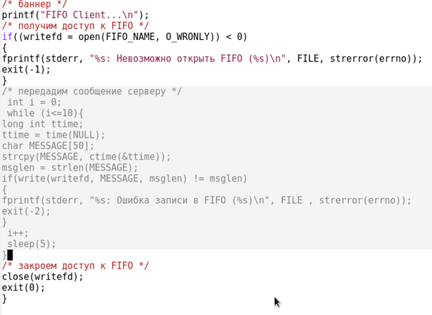
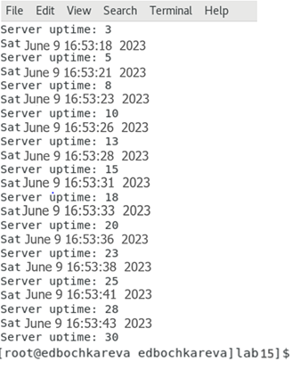

**РОССИЙСКИЙ УНИВЕРСИТЕТ ДРУЖБЫ НАРОДОВ**

**Факультет физико-математических и естественных наук**

**Кафедра прикладной информатики и теории вероятностей**

**ОТЧЕТ**

по лабораторной работе №15

**«Именованные каналы».**

[дисциплина: Операционные системы]{.underline}

[Студентка:]{.underline}

[Бочкарева Елена Дмитриевна]{.underline}

Студенческий билет номер №: 1032207514

Группа:

[НПМбв-01-19]{.underline}

**МОСКВА**

2023

# Оглавление {#оглавление .TOC-Heading .unnumbered}

[11.1. Цель работы [3](#цель-работы)](#цель-работы)

[11.1.1. Запускаю операционную систему (рис.1)
[3](#запускаю-операционную-систему-рис.1)](#запускаю-операционную-систему-рис.1)

[11.1.2. Вхожу от имени пользователя edbochkareva. Ввожу пароль (рис.2).
[3](#вхожу-от-имени-пользователя-edbochkareva.-ввожу-пароль-рис.2.)](#вхожу-от-имени-пользователя-edbochkareva.-ввожу-пароль-рис.2.)

[11.3. Последовательность выполнения работы
[4](#последовательность-выполнения-работы)](#последовательность-выполнения-работы)

[1. Изучите приведённые в тексте программы server.c и client.c.
[4](#изучите-приведённые-в-тексте-программы-server.c-и-client.c.)](#изучите-приведённые-в-тексте-программы-server.c-и-client.c.)

[2. Взяв данные примеры за образец, напишите аналогичные программы,
внеся следующие изменения:
[4](#взяв-данные-примеры-за-образец-напишите-аналогичные-программы-внеся-следующие-изменения)](#взяв-данные-примеры-за-образец-напишите-аналогичные-программы-внеся-следующие-изменения)

[3. Работает не 1 клиент, а несколько (например, два). Клиенты передают
текущее время с некоторой периодичностью (например, раз в пять секунд).
Используйте функцию sleep() для приостановки работы клиента.
[4](#работает-не-1-клиент-а-несколько-например-два.-клиенты-передают-текущее-время-с-некоторой-периодичностью-например-раз-в-пять-секунд.-используйте-функцию-sleep-для-приостановки-работы-клиента.)](#работает-не-1-клиент-а-несколько-например-два.-клиенты-передают-текущее-время-с-некоторой-периодичностью-например-раз-в-пять-секунд.-используйте-функцию-sleep-для-приостановки-работы-клиента.)

[4. Сервер работает не бесконечно, а прекращает работу через некоторое
время (например, 30 сек). Используйте функцию clock() для определения
времени работы сервера. Что будет в случае, если сервер завершит работу,
не закрыв канал?
[4](#сервер-работает-не-бесконечно-а-прекращает-работу-через-некоторое-время-например-30-сек.-используйте-функцию-clock-для-определения-времени-работы-сервера.-что-будет-в-случае-если-сервер-завершит-работу-не-закрыв-канал)](#сервер-работает-не-бесконечно-а-прекращает-работу-через-некоторое-время-например-30-сек.-используйте-функцию-clock-для-определения-времени-работы-сервера.-что-будет-в-случае-если-сервер-завершит-работу-не-закрыв-канал)

[Рисунок 3 (image3): Для выполнения пункта три внесем изменения в
программу client.c в блок кода, отвечающий за передачу сообщений серверу
(выделен серым) (рис.3).
[4](#рисунок-3-image3-для-выполнения-пункта-три-внесем-изменения-в-программу-client.c-в-блок-кода-отвечающий-за-передачу-сообщений-серверу-выделен-серым-рис.3.)](#рисунок-3-image3-для-выполнения-пункта-три-внесем-изменения-в-программу-client.c-в-блок-кода-отвечающий-за-передачу-сообщений-серверу-выделен-серым-рис.3.)

[Рисунок 4 (image4): Внесенные изменения в файл client.c
[5](#рисунок-4-image4-внесенные-изменения-в-файл-client.c)](#рисунок-4-image4-внесенные-изменения-в-файл-client.c)

[Рисунок 5 (image5): Внесенные изменения в файл server.c
[6](#рисунок-5-image5-внесенные-изменения-в-файл-server.c)](#рисунок-5-image5-внесенные-изменения-в-файл-server.c)

[Рисунок 6 (image6): Запуск двух клиентов
[7](#рисунок-6-image6-запуск-двух-клиентов)](#рисунок-6-image6-запуск-двух-клиентов)

[Ответы на контрольные вопросы
[8](#ответы-на-контрольные-вопросы)](#ответы-на-контрольные-вопросы)

[1. В чем ключевое отличие именованных каналов от неименованных?
[8](#_Toc137224819)](#_Toc137224819)

[2. Возможно ли создание неименованного канала из командной строки?
[9](#_Toc137224820)](#_Toc137224820)

[3. Возможно ли создание именованного канала из командной строки?
[9](#_Toc137224821)](#_Toc137224821)

[4. Опишите функцию языка С, создающую неименованный канал.
[9](#_Toc137224822)](#_Toc137224822)

[5. Опишите функцию языка С, создающую именованный канал.
[10](#_Toc137224823)](#_Toc137224823)

[6. Что будет в случае прочтения из fifo меньшего числа байтов, чем
находится в канале? Большего числа байтов?
[10](#_Toc137224824)](#_Toc137224824)

[7. Аналогично, что будет в случае записи в fifo меньшего числа байтов,
чем позволяет буфер? Большего числа байтов?
[10](#_Toc137224825)](#_Toc137224825)

[8. Могут ли два и более процессов читать или записывать в канал?
[11](#_Toc137224826)](#_Toc137224826)

[9. Опишите функцию write (тип возвращаемого значения, аргументы и
логику работы). Что означает 1 (единица) в вызове этой функции в
программе server.c (строка 42)? [11](#_Toc137224827)](#_Toc137224827)

[10. Опишите функцию strerror. [11](#_Toc137224828)](#_Toc137224828)

[Выводы, согласованные с целью
[12](#выводы-согласованные-с-целью)](#выводы-согласованные-с-целью)

# 11.1. Цель работы {#цель-работы .unnumbered}

Приобретение практических навыков работы с именованными каналам

## 11.1.1. Запускаю операционную систему (рис.1) {#запускаю-операционную-систему-рис.1 .unnumbered}

Рис.1: Рисунок 1

## 11.1.2. Вхожу от имени пользователя edbochkareva. Ввожу пароль (рис.2). {#вхожу-от-имени-пользователя-edbochkareva.-ввожу-пароль-рис.2. .unnumbered}

Рис.2: Рисунок 2

# 11.3. Последовательность выполнения работы {#последовательность-выполнения-работы .unnumbered}

# Изучите приведённые в тексте программы server.c и client.c. 

# Взяв данные примеры за образец, напишите аналогичные программы, внеся следующие изменения: 

# Работает не 1 клиент, а несколько (например, два). Клиенты передают текущее время с некоторой периодичностью (например, раз в пять секунд). Используйте функцию sleep() для приостановки работы клиента. 

# Сервер работает не бесконечно, а прекращает работу через некоторое время (например, 30 сек). Используйте функцию clock() для определения времени работы сервера. Что будет в случае, если сервер завершит работу, не закрыв канал?

В рамках первого пункта задания были изучены представленные в
лабораторной работе программы server.c и client.c.

Программный код представленных программ не накладывает ограничений на
количество клиентов, поэтому пункт 2 задания считается автоматически
выполненным. Одновременный запуск двух клиентов будет продемонстрирован
при тестировании далее.

## Рисунок 3 (image3): Для выполнения пункта три внесем изменения в программу client.c в блок кода, отвечающий за передачу сообщений серверу (выделен серым) (рис.3). {#рисунок-3-image3-для-выполнения-пункта-три-внесем-изменения-в-программу-client.c-в-блок-кода-отвечающий-за-передачу-сообщений-серверу-выделен-серым-рис.3. .unnumbered}

Рис.3: Рисунок 3

### Рисунок 4 (image4): Внесенные изменения в файл client.c {#рисунок-4-image4-внесенные-изменения-в-файл-client.c .unnumbered}

Допустим, что необходимо передать текущее время на сервер 11 раз с
паузой в 5 секунд. В существующий код добавляем цикл while на 11
итераций, предварительно объявив счетчик - переменную i.

В цикле с помощью функции time() получаем текущее время, приводим
полученный результат в удобный для восприятия формат при помощи функции
ctime(). Результат преобразования записываем в переменную MESSAGE. В сам
процесс передачи сообщения не вмешиваемся, оставляем как был в исходной
программе. В конце цикла заставляем программу сделать паузу в пять
секунд функцией sleep(5) и увеличиваем счетчик **(рис.4).**

Рис.4: Рисунок 4

Внесем изменения в программу server.c в блок кода, отвечающий за чтение
данных (выделен серым на рисунке).

### Рисунок 5 (image5): Внесенные изменения в файл server.c {#рисунок-5-image5-внесенные-изменения-в-файл-server.c .unnumbered}

В условии указано использовать функцию clock(), но она не подошла для
правильной реализации задания, т.к. показывает не реальное время, а
время, которое потратил процессор на выполнение операций.

В нашем случае это время настолько незначительное, что невозможно
корректно уловить разницу. Вместо функции clock() используем функцию
time(), которая возвращает текущее время в секундах.

Инициализируем переменные start и stop присвоим им текущее время в
секундах функцией time(). Вместо существующего цикла while, который
продолжает чтение пока не закончатся сообщения, добавим свой цикл по
времени.

В процесс чтения сообщений из исходной программы не вмешиваемся. В конце
цикла фиксируем время в переменной stop. Выводим на экран сообщение с
разницей времени в секундах между началом цикла и текущей операцией. Это
время будем считать временем работы сервера. Работа сервера должна
прекратиться по достижении значения 30.

Приступим к тестированию. В первом терминале запустим скомпилированную
программу server, а в двух других - программу client **(рис.5).**

Рис.5: Рисунок 5

### Рисунок 6 (image6): Запуск двух клиентов {#рисунок-6-image6-запуск-двух-клиентов .unnumbered}

Вернемся к первому терминалу, где запущен server. По полученному времени
видим, что шаг менее пяти секунд. Так происходит, потому что мы получаем
сообщения сразу от двух клиентов.

Также видим, что сервер прекратил работу, когда время его работы
достигло 30 секунд. Модифицированные программы работают корректно
**(рис.6).**

Рис.6: Рисунок 6

# Ответы на контрольные вопросы {#ответы-на-контрольные-вопросы .unnumbered}

1.  []{#_Toc137224819 .anchor}**В чем ключевое отличие именованных
    каналов от неименованных?\
    ОТВЕТ:** Именованные каналы отличаются от неименованных наличием
    имени, то есть идентификатора канала Именованный канал виден всем
    процессам системы. Для идентификации именованного канала создается
    файл специального типа pipe. Файлы именованных каналов являются
    элементами файловой системы, как и остальные файлы в ОС UNIX, и для
    них действуют те же права доступа. Именованные каналы можно
    использовать для обеспечения взаимодействия между процессами на
    одном компьютере или между процессами на разных компьютерах по сети.
    Если служба сервера запущена, все именованные каналы доступны
    удаленно.

2.  []{#_Toc137224820 .anchor}**Возможно ли создание неименованного
    канала из командной строки?\
    ОТВЕТ:** Да. С помощью **команды pipe**. В Linux команда
    pipe позволяет отправлять вывод одной команды в другую. Каналы, как
    предполагает термин, могут перенаправлять стандартный вывод, ввод
    или ошибку одного процесса другому для дальнейшей обработки. Также
    неименованные каналы автоматически создаются системой при
    перенаправлении вывода из одной команды в другую**.**

3.  []{#_Toc137224821 .anchor}**Возможно ли создание именованного канала
    из командной строки?\
    ОТВЕТ:** Да. С помощью команды mknod. Команда mknod позволяет
    задействовать одноименную утилиту, предназначенную для создания
    файлов устройств и именованных каналов.

4.  []{#_Toc137224822 .anchor}**Опишите функцию языка С, создающую
    неименованный канал.\
    ОТВЕТ:** Для создания неименованных каналов в языке С используется
    функция int pipe(int \*fd). На вход принимается массив, состоящий из
    двух элементов. Если канал создан успешно, функция возвращает код
    ответа 0, а в массиве будут содержаться два открытых файловых
    дескриптора. В fd\[0\] будет дескриптор чтения из канала, а в
    fd\[1\] --- дескриптор записи в канал.

5.  []{#_Toc137224823 .anchor}**Опишите функцию языка С, создающую
    именованный канал.\
    ОТВЕТ:** Для создания именованных каналов в языке С используется
    функция int mkfifo(const char \*pathname, mode_t mode). На вход
    принимает pathname - путь, по которому создастся специальный
    FIFO-файл, mode - права доступа к файлу. При успешном создании
    канала функция возвращает код ответа 0.

6.  []{#_Toc137224824 .anchor}**Что будет в случае прочтения из fifo
    меньшего числа байтов, чем находится в канале? Большего числа
    байтов?\
    ОТВЕТ:** При чтении числа байт, меньшего чем находится в канале,
    возвращается требуемое число байтов, остаток сохраняется для
    последующих чтений. При чтении числа байт, большего чем находится в
    канале, возвращается доступное число байт.

7.  []{#_Toc137224825 .anchor}**Аналогично, что будет в случае записи в
    fifo меньшего числа байтов, чем позволяет буфер? Большего числа
    байтов?\
    ОТВЕТ:** Запись меньшего числа байтов гарантированно атомарна. Это
    означает, что в случае, когда несколько процессов одновременно
    записывают в канал, порции данных от этих процессов не
    перемешиваются. При записи большего числа байтов вызов write(2)
    блокируется до освобождения требуемого места. При этом атомарность
    операции не гарантируется.

8.  []{#_Toc137224826 .anchor}**Могут ли два и более процессов читать
    или записывать в канал?\
    ОТВЕТ:** Могут.

9.  []{#_Toc137224827 .anchor}**Опишите функцию write (тип возвращаемого
    значения, аргументы и логику работы). Что означает 1 (единица) в
    вызове этой функции в программе server.c (строка 42)?\
    ОТВЕТ:** Рассмотрим функцию write(1, buff, n). Она записывает n
    байтов из buff в файл, определенный дескриптором файла (в нашем
    случае вместо него 1). В дескриптор файла записывается 1, если файл
    был успешно открыт. В программе server открытие происходит в блоке
    \"откроем FIFO на чтение\", если есть ошибка открытия, то она
    возникнет в этом блоке, дальнейшая работа невозможна, выполнение
    программы останавливается. Т.е. на этапе работы функции write уже
    точно известно, что открытие успешно и повторно его проверять нет
    необходимости.\
    Функция write возвращает число действительно записанных в файл
    байтов или -1 при ошибке.

10. []{#_Toc137224828 .anchor}**Опишите функцию strerror.\
    ОТВЕТ:** Функция strerror формирует описание ошибки по коду ошибки
    указанному в аргументе и возвращает указатель на строку, содержащую
    сформированное описание ошибки.

# Выводы, согласованные с целью {#выводы-согласованные-с-целью .unnumbered}

В рамках первого пункта задания были изучены представленные в
лабораторной работе программы server.c и client.c.

В процессе выполнения работы получены практические навыки работы с
именованными каналами.
